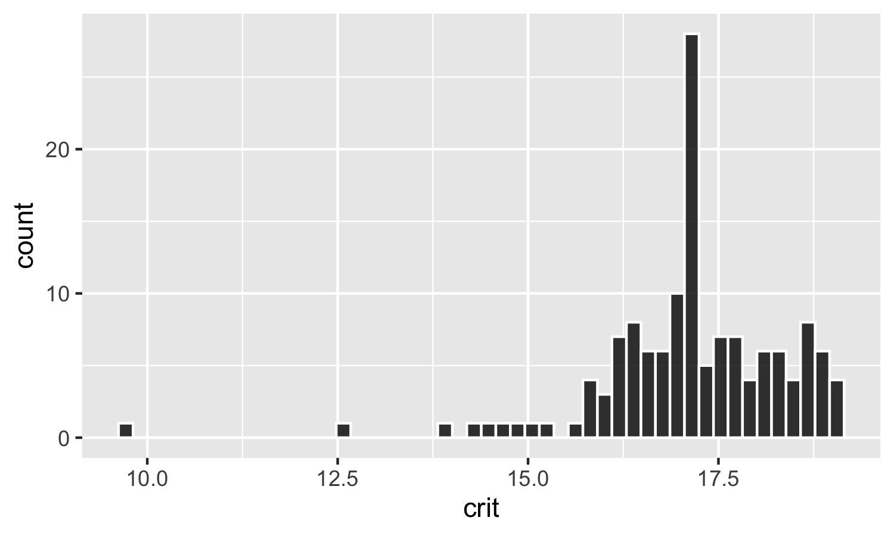
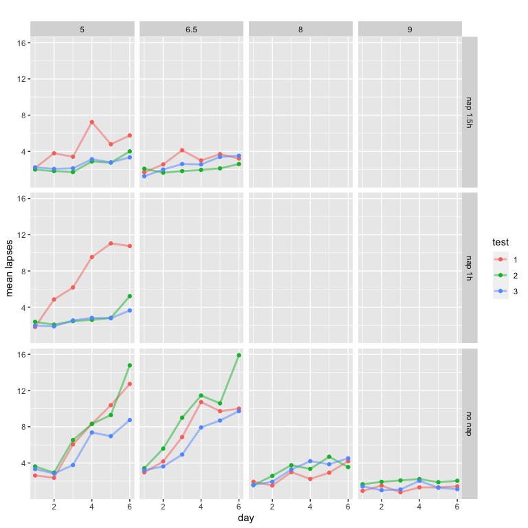

Estimating the sleep need of adolescents using nonlinear mixed effects
modelling
================
Arjun Kumar

-   [Introduction](#introduction)
-   [Part 1 - with aggregated test
    conditions](#part-1---with-aggregated-test-conditions)
    -   [The Dataset](#the-dataset)
        -   [Data cleaning](#data-cleaning)
        -   [Clean data](#clean-data)
    -   [Visualising the dataset](#visualising-the-dataset)
        -   [Boxplot - Lapses vs Sleep
            Condition](#boxplot---lapses-vs-sleep-condition)
        -   [Line plot - Lapses vs Day](#line-plot---lapses-vs-day)
    -   [Estimating Sleep Need](#estimating-sleep-need)
        -   [TBT based estimate](#tbt-based-estimate)
        -   [TST based estimate](#tst-based-estimate)
    -   [Visualising the results of TST based
        estimate](#visualising-the-results-of-tst-based-estimate)
        -   [Dot Plot - Critical Wake Durations across
            participants](#dot-plot---critical-wake-durations-across-participants)
        -   [QQ Plot - Normality of
            distribution](#qq-plot---normality-of-distribution)
        -   [Histogram - Normality of
            distribution](#histogram---normality-of-distribution)
        -   [Residuals Plot](#residuals-plot)
        -   [Comparison against estimates based on the
            literature](#comparison-against-estimates-based-on-the-literature)
        -   [Mean lapses vs excess
            wakefulness](#mean-lapses-vs-excess-wakefulness)
        -   [Predicted Lapses vs Day](#predicted-lapses-vs-day)
-   [Part 2 - without aggregating test
    conditions](#part-2---without-aggregating-test-conditions)
    -   [The Dataset](#the-dataset-1)
        -   [Data cleaning](#data-cleaning-1)
        -   [Clean dataset](#clean-dataset)
    -   [Visualising the Dataset](#visualising-the-dataset-1)
        -   [mean lapses against time awake (from sleep at night or
            nap)](#mean-lapses-against-time-awake-from-sleep-at-night-or-nap)
        -   [Mean lapses vs Day](#mean-lapses-vs-day)
    -   [Estimating Sleep Need](#estimating-sleep-need-1)
        -   [All conditions](#all-conditions)
        -   [Only no nap conditions](#only-no-nap-conditions)

# Introduction

How much sleep is enough sleep? Using changes in lapses during the
psychomotor vigilance task (PVT), Van Dongen et al. (2003) estimated
that it is close to 8.16h. In their study, participants were split into
different sleep restriction conditions and lapses were analysed for each
of these conditions across several days. Lapses in a PVT task are when
participants miss reacting to a stimulus that they are supposed to. In
general, the number of lapses increases as the amount of sleep
restriction increases. Van Dongen et al. modelled this alternatively as
lapses increasing as the amount of wakefulness during the previous day
increase beyond a certain critical value. This was formulated
mathematically as follows:

^\theta")

Here, b represents rate of change of lapses per unit change in the
nonlinear part of the equation. Excess denotes sleep in excess of the
critical waking duration. Theta accomodates nonlineaerity in the
relationship. Excess can then be formulated as the difference between
Cumulative Wake Time (CWT) across a number of days and the critical
waking duration multiplied across the number of days.

^\theta")

Van Dongen’s study was based on a population of adults between the ages
21 and 38. In this analysis, I use the same approach but for adolescents
between the ages of 15 and 19. The data here is from the Need for sleep
studies (Lo et al, 2016; 2017; 2019; 2020). There are four different
sleep conditions - 5h, 6.5 h, 8h and 9h across the studies. The baseline
sleep for all sleep conditions was 9h. Participants took the
neurobehavioral tests three times every day across the sleep restriction
days. For the analysis, I need the average lapses across days. These
studies also had periods of recovery sleep, either inbetween or at the
end. However, only the baseline sleep plus the days of sleep restriction
until the first sleep recovery period is sufficient for this analysis.

# Part 1 - with aggregated test conditions

## The Dataset

The dataset for this analysis came from NFS1, NFS2, NFS4 and NFS5. Here
is a section of the original dataset. Most of the columns have been
omitted for the sake of presentation here.

    ##     subj gender day_num test_num kss pvt_median_rt pvt_sd_rt pvt_lapses
    ## 1 NFS001 Female       1        1   6           229        78          1
    ## 2 NFS001 Female       1        2   7           250        90          2
    ## 3 NFS001 Female       1        3   4           244        68          1
    ## 4 NFS001 Female       2        1   4           245        59          1
    ## 5 NFS001 Female       2        2   4           253        44          0
    ## 6 NFS001 Female       2        3   5           253        52          0

### Data cleaning

First, I selected only the columns that were required for the analysis.

    ##     subj day_num      group lapses
    ## 1 NFS001       1 nonap_5hx7      1
    ## 2 NFS001       1 nonap_5hx7      2
    ## 3 NFS001       1 nonap_5hx7      1
    ## 4 NFS001       2 nonap_5hx7      1
    ## 5 NFS001       2 nonap_5hx7      0
    ## 6 NFS001       2 nonap_5hx7      0

Since participants did the PVT task three times a day, I summarised the
results to get the average PVT lapses for each day.

    ## # A tibble: 6 × 4
    ## # Groups:   subj, group [1]
    ##   subj   group      day_num lapses
    ##   <chr>  <chr>        <int>  <dbl>
    ## 1 NFS001 nonap_5hx7       1  1.33 
    ## 2 NFS001 nonap_5hx7       2  0.333
    ## 3 NFS001 nonap_5hx7       3  5    
    ## 4 NFS001 nonap_5hx7       4  6.33 
    ## 5 NFS001 nonap_5hx7       5  7    
    ## 6 NFS001 nonap_5hx7       6 17.3

I then imported the TST data.

    ##     subj  TST day_num study
    ## 1 NFS001 7.17       1  NFS1
    ## 2 NFS001 3.47       2  NFS1
    ## 3 NFS001 3.97       3  NFS1
    ## 4 NFS001 4.20       4  NFS1
    ## 5 NFS001 4.30       5  NFS1
    ## 6 NFS001 4.23       6  NFS1

Then I merged the TST dataset and the NFS dataset.

    ##     subj day_num      group     lapses  TST study
    ## 1 NFS001       1 nonap_5hx7  1.3333333 7.17  NFS1
    ## 2 NFS001       2 nonap_5hx7  0.3333333 3.47  NFS1
    ## 3 NFS001       3 nonap_5hx7  5.0000000 3.97  NFS1
    ## 4 NFS001       4 nonap_5hx7  6.3333333 4.20  NFS1
    ## 5 NFS001       5 nonap_5hx7  7.0000000 4.30  NFS1
    ## 6 NFS001       6 nonap_5hx7 17.3333333 4.23  NFS1

I created a new column that denotes their total bed time during the
previous night. On baseline days, they had 9h of sleep and their bed
time varies based on their sleep condition on the other days. The day
numbers were also made to align across the different studies and start
with day 1 being the baseline day.

    ##     subj day_num      group     lapses  TST study TBT condition
    ## 1 NFS001       1 nonap_5hx7  1.3333333 7.17  NFS1   9         5
    ## 2 NFS001       2 nonap_5hx7  0.3333333 3.47  NFS1   5         5
    ## 3 NFS001       3 nonap_5hx7  5.0000000 3.97  NFS1   5         5
    ## 4 NFS001       4 nonap_5hx7  6.3333333 4.20  NFS1   5         5
    ## 5 NFS001       5 nonap_5hx7  7.0000000 4.30  NFS1   5         5
    ## 6 NFS001       6 nonap_5hx7 17.3333333 4.23  NFS1   5         5

Finally I calculated the cumulative wake duration for each participant
based on the TBT and TST estimates.

    ## # A tibble: 6 × 10
    ## # Groups:   subj [1]
    ##   subj   day_num group      lapses   TST study   TBT condition TWT_tbt TWT_tst
    ##   <chr>    <dbl> <chr>       <dbl> <dbl> <chr> <dbl>     <dbl>   <dbl>   <dbl>
    ## 1 NFS001       1 nonap_5hx7  1.33   7.17 NFS1      9         5      15    16.8
    ## 2 NFS001       2 nonap_5hx7  0.333  3.47 NFS1      5         5      34    37.4
    ## 3 NFS001       3 nonap_5hx7  5      3.97 NFS1      5         5      53    57.4
    ## 4 NFS001       4 nonap_5hx7  6.33   4.2  NFS1      5         5      72    77.2
    ## 5 NFS001       5 nonap_5hx7  7      4.3  NFS1      5         5      91    96.9
    ## 6 NFS001       6 nonap_5hx7 17.3    4.23 NFS1      5         5     110   117.

### Clean data

Summing up, the last baseline day plus the first five sleep manipulation
days were used for the analysis from the NFS studies. ‘Lapses’
represents mean lapses on a particular day (day_num). TST represents the
total sleep time on the previous night. TBT represents the total bed
time on the previous night. Total Wake Time was calculated as the
cumulative total wakeful duration across days based on both the TST
estimate \[(TWT_tst = 24 – TST_tbt) x day_num\] and TBT estimate
\[(TWT_tbt = 24 – TST_tbt) x day_num\]. After cleaning, there were 834
observations in total (6 days x 139 subjects).

    ## # A tibble: 6 × 10
    ## # Groups:   subj [1]
    ##   subj   day_num group      lapses   TST study   TBT condition TWT_tbt TWT_tst
    ##   <chr>    <dbl> <chr>       <dbl> <dbl> <chr> <dbl>     <dbl>   <dbl>   <dbl>
    ## 1 NFS001       1 nonap_5hx7  1.33   7.17 NFS1      9         5      15    16.8
    ## 2 NFS001       2 nonap_5hx7  0.333  3.47 NFS1      5         5      34    37.4
    ## 3 NFS001       3 nonap_5hx7  5      3.97 NFS1      5         5      53    57.4
    ## 4 NFS001       4 nonap_5hx7  6.33   4.2  NFS1      5         5      72    77.2
    ## 5 NFS001       5 nonap_5hx7  7      4.3  NFS1      5         5      91    96.9
    ## 6 NFS001       6 nonap_5hx7 17.3    4.23 NFS1      5         5     110   117.

## Visualising the dataset

For this analysis, I have mainly focused on no nap conditions. Hence the
visualizations below do not include the conditions that had nap time.

### Boxplot - Lapses vs Sleep Condition

<!-- -->

As it can be seen, the number of lapses increases across the days as the
level of sleep restriction increases. This can be noted more clearly in
the following charts

### Line plot - Lapses vs Day

<!-- -->

## Estimating Sleep Need

### TBT based estimate

#### Summary

I’m using the nlme() function from the nlme library to fit a nonlinear
mixed effects model to my data.

``` r
library(nlme)
TBT.nonap.lapses <- nlme(lapses ~ b*(TWT_tbt - crit*day_num)^theta,
                   data = data.nonap,
                   fixed = b + theta + crit ~ 1,
                   random = crit ~ 1,
                   groups = ~ subj,
                   start = c(b = 1.4, theta = 0.4, crit = 13),
                   na.action = na.omit
                   ) 

summary(TBT.nonap.lapses)
```

    ## Nonlinear mixed-effects model fit by maximum likelihood
    ##   Model: lapses ~ b * (TWT_tbt - crit * day_num)^theta 
    ##   Data: data.nonap 
    ##        AIC      BIC    logLik
    ##   4360.464 4384.035 -2175.232
    ## 
    ## Random effects:
    ##  Formula: crit ~ 1 | subj
    ##             crit Residual
    ## StdDev: 1.696446 2.472632
    ## 
    ## Fixed effects:  b + theta + crit ~ 1 
    ##           Value  Std.Error  DF  t-value p-value
    ## b      3.276916 0.30539792 683 10.72999       0
    ## theta  0.667553 0.02602681 683 25.64869       0
    ## crit  16.213213 0.17853896 683 90.81051       0
    ##  Correlation: 
    ##       b      theta 
    ## theta -0.904       
    ## crit   0.342 -0.222
    ## 
    ## Standardized Within-Group Residuals:
    ##         Min          Q1         Med          Q3         Max 
    ## -4.08657132 -0.66240176 -0.01365964  0.60578292  5.07993341 
    ## 
    ## Number of Observations: 824
    ## Number of Groups: 139

#### Estimates and their 95% confidence intervals

``` r
intervals(TBT.nonap.lapses)
```

    ## Approximate 95% confidence intervals
    ## 
    ##  Fixed effects:
    ##            lower       est.      upper
    ## b      2.6783772  3.2769161  3.8754551
    ## theta  0.6165443  0.6675534  0.7185624
    ## crit  15.8633011 16.2132135 16.5631259
    ## attr(,"label")
    ## [1] "Fixed effects:"
    ## 
    ##  Random Effects:
    ##   Level: subj 
    ##            lower     est.    upper
    ## sd(crit) 1.42516 1.696446 2.019372
    ## 
    ##  Within-group standard error:
    ##    lower     est.    upper 
    ## 2.341592 2.472632 2.611006

### TST based estimate

#### Summary

``` r
#SLEEP TIME ESTIMATES - no nap
TST.nonap.lapses <- nlme(lapses ~ b*(TWT_tst - crit*day_num)^theta,
                   data = data.nonap,
                   fixed = b + theta + crit ~ 1,
                   random = crit ~ 1,
                   groups = ~ subj,
                   start = c(b = 1.4, theta = 0.5, crit = 12),
                   na.action = na.omit
                   ) 

summary(TST.nonap.lapses)
```

    ## Nonlinear mixed-effects model fit by maximum likelihood
    ##   Model: lapses ~ b * (TWT_tst - crit * day_num)^theta 
    ##   Data: data.nonap 
    ##        AIC      BIC    logLik
    ##   4406.687 4430.258 -2198.344
    ## 
    ## Random effects:
    ##  Formula: crit ~ 1 | subj
    ##             crit Residual
    ## StdDev: 1.402444  2.50208
    ## 
    ## Fixed effects:  b + theta + crit ~ 1 
    ##           Value  Std.Error  DF   t-value p-value
    ## b      3.622969 0.31543308 683  11.48570       0
    ## theta  0.674452 0.02582812 683  26.11308       0
    ## crit  17.131346 0.14233562 683 120.35881       0
    ##  Correlation: 
    ##       b      theta 
    ## theta -0.889       
    ## crit   0.334 -0.208
    ## 
    ## Standardized Within-Group Residuals:
    ##         Min          Q1         Med          Q3         Max 
    ## -4.29474310 -0.62959079 -0.02426273  0.57142563  4.97521379 
    ## 
    ## Number of Observations: 824
    ## Number of Groups: 139

#### Estimates and their 95% confidence intervals

``` r
intervals(TST.nonap.lapses)
```

    ## Approximate 95% confidence intervals
    ## 
    ##  Fixed effects:
    ##            lower       est.      upper
    ## b      3.0047630  3.6229695  4.2411760
    ## theta  0.6238322  0.6744519  0.7250715
    ## crit  16.8523870 17.1313457 17.4103045
    ## attr(,"label")
    ## [1] "Fixed effects:"
    ## 
    ##  Random Effects:
    ##   Level: subj 
    ##             lower     est.    upper
    ## sd(crit) 1.193168 1.402444 1.648426
    ## 
    ##  Within-group standard error:
    ##    lower     est.    upper 
    ## 2.369793 2.502080 2.641752

## Visualising the results of TST based estimate

### Dot Plot - Critical Wake Durations across participants

<!-- -->

### QQ Plot - Normality of distribution

<!-- -->

### Histogram - Normality of distribution

The plot indicates a left skew. Let’s check the histogram

<!-- -->

### Residuals Plot

<!-- -->

### Comparison against estimates based on the literature

I compared the distribution obtained from this estimate with Van Dongen
et al.(2003) and Short et al. (2018) estimates for the critical waking
duration

<!-- -->

### Mean lapses vs excess wakefulness

^{0.67}")

The line represents predicted number of lapses, dots represent the
actual number of lapses observed.

<!-- -->

### Predicted Lapses vs Day

^{0.67}")

<!-- -->

To conclude, the estimate of critical waking duration (17.13) was
greater than that of Van Dongen’s estimate (15.84). Our results seem to
suggest that for the average adolescent (based on the sample used for
this study), 6.87h of sleep would be sufficient to prevent the build of
neurobehavioral deficits at least in the context of the PVT task.

# Part 2 - without aggregating test conditions

In this part of the analysis, I won’t be aggregating the test results.

## The Dataset

I reloaded the nfs dataset again for the analysis.

    ##     subj gender day_num test_num kss pvt_median_rt pvt_sd_rt pvt_lapses
    ## 1 NFS001 Female       1        1   6           229        78          1
    ## 2 NFS001 Female       1        2   7           250        90          2
    ## 3 NFS001 Female       1        3   4           244        68          1
    ## 4 NFS001 Female       2        1   4           245        59          1
    ## 5 NFS001 Female       2        2   4           253        44          0
    ## 6 NFS001 Female       2        3   5           253        52          0

### Data cleaning

Again, similar to part 1, I selected only the columns that were required
for the analysis.

    ##     subj day_num      group lapses
    ## 1 NFS001       1 nonap_5hx7      1
    ## 2 NFS001       1 nonap_5hx7      2
    ## 3 NFS001       1 nonap_5hx7      1
    ## 4 NFS001       2 nonap_5hx7      1
    ## 5 NFS001       2 nonap_5hx7      0
    ## 6 NFS001       2 nonap_5hx7      0
    ## 7 NFS001       3 nonap_5hx7      6
    ## 8 NFS001       3 nonap_5hx7      6

I created a new column called ST that indicated the TBT from the past
night

    ##     subj day_num      group lapses TBT condition
    ## 1 NFS001       1 nonap_5hx7      1   9         5
    ## 2 NFS001       1 nonap_5hx7      2   9         5
    ## 3 NFS001       1 nonap_5hx7      1   9         5
    ## 4 NFS001       2 nonap_5hx7      1   5         5
    ## 5 NFS001       2 nonap_5hx7      0   5         5
    ## 6 NFS001       2 nonap_5hx7      0   5         5
    ## 7 NFS001       3 nonap_5hx7      6   5         5
    ## 8 NFS001       3 nonap_5hx7      6   5         5

Next, I used the TBT data from each night to calculate the cumulative
total wake time based on the TBT measures until each test time. For
example, if test 1 is at 10 AM and this is day 3, the cumulative wake
duration would be the (Total hours since start of first wake time after
the end of baseline sleep - cumulative TBT since start of protocol).
Additionally, for conditions with nap, I subtracted the nap duration
from the cumulative wake duration for test in which participants had a
nap preceding the test and during the day.

    ## [1] 3996

    ##     subj day_num    group lapses TBT condition test TWT wake_time test_time WD
    ## 1 NFS001       1 nonap_5h      1   9         5    1  19         6        10  4
    ## 2 NFS001       1 nonap_5h      2   9         5    2  24         6        15  9
    ## 3 NFS001       1 nonap_5h      1   9         5    3  29         6        20 14
    ## 4 NFS001       2 nonap_5h      1   5         5    1  38         6        10  4
    ## 5 NFS001       2 nonap_5h      0   5         5    2  43         6        15  9
    ## 6 NFS001       2 nonap_5h      0   5         5    3  48         6        20 14
    ## 7 NFS001       3 nonap_5h      6   5         5    1  57         6        10  4
    ## 8 NFS001       3 nonap_5h      6   5         5    2  62         6        15  9
    ##     type
    ## 1 no nap
    ## 2 no nap
    ## 3 no nap
    ## 4 no nap
    ## 5 no nap
    ## 6 no nap
    ## 7 no nap
    ## 8 no nap

### Clean dataset

Final dataset after cleaning

    ##     subj day_num    group lapses TBT condition test TWT wake_time test_time WD
    ## 1 NFS001       1 nonap_5h      1   9         5    1  19         6        10  4
    ## 2 NFS001       1 nonap_5h      2   9         5    2  24         6        15  9
    ## 3 NFS001       1 nonap_5h      1   9         5    3  29         6        20 14
    ## 4 NFS001       2 nonap_5h      1   5         5    1  38         6        10  4
    ## 5 NFS001       2 nonap_5h      0   5         5    2  43         6        15  9
    ## 6 NFS001       2 nonap_5h      0   5         5    3  48         6        20 14
    ## 7 NFS001       3 nonap_5h      6   5         5    1  57         6        10  4
    ## 8 NFS001       3 nonap_5h      6   5         5    2  62         6        15  9
    ##     type
    ## 1 no nap
    ## 2 no nap
    ## 3 no nap
    ## 4 no nap
    ## 5 no nap
    ## 6 no nap
    ## 7 no nap
    ## 8 no nap

## Visualising the Dataset

### mean lapses against time awake (from sleep at night or nap)


### Mean lapses vs Day

``` r
#mean lapses vs Day

data.nfs %>% mutate(across(group, factor, levels=c("control_9h","nonap_8h","nap90_6pt5h", "nonap_6pt5h", "nap90_5h", "nap60_5h", "nonap_5h"))) %>% 
ggplot(aes(x = day_num, y = lapses, color = as.factor(test))) +
   stat_summary(fun = mean, geom = "line", size = 1, alpha = 0.5) +
   stat_summary(fun = mean, geom = "point") +
   #stat_summary(fun.data = mean_cl_normal, geom = "errorbar", aes(group = as.factor(condition)), width = 0.05) +
   labs(x = "day", y = "mean lapses", title = " ", color = "test") +
  facet_wrap(~ group)
```



## Estimating Sleep Need

### All conditions

``` r
library(nlme)

# sleep.lme <- lmer(lapses ~ day_num + test + (day_num | id) + (day_num | group) , data.nfs)
# 
# sleep.lme
# plot(sleep.lme)

#inclusive of nap conditions

library(modelr)

sleep.allconditions.lapses <- nlme(lapses ~ b*(TWT - crit*day_num)^theta,
                   data = data.nfs,
                   fixed = b + crit + theta ~ 1,
                   random = crit ~ 1,
                   groups = ~ subj,
                   start = c(b = 2, crit = 14, theta = 0.5),
                   na.action = na.omit
                   )

summary(sleep.allconditions.lapses)
```

    ## Nonlinear mixed-effects model fit by maximum likelihood
    ##   Model: lapses ~ b * (TWT - crit * day_num)^theta 
    ##   Data: data.nfs 
    ##        AIC      BIC    logLik
    ##   26137.06 26168.53 -13063.53
    ## 
    ## Random effects:
    ##  Formula: crit ~ 1 | subj
    ##                crit Residual
    ## StdDev: 0.000572914 6.366384
    ## 
    ## Fixed effects:  b + crit + theta ~ 1 
    ##           Value Std.Error   DF  t-value p-value
    ## b      0.205547 0.0461620 3771  4.45272       0
    ## crit  13.822926 0.3283707 3771 42.09549       0
    ## theta  1.077504 0.0588213 3771 18.31828       0
    ##  Correlation: 
    ##       b      crit  
    ## crit   0.641       
    ## theta -0.959 -0.412
    ## 
    ## Standardized Within-Group Residuals:
    ##        Min         Q1        Med         Q3        Max 
    ## -1.7681189 -0.5314576 -0.1973687  0.2172085  7.9065137 
    ## 
    ## Number of Observations: 3995
    ## Number of Groups: 222

``` r
rmse(sleep.allconditions.lapses, data.nfs)
```

    ## [1] 6.366383

### Only no nap conditions

``` r
#no nap

sleep.nonap.lapses <- nlme(lapses ~ b*(TWT - crit*day_num)^theta,
                   data = data.nonap,
                   fixed = b + crit + theta ~ 1,
                   random = crit ~ 1,
                   groups = ~ subj,
                   start = c(b = 1, crit = 12, theta = 0.4),
                   na.action = na.omit
                   )

summary(sleep.nonap.lapses)
```

    ## Nonlinear mixed-effects model fit by maximum likelihood
    ##   Model: lapses ~ b * (TWT - crit * day_num)^theta 
    ##   Data: data.nonap 
    ##       AIC      BIC    logLik
    ##   17379.7 17408.93 -8684.849
    ## 
    ## Random effects:
    ##  Formula: crit ~ 1 | subj
    ##                crit Residual
    ## StdDev: 0.001138025 7.244334
    ## 
    ## Fixed effects:  b + crit + theta ~ 1 
    ##           Value Std.Error   DF   t-value p-value
    ## b      0.115809 0.0348742 2411  3.320769   9e-04
    ## crit  12.440110 0.5334087 2411 23.321908   0e+00
    ## theta  1.199507 0.0748659 2411 16.022063   0e+00
    ##  Correlation: 
    ##       b      crit  
    ## crit   0.563       
    ## theta -0.953 -0.299
    ## 
    ## Standardized Within-Group Residuals:
    ##        Min         Q1        Med         Q3        Max 
    ## -1.7177180 -0.5190705 -0.2433830  0.1732791  6.8882463 
    ## 
    ## Number of Observations: 2555
    ## Number of Groups: 142

``` r
rmse(sleep.nonap.lapses, data.nonap)
```

    ## [1] 7.244333

``` r
#nap only
# 
# sleep.nap.lapses <- nlme(lapses ~ b*(TWT - crit*day_num)^theta,
#                    data = data.nap,
#                    fixed = b + crit + theta ~ 1,
#                    random = crit ~ 1,
#                    groups = ~ subj,
#                    start = c(b = 2, crit = 14, theta = 0.6),
#                    na.action = na.omit
#                    )
# 
# summary(sleep.nap.lapses)
```
