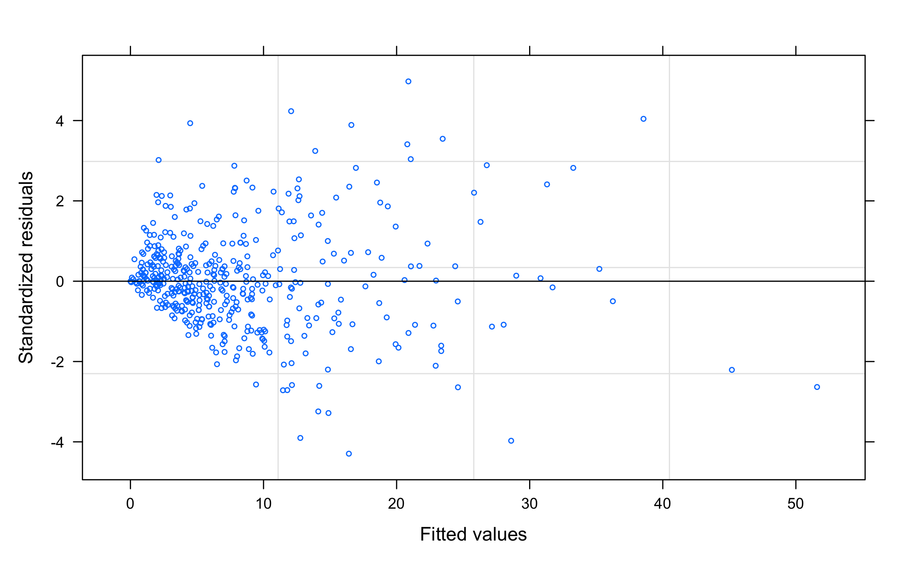

Estimating the sleep need of adolescents using nonlinear mixed effects
modelling V1 (ongoing project)
================
Arjun Kumar
9/22/2021

-   [Introduction](#introduction)
-   [The Dataset](#the-dataset)
    -   [Data cleaning](#data-cleaning)
    -   [Clean data](#clean-data)
-   [Visualising the dataset](#visualising-the-dataset)
    -   [Boxplot - Lapses vs Sleep
        Condition](#boxplot---lapses-vs-sleep-condition)
    -   [Line plot - Lapses vs Day](#line-plot---lapses-vs-day)
-   [Estimating Sleep Need](#estimating-sleep-need)
    -   [TBT based estimate](#tbt-based-estimate)
        -   [Summary](#summary)
        -   [Estimates and their 95% confidence
            intervals](#estimates-and-their-95-confidence-intervals)
    -   [TST based estimate](#tst-based-estimate)
        -   [Summary](#summary-1)
        -   [Estimates and their 95% confidence
            intervals](#estimates-and-their-95-confidence-intervals-1)
-   [Visualising the results](#visualising-the-results)
    -   [Dot Plot - Critical Wake Durations across
        participants](#dot-plot---critical-wake-durations-across-participants)
    -   [QQ Plot - Normality of
        distribution](#qq-plot---normality-of-distribution)
    -   [Histogram - Normality of
        distribution](#histogram---normality-of-distribution)
    -   [Residuals Plot](#residuals-plot)
    -   [Comparison against estimates based on the
        literature](#comparison-against-estimates-based-on-the-literature)
    -   [Mean lapses vs excess
        wakefulness](#mean-lapses-vs-excess-wakefulness)

# Introduction

How much sleep is enough sleep? Using changes in lapses during the
psychomotor vigilance task (PVT), Van Dongen et al. (2003) estimated
that it is close to 8.16h. In their study, participants were split into
different sleep restriction conditions and lapses were analysed for each
of these conditions across several days. Lapses in a PVT task are when
participants miss reacting to a stimulus that they are supposed to. In
general, the number of lapses increases as the amount of sleep
restriction increases. Van Dongen et al. modelled this alternatively as
lapses increasing as the amount of wakefulness during the previous day
increase beyond a certain critical value. This was formulated
mathematically as follows:

*l**a**p**s**e**s* = *b*(*e**x**c**e**s**s*)<sup>*θ*</sup>

Here, b represents rate of change of lapses per unit change in the
nonlinear part of the equation. Excess denotes sleep in excess of the
critical waking duration. Theta accomodates nonlineaerity in the
relationship. Excess can then be formulated as the difference between
Cumulative Wake Time (CWT) across a number of days and the critical
waking duration multiplied across the number of days.

*l**a**p**s**e**s* = *b*(*C**W**T*−*c**r**i**t**i**c**a**l*\**d**a**y*)<sup>*θ*</sup>

Van Dongen’s study was based on a population of adults between the ages
21 and 38. In this analysis, I use the same approach but for adolescents
between the ages of 15 and 19. The data here is from the Need for sleep
studies (Lo et al, 2016; 2017; 2019; 2020). There are four different
sleep conditions - 5h, 6.5 h, 8h and 9h across the studies. The baseline
sleep for all sleep conditions was 9h. Participants took the
neurobehavioral tests three times every day across the sleep restriction
days. For the analysis, I need the average lapses across days. These
studies also had periods of recovery sleep, either inbetween or at the
end. However, only the baseline sleep plus the days of sleep restriction
until the first sleep recovery period is sufficient for this analysis.

# The Dataset

The dataset for this analysis comes from NFS1, NFS2, NFS4 and NFS5. Here
is a section of the original dataset. Most of the columns have been
ommitted for the sake of presentation here.

    ##     subj gender day_num test_num kss pvt_median_rt pvt_sd_rt pvt_lapses
    ## 1 NFS001 Female       1        1   6           229        78          1
    ## 2 NFS001 Female       1        2   7           250        90          2
    ## 3 NFS001 Female       1        3   4           244        68          1
    ## 4 NFS001 Female       2        1   4           245        59          1
    ## 5 NFS001 Female       2        2   4           253        44          0
    ## 6 NFS001 Female       2        3   5           253        52          0

## Data cleaning

First, I select only the columns that are required for the analysis.

    ##     subj day_num      group lapses
    ## 1 NFS001       1 nonap_5hx7      1
    ## 2 NFS001       1 nonap_5hx7      2
    ## 3 NFS001       1 nonap_5hx7      1
    ## 4 NFS001       2 nonap_5hx7      1
    ## 5 NFS001       2 nonap_5hx7      0
    ## 6 NFS001       2 nonap_5hx7      0

Since participants did the PVT task thrice a day, I summarise the
results to get the average PVT lapses for each day.

    ## # A tibble: 6 × 4
    ## # Groups:   subj, group [1]
    ##   subj   group      day_num lapses
    ##   <chr>  <chr>        <int>  <dbl>
    ## 1 NFS001 nonap_5hx7       1  1.33 
    ## 2 NFS001 nonap_5hx7       2  0.333
    ## 3 NFS001 nonap_5hx7       3  5    
    ## 4 NFS001 nonap_5hx7       4  6.33 
    ## 5 NFS001 nonap_5hx7       5  7    
    ## 6 NFS001 nonap_5hx7       6 17.3

Import sleep time data:

<div data-pagedtable="false">

<script data-pagedtable-source type="application/json">
{"columns":[{"label":["subj"],"name":[1],"type":["chr"],"align":["left"]},{"label":["sleep_time"],"name":[2],"type":["chr"],"align":["left"]},{"label":["day"],"name":[3],"type":["dbl"],"align":["right"]},{"label":["study"],"name":[4],"type":["chr"],"align":["left"]}],"data":[{"1":"NFS2001","2":"8.12","3":"1","4":"NFS2"},{"1":"NFS2001","2":"8.40","3":"2","4":"NFS2"},{"1":"NFS2001","2":"8.50","3":"3","4":"NFS2"},{"1":"NFS2001","2":"4.62","3":"4","4":"NFS2"},{"1":"NFS2001","2":"4.43","3":"5","4":"NFS2"},{"1":"NFS2001","2":"4.68","3":"6","4":"NFS2"},{"1":"NFS2001","2":"4.55","3":"7","4":"NFS2"},{"1":"NFS2001","2":"4.45","3":"8","4":"NFS2"},{"1":"NFS2001","2":"8.37","3":"9","4":"NFS2"},{"1":"NFS2001","2":"8.20","3":"10","4":"NFS2"},{"1":"NFS2001","2":"4.57","3":"11","4":"NFS2"},{"1":"NFS2001","2":"4.78","3":"12","4":"NFS2"},{"1":"NFS2001","2":"4.85","3":"13","4":"NFS2"},{"1":"NFS2001","2":"8.37","3":"14","4":"NFS2"},{"1":"NFS2001","2":"8.17","3":"15","4":"NFS2"},{"1":"NFS2006","2":"8.98","3":"1","4":"NFS2"},{"1":"NFS2006","2":"7.92","3":"2","4":"NFS2"},{"1":"NFS2006","2":"7.97","3":"3","4":"NFS2"},{"1":"NFS2006","2":"3.77","3":"4","4":"NFS2"},{"1":"NFS2006","2":"4.53","3":"5","4":"NFS2"},{"1":"NFS2006","2":"4.67","3":"6","4":"NFS2"},{"1":"NFS2006","2":"4.67","3":"7","4":"NFS2"},{"1":"NFS2006","2":"4.50","3":"8","4":"NFS2"},{"1":"NFS2006","2":"8.55","3":"9","4":"NFS2"},{"1":"NFS2006","2":"7.93","3":"10","4":"NFS2"},{"1":"NFS2006","2":"4.72","3":"11","4":"NFS2"},{"1":"NFS2006","2":"4.83","3":"12","4":"NFS2"},{"1":"NFS2006","2":"4.52","3":"13","4":"NFS2"},{"1":"NFS2006","2":"8.43","3":"14","4":"NFS2"},{"1":"NFS2006","2":"8.17","3":"15","4":"NFS2"},{"1":"NFS2007","2":"7.78","3":"1","4":"NFS2"},{"1":"NFS2007","2":".","3":"2","4":"NFS2"},{"1":"NFS2007","2":".","3":"3","4":"NFS2"},{"1":"NFS2007","2":".","3":"4","4":"NFS2"},{"1":"NFS2007","2":".","3":"5","4":"NFS2"},{"1":"NFS2007","2":"4.47","3":"6","4":"NFS2"},{"1":"NFS2007","2":"4.33","3":"7","4":"NFS2"},{"1":"NFS2007","2":"4.20","3":"8","4":"NFS2"},{"1":"NFS2007","2":"7.77","3":"9","4":"NFS2"},{"1":"NFS2007","2":"7.50","3":"10","4":"NFS2"},{"1":"NFS2007","2":"3.78","3":"11","4":"NFS2"},{"1":"NFS2007","2":"4.18","3":"12","4":"NFS2"},{"1":"NFS2007","2":"4.07","3":"13","4":"NFS2"},{"1":"NFS2007","2":"8.03","3":"14","4":"NFS2"},{"1":"NFS2007","2":"7.98","3":"15","4":"NFS2"},{"1":"NFS2010","2":"8.15","3":"1","4":"NFS2"},{"1":"NFS2010","2":".","3":"2","4":"NFS2"},{"1":"NFS2010","2":"8.37","3":"3","4":"NFS2"},{"1":"NFS2010","2":"4.72","3":"4","4":"NFS2"},{"1":"NFS2010","2":"4.78","3":"5","4":"NFS2"},{"1":"NFS2010","2":"4.62","3":"6","4":"NFS2"},{"1":"NFS2010","2":"4.73","3":"7","4":"NFS2"},{"1":"NFS2010","2":"4.87","3":"8","4":"NFS2"},{"1":"NFS2010","2":"8.55","3":"9","4":"NFS2"},{"1":"NFS2010","2":"8.20","3":"10","4":"NFS2"},{"1":"NFS2010","2":"4.88","3":"11","4":"NFS2"},{"1":"NFS2010","2":"4.25","3":"12","4":"NFS2"},{"1":"NFS2010","2":"4.92","3":"13","4":"NFS2"},{"1":"NFS2010","2":"8.45","3":"14","4":"NFS2"},{"1":"NFS2010","2":"7.98","3":"15","4":"NFS2"},{"1":"NFS2011","2":"8.32","3":"1","4":"NFS2"},{"1":"NFS2011","2":"8.75","3":"2","4":"NFS2"},{"1":"NFS2011","2":"8.50","3":"3","4":"NFS2"},{"1":"NFS2011","2":"4.62","3":"4","4":"NFS2"},{"1":"NFS2011","2":"4.67","3":"5","4":"NFS2"},{"1":"NFS2011","2":"4.77","3":"6","4":"NFS2"},{"1":"NFS2011","2":"4.50","3":"7","4":"NFS2"},{"1":"NFS2011","2":"4.82","3":"8","4":"NFS2"},{"1":"NFS2011","2":"8.43","3":"9","4":"NFS2"},{"1":"NFS2011","2":"8.22","3":"10","4":"NFS2"},{"1":"NFS2011","2":"4.67","3":"11","4":"NFS2"},{"1":"NFS2011","2":"4.58","3":"12","4":"NFS2"},{"1":"NFS2011","2":"4.75","3":"13","4":"NFS2"},{"1":"NFS2011","2":"8.18","3":"14","4":"NFS2"},{"1":"NFS2011","2":"8.10","3":"15","4":"NFS2"},{"1":"NFS2015","2":"8.05","3":"1","4":"NFS2"},{"1":"NFS2015","2":"8.22","3":"2","4":"NFS2"},{"1":"NFS2015","2":"8.10","3":"3","4":"NFS2"},{"1":"NFS2015","2":"4.58","3":"4","4":"NFS2"},{"1":"NFS2015","2":"4.35","3":"5","4":"NFS2"},{"1":"NFS2015","2":"4.40","3":"6","4":"NFS2"},{"1":"NFS2015","2":"4.42","3":"7","4":"NFS2"},{"1":"NFS2015","2":"4.48","3":"8","4":"NFS2"},{"1":"NFS2015","2":"8.47","3":"9","4":"NFS2"},{"1":"NFS2015","2":"8.22","3":"10","4":"NFS2"},{"1":"NFS2015","2":"4.68","3":"11","4":"NFS2"},{"1":"NFS2015","2":"4.42","3":"12","4":"NFS2"},{"1":"NFS2015","2":"4.67","3":"13","4":"NFS2"},{"1":"NFS2015","2":"8.33","3":"14","4":"NFS2"},{"1":"NFS2015","2":"7.63","3":"15","4":"NFS2"},{"1":"NFS2016","2":"7.97","3":"1","4":"NFS2"},{"1":"NFS2016","2":"7.88","3":"2","4":"NFS2"},{"1":"NFS2016","2":"7.68","3":"3","4":"NFS2"},{"1":"NFS2016","2":"4.38","3":"4","4":"NFS2"},{"1":"NFS2016","2":"4.27","3":"5","4":"NFS2"},{"1":"NFS2016","2":"4.47","3":"6","4":"NFS2"},{"1":"NFS2016","2":"4.57","3":"7","4":"NFS2"},{"1":"NFS2016","2":"4.58","3":"8","4":"NFS2"},{"1":"NFS2016","2":"8.33","3":"9","4":"NFS2"},{"1":"NFS2016","2":"7.60","3":"10","4":"NFS2"},{"1":"NFS2016","2":"4.50","3":"11","4":"NFS2"},{"1":"NFS2016","2":"4.68","3":"12","4":"NFS2"},{"1":"NFS2016","2":"4.60","3":"13","4":"NFS2"},{"1":"NFS2016","2":"7.88","3":"14","4":"NFS2"},{"1":"NFS2016","2":"7.88","3":"15","4":"NFS2"},{"1":"NFS2020","2":"7.55","3":"1","4":"NFS2"},{"1":"NFS2020","2":"8.13","3":"2","4":"NFS2"},{"1":"NFS2020","2":"7.65","3":"3","4":"NFS2"},{"1":"NFS2020","2":"4.48","3":"4","4":"NFS2"},{"1":"NFS2020","2":"4.13","3":"5","4":"NFS2"},{"1":"NFS2020","2":"4.72","3":"6","4":"NFS2"},{"1":"NFS2020","2":"4.38","3":"7","4":"NFS2"},{"1":"NFS2020","2":"4.48","3":"8","4":"NFS2"},{"1":"NFS2020","2":"7.85","3":"9","4":"NFS2"},{"1":"NFS2020","2":"7.73","3":"10","4":"NFS2"},{"1":"NFS2020","2":"4.42","3":"11","4":"NFS2"},{"1":"NFS2020","2":"4.60","3":"12","4":"NFS2"},{"1":"NFS2020","2":"4.12","3":"13","4":"NFS2"},{"1":"NFS2020","2":"8.05","3":"14","4":"NFS2"},{"1":"NFS2020","2":"7.15","3":"15","4":"NFS2"},{"1":"NFS2022","2":"7.85","3":"1","4":"NFS2"},{"1":"NFS2022","2":"7.95","3":"2","4":"NFS2"},{"1":"NFS2022","2":"7.98","3":"3","4":"NFS2"},{"1":"NFS2022","2":"4.18","3":"4","4":"NFS2"},{"1":"NFS2022","2":"4.52","3":"5","4":"NFS2"},{"1":"NFS2022","2":"4.43","3":"6","4":"NFS2"},{"1":"NFS2022","2":"4.68","3":"7","4":"NFS2"},{"1":"NFS2022","2":"4.88","3":"8","4":"NFS2"},{"1":"NFS2022","2":"8.55","3":"9","4":"NFS2"},{"1":"NFS2022","2":"7.68","3":"10","4":"NFS2"},{"1":"NFS2022","2":"4.23","3":"11","4":"NFS2"},{"1":"NFS2022","2":"3.63","3":"12","4":"NFS2"},{"1":"NFS2022","2":"4.77","3":"13","4":"NFS2"},{"1":"NFS2022","2":"8.68","3":"14","4":"NFS2"},{"1":"NFS2022","2":"7.35","3":"15","4":"NFS2"},{"1":"NFS2023","2":"7.87","3":"1","4":"NFS2"},{"1":"NFS2023","2":"7.88","3":"2","4":"NFS2"},{"1":"NFS2023","2":"8.22","3":"3","4":"NFS2"},{"1":"NFS2023","2":"4.42","3":"4","4":"NFS2"},{"1":"NFS2023","2":"3.85","3":"5","4":"NFS2"},{"1":"NFS2023","2":"4.05","3":"6","4":"NFS2"},{"1":"NFS2023","2":"4.28","3":"7","4":"NFS2"},{"1":"NFS2023","2":"4.30","3":"8","4":"NFS2"},{"1":"NFS2023","2":"7.83","3":"9","4":"NFS2"},{"1":"NFS2023","2":"7.73","3":"10","4":"NFS2"},{"1":"NFS2023","2":"4.92","3":"11","4":"NFS2"},{"1":"NFS2023","2":"4.15","3":"12","4":"NFS2"},{"1":"NFS2023","2":"4.30","3":"13","4":"NFS2"},{"1":"NFS2023","2":"8.10","3":"14","4":"NFS2"},{"1":"NFS2023","2":"8.02","3":"15","4":"NFS2"},{"1":"NFS2024","2":"7.77","3":"1","4":"NFS2"},{"1":"NFS2024","2":"7.28","3":"2","4":"NFS2"},{"1":"NFS2024","2":"7.17","3":"3","4":"NFS2"},{"1":"NFS2024","2":"4.20","3":"4","4":"NFS2"},{"1":"NFS2024","2":"4.53","3":"5","4":"NFS2"},{"1":"NFS2024","2":"4.35","3":"6","4":"NFS2"},{"1":"NFS2024","2":"4.53","3":"7","4":"NFS2"},{"1":"NFS2024","2":"4.60","3":"8","4":"NFS2"},{"1":"NFS2024","2":"8.43","3":"9","4":"NFS2"},{"1":"NFS2024","2":"7.82","3":"10","4":"NFS2"},{"1":"NFS2024","2":"4.35","3":"11","4":"NFS2"},{"1":"NFS2024","2":"4.72","3":"12","4":"NFS2"},{"1":"NFS2024","2":"4.65","3":"13","4":"NFS2"},{"1":"NFS2024","2":"7.90","3":"14","4":"NFS2"},{"1":"NFS2024","2":"8.00","3":"15","4":"NFS2"},{"1":"NFS2025","2":"8.65","3":"1","4":"NFS2"},{"1":"NFS2025","2":"8.32","3":"2","4":"NFS2"},{"1":"NFS2025","2":"8.20","3":"3","4":"NFS2"},{"1":"NFS2025","2":"4.35","3":"4","4":"NFS2"},{"1":"NFS2025","2":"4.23","3":"5","4":"NFS2"},{"1":"NFS2025","2":"4.37","3":"6","4":"NFS2"},{"1":"NFS2025","2":"4.32","3":"7","4":"NFS2"},{"1":"NFS2025","2":"4.32","3":"8","4":"NFS2"},{"1":"NFS2025","2":"8.37","3":"9","4":"NFS2"},{"1":"NFS2025","2":"7.72","3":"10","4":"NFS2"},{"1":"NFS2025","2":"4.50","3":"11","4":"NFS2"},{"1":"NFS2025","2":"4.28","3":"12","4":"NFS2"},{"1":"NFS2025","2":"4.67","3":"13","4":"NFS2"},{"1":"NFS2025","2":"7.08","3":"14","4":"NFS2"},{"1":"NFS2025","2":"7.68","3":"15","4":"NFS2"},{"1":"NFS2026","2":"7.18","3":"1","4":"NFS2"},{"1":"NFS2026","2":"7.55","3":"2","4":"NFS2"},{"1":"NFS2026","2":"7.48","3":"3","4":"NFS2"},{"1":"NFS2026","2":"4.38","3":"4","4":"NFS2"},{"1":"NFS2026","2":"4.67","3":"5","4":"NFS2"},{"1":"NFS2026","2":"4.47","3":"6","4":"NFS2"},{"1":"NFS2026","2":"4.63","3":"7","4":"NFS2"},{"1":"NFS2026","2":"4.70","3":"8","4":"NFS2"},{"1":"NFS2026","2":"8.58","3":"9","4":"NFS2"},{"1":"NFS2026","2":"8.00","3":"10","4":"NFS2"},{"1":"NFS2026","2":"4.60","3":"11","4":"NFS2"},{"1":"NFS2026","2":"4.40","3":"12","4":"NFS2"},{"1":"NFS2026","2":"4.45","3":"13","4":"NFS2"},{"1":"NFS2026","2":"7.53","3":"14","4":"NFS2"},{"1":"NFS2026","2":"7.47","3":"15","4":"NFS2"},{"1":"NFS2027","2":"8.37","3":"1","4":"NFS2"},{"1":"NFS2027","2":"8.38","3":"2","4":"NFS2"},{"1":"NFS2027","2":"8.57","3":"3","4":"NFS2"},{"1":"NFS2027","2":"4.58","3":"4","4":"NFS2"},{"1":"NFS2027","2":"4.37","3":"5","4":"NFS2"},{"1":"NFS2027","2":"4.62","3":"6","4":"NFS2"},{"1":"NFS2027","2":"4.75","3":"7","4":"NFS2"},{"1":"NFS2027","2":"4.57","3":"8","4":"NFS2"},{"1":"NFS2027","2":"8.65","3":"9","4":"NFS2"},{"1":"NFS2027","2":"7.92","3":"10","4":"NFS2"},{"1":"NFS2027","2":"4.67","3":"11","4":"NFS2"},{"1":"NFS2027","2":"4.48","3":"12","4":"NFS2"},{"1":"NFS2027","2":"4.63","3":"13","4":"NFS2"},{"1":"NFS2027","2":"8.17","3":"14","4":"NFS2"},{"1":"NFS2027","2":"8.43","3":"15","4":"NFS2"},{"1":"NFS2029","2":"8.10","3":"1","4":"NFS2"},{"1":"NFS2029","2":"8.58","3":"2","4":"NFS2"},{"1":"NFS2029","2":"8.40","3":"3","4":"NFS2"},{"1":"NFS2029","2":"4.50","3":"4","4":"NFS2"},{"1":"NFS2029","2":"4.75","3":"5","4":"NFS2"},{"1":"NFS2029","2":"4.83","3":"6","4":"NFS2"},{"1":"NFS2029","2":"4.82","3":"7","4":"NFS2"},{"1":"NFS2029","2":"4.80","3":"8","4":"NFS2"},{"1":"NFS2029","2":"8.28","3":"9","4":"NFS2"},{"1":"NFS2029","2":"8.43","3":"10","4":"NFS2"},{"1":"NFS2029","2":"4.63","3":"11","4":"NFS2"},{"1":"NFS2029","2":"4.73","3":"12","4":"NFS2"},{"1":"NFS2029","2":"4.68","3":"13","4":"NFS2"},{"1":"NFS2029","2":"8.15","3":"14","4":"NFS2"},{"1":"NFS2029","2":"8.40","3":"15","4":"NFS2"},{"1":"NFS2030","2":".","3":"1","4":"NFS2"},{"1":"NFS2030","2":"8.22","3":"2","4":"NFS2"},{"1":"NFS2030","2":"8.52","3":"3","4":"NFS2"},{"1":"NFS2030","2":"4.80","3":"4","4":"NFS2"},{"1":"NFS2030","2":"4.37","3":"5","4":"NFS2"},{"1":"NFS2030","2":"4.55","3":"6","4":"NFS2"},{"1":"NFS2030","2":"4.07","3":"7","4":"NFS2"},{"1":"NFS2030","2":"4.58","3":"8","4":"NFS2"},{"1":"NFS2030","2":"8.30","3":"9","4":"NFS2"},{"1":"NFS2030","2":"8.02","3":"10","4":"NFS2"},{"1":"NFS2030","2":"4.57","3":"11","4":"NFS2"},{"1":"NFS2030","2":"4.42","3":"12","4":"NFS2"},{"1":"NFS2030","2":"4.83","3":"13","4":"NFS2"},{"1":"NFS2030","2":"8.32","3":"14","4":"NFS2"},{"1":"NFS2030","2":"8.15","3":"15","4":"NFS2"},{"1":"NFS2032","2":"8.00","3":"1","4":"NFS2"},{"1":"NFS2032","2":"8.42","3":"2","4":"NFS2"},{"1":"NFS2032","2":"8.08","3":"3","4":"NFS2"},{"1":"NFS2032","2":"4.52","3":"4","4":"NFS2"},{"1":"NFS2032","2":"4.50","3":"5","4":"NFS2"},{"1":"NFS2032","2":"4.85","3":"6","4":"NFS2"},{"1":"NFS2032","2":"4.57","3":"7","4":"NFS2"},{"1":"NFS2032","2":"4.83","3":"8","4":"NFS2"},{"1":"NFS2032","2":"8.45","3":"9","4":"NFS2"},{"1":"NFS2032","2":"8.23","3":"10","4":"NFS2"},{"1":"NFS2032","2":"4.70","3":"11","4":"NFS2"},{"1":"NFS2032","2":"4.75","3":"12","4":"NFS2"},{"1":"NFS2032","2":"4.75","3":"13","4":"NFS2"},{"1":"NFS2032","2":"8.33","3":"14","4":"NFS2"},{"1":"NFS2032","2":"8.40","3":"15","4":"NFS2"},{"1":"NFS2033","2":"7.85","3":"1","4":"NFS2"},{"1":"NFS2033","2":"8.28","3":"2","4":"NFS2"},{"1":"NFS2033","2":"7.45","3":"3","4":"NFS2"},{"1":"NFS2033","2":"4.13","3":"4","4":"NFS2"},{"1":"NFS2033","2":"4.43","3":"5","4":"NFS2"},{"1":"NFS2033","2":"4.52","3":"6","4":"NFS2"},{"1":"NFS2033","2":"4.78","3":"7","4":"NFS2"},{"1":"NFS2033","2":"4.68","3":"8","4":"NFS2"},{"1":"NFS2033","2":"8.50","3":"9","4":"NFS2"},{"1":"NFS2033","2":"8.27","3":"10","4":"NFS2"},{"1":"NFS2033","2":"4.72","3":"11","4":"NFS2"},{"1":"NFS2033","2":"4.78","3":"12","4":"NFS2"},{"1":"NFS2033","2":"4.83","3":"13","4":"NFS2"},{"1":"NFS2033","2":"8.35","3":"14","4":"NFS2"},{"1":"NFS2033","2":"8.10","3":"15","4":"NFS2"},{"1":"NFS2034","2":"7.13","3":"1","4":"NFS2"},{"1":"NFS2034","2":"8.10","3":"2","4":"NFS2"},{"1":"NFS2034","2":"7.12","3":"3","4":"NFS2"},{"1":"NFS2034","2":"4.23","3":"4","4":"NFS2"},{"1":"NFS2034","2":"4.42","3":"5","4":"NFS2"},{"1":"NFS2034","2":"4.42","3":"6","4":"NFS2"},{"1":"NFS2034","2":"4.35","3":"7","4":"NFS2"},{"1":"NFS2034","2":"4.10","3":"8","4":"NFS2"},{"1":"NFS2034","2":"6.93","3":"9","4":"NFS2"},{"1":"NFS2034","2":"7.92","3":"10","4":"NFS2"},{"1":"NFS2034","2":"4.58","3":"11","4":"NFS2"},{"1":"NFS2034","2":"3.67","3":"12","4":"NFS2"},{"1":"NFS2034","2":"4.20","3":"13","4":"NFS2"},{"1":"NFS2034","2":"7.28","3":"14","4":"NFS2"},{"1":"NFS2034","2":"5.45","3":"15","4":"NFS2"},{"1":"NFS2035","2":"7.93","3":"1","4":"NFS2"},{"1":"NFS2035","2":"7.22","3":"2","4":"NFS2"},{"1":"NFS2035","2":"7.83","3":"3","4":"NFS2"},{"1":"NFS2035","2":"4.38","3":"4","4":"NFS2"},{"1":"NFS2035","2":"4.52","3":"5","4":"NFS2"},{"1":"NFS2035","2":"4.72","3":"6","4":"NFS2"},{"1":"NFS2035","2":"4.45","3":"7","4":"NFS2"},{"1":"NFS2035","2":"4.27","3":"8","4":"NFS2"},{"1":"NFS2035","2":"8.35","3":"9","4":"NFS2"},{"1":"NFS2035","2":"7.38","3":"10","4":"NFS2"},{"1":"NFS2035","2":"4.17","3":"11","4":"NFS2"},{"1":"NFS2035","2":"4.42","3":"12","4":"NFS2"},{"1":"NFS2035","2":"4.63","3":"13","4":"NFS2"},{"1":"NFS2035","2":"8.57","3":"14","4":"NFS2"},{"1":"NFS2035","2":"7.78","3":"15","4":"NFS2"},{"1":"NFS2036","2":"7.87","3":"1","4":"NFS2"},{"1":"NFS2036","2":"7.80","3":"2","4":"NFS2"},{"1":"NFS2036","2":"7.13","3":"3","4":"NFS2"},{"1":"NFS2036","2":"3.75","3":"4","4":"NFS2"},{"1":"NFS2036","2":"4.20","3":"5","4":"NFS2"},{"1":"NFS2036","2":"4.38","3":"6","4":"NFS2"},{"1":"NFS2036","2":"4.40","3":"7","4":"NFS2"},{"1":"NFS2036","2":"4.35","3":"8","4":"NFS2"},{"1":"NFS2036","2":"8.45","3":"9","4":"NFS2"},{"1":"NFS2036","2":"7.83","3":"10","4":"NFS2"},{"1":"NFS2036","2":"4.45","3":"11","4":"NFS2"},{"1":"NFS2036","2":"4.57","3":"12","4":"NFS2"},{"1":"NFS2036","2":"4.68","3":"13","4":"NFS2"},{"1":"NFS2036","2":"8.37","3":"14","4":"NFS2"},{"1":"NFS2036","2":"7.77","3":"15","4":"NFS2"},{"1":"NFS2038","2":"8.35","3":"1","4":"NFS2"},{"1":"NFS2038","2":"8.13","3":"2","4":"NFS2"},{"1":"NFS2038","2":"8.17","3":"3","4":"NFS2"},{"1":"NFS2038","2":"4.65","3":"4","4":"NFS2"},{"1":"NFS2038","2":"4.15","3":"5","4":"NFS2"},{"1":"NFS2038","2":"4.68","3":"6","4":"NFS2"},{"1":"NFS2038","2":"4.62","3":"7","4":"NFS2"},{"1":"NFS2038","2":"4.62","3":"8","4":"NFS2"},{"1":"NFS2038","2":"8.67","3":"9","4":"NFS2"},{"1":"NFS2038","2":"7.55","3":"10","4":"NFS2"},{"1":"NFS2038","2":"4.63","3":"11","4":"NFS2"},{"1":"NFS2038","2":"4.60","3":"12","4":"NFS2"},{"1":"NFS2038","2":"4.50","3":"13","4":"NFS2"},{"1":"NFS2038","2":"8.40","3":"14","4":"NFS2"},{"1":"NFS2038","2":"7.93","3":"15","4":"NFS2"},{"1":"NFS2039","2":"7.45","3":"1","4":"NFS2"},{"1":"NFS2039","2":"8.63","3":"2","4":"NFS2"},{"1":"NFS2039","2":"8.42","3":"3","4":"NFS2"},{"1":"NFS2039","2":"4.47","3":"4","4":"NFS2"},{"1":"NFS2039","2":"4.80","3":"5","4":"NFS2"},{"1":"NFS2039","2":"4.68","3":"6","4":"NFS2"},{"1":"NFS2039","2":"4.78","3":"7","4":"NFS2"},{"1":"NFS2039","2":"4.72","3":"8","4":"NFS2"},{"1":"NFS2039","2":"8.30","3":"9","4":"NFS2"},{"1":"NFS2039","2":"8.45","3":"10","4":"NFS2"},{"1":"NFS2039","2":"4.77","3":"11","4":"NFS2"},{"1":"NFS2039","2":"4.78","3":"12","4":"NFS2"},{"1":"NFS2039","2":"4.80","3":"13","4":"NFS2"},{"1":"NFS2039","2":"8.52","3":"14","4":"NFS2"},{"1":"NFS2039","2":"8.12","3":"15","4":"NFS2"},{"1":"NFS2041","2":"7.73","3":"1","4":"NFS2"},{"1":"NFS2041","2":"7.82","3":"2","4":"NFS2"},{"1":"NFS2041","2":"8.13","3":"3","4":"NFS2"},{"1":"NFS2041","2":"4.62","3":"4","4":"NFS2"},{"1":"NFS2041","2":"4.40","3":"5","4":"NFS2"},{"1":"NFS2041","2":"4.55","3":"6","4":"NFS2"},{"1":"NFS2041","2":"4.27","3":"7","4":"NFS2"},{"1":"NFS2041","2":"4.63","3":"8","4":"NFS2"},{"1":"NFS2041","2":"7.42","3":"9","4":"NFS2"},{"1":"NFS2041","2":"7.77","3":"10","4":"NFS2"},{"1":"NFS2041","2":"4.70","3":"11","4":"NFS2"},{"1":"NFS2041","2":"4.60","3":"12","4":"NFS2"},{"1":"NFS2041","2":"4.40","3":"13","4":"NFS2"},{"1":"NFS2041","2":"8.28","3":"14","4":"NFS2"},{"1":"NFS2041","2":"8.17","3":"15","4":"NFS2"},{"1":"NFS2042","2":"8.00","3":"1","4":"NFS2"},{"1":"NFS2042","2":"8.07","3":"2","4":"NFS2"},{"1":"NFS2042","2":"7.40","3":"3","4":"NFS2"},{"1":"NFS2042","2":"4.53","3":"4","4":"NFS2"},{"1":"NFS2042","2":"4.23","3":"5","4":"NFS2"},{"1":"NFS2042","2":"4.48","3":"6","4":"NFS2"},{"1":"NFS2042","2":"4.68","3":"7","4":"NFS2"},{"1":"NFS2042","2":"4.77","3":"8","4":"NFS2"},{"1":"NFS2042","2":"8.37","3":"9","4":"NFS2"},{"1":"NFS2042","2":"8.22","3":"10","4":"NFS2"},{"1":"NFS2042","2":"4.57","3":"11","4":"NFS2"},{"1":"NFS2042","2":"4.77","3":"12","4":"NFS2"},{"1":"NFS2042","2":"4.70","3":"13","4":"NFS2"},{"1":"NFS2042","2":"8.55","3":"14","4":"NFS2"},{"1":"NFS2042","2":"8.53","3":"15","4":"NFS2"},{"1":"NFS2043","2":"8.22","3":"1","4":"NFS2"},{"1":"NFS2043","2":"7.90","3":"2","4":"NFS2"},{"1":"NFS2043","2":"7.50","3":"3","4":"NFS2"},{"1":"NFS2043","2":"4.62","3":"4","4":"NFS2"},{"1":"NFS2043","2":"4.52","3":"5","4":"NFS2"},{"1":"NFS2043","2":"4.47","3":"6","4":"NFS2"},{"1":"NFS2043","2":"3.60","3":"7","4":"NFS2"},{"1":"NFS2043","2":"4.47","3":"8","4":"NFS2"},{"1":"NFS2043","2":"7.32","3":"9","4":"NFS2"},{"1":"NFS2043","2":"7.15","3":"10","4":"NFS2"},{"1":"NFS2043","2":"4.50","3":"11","4":"NFS2"},{"1":"NFS2043","2":"4.63","3":"12","4":"NFS2"},{"1":"NFS2043","2":"4.62","3":"13","4":"NFS2"},{"1":"NFS2043","2":"7.95","3":"14","4":"NFS2"},{"1":"NFS2043","2":"7.10","3":"15","4":"NFS2"},{"1":"NFS2046","2":"8.17","3":"1","4":"NFS2"},{"1":"NFS2046","2":"8.43","3":"2","4":"NFS2"},{"1":"NFS2046","2":"7.80","3":"3","4":"NFS2"},{"1":"NFS2046","2":"4.65","3":"4","4":"NFS2"},{"1":"NFS2046","2":"4.60","3":"5","4":"NFS2"},{"1":"NFS2046","2":"4.83","3":"6","4":"NFS2"},{"1":"NFS2046","2":"4.77","3":"7","4":"NFS2"},{"1":"NFS2046","2":"4.80","3":"8","4":"NFS2"},{"1":"NFS2046","2":"8.50","3":"9","4":"NFS2"},{"1":"NFS2046","2":"8.25","3":"10","4":"NFS2"},{"1":"NFS2046","2":"4.65","3":"11","4":"NFS2"},{"1":"NFS2046","2":"4.30","3":"12","4":"NFS2"},{"1":"NFS2046","2":"4.55","3":"13","4":"NFS2"},{"1":"NFS2046","2":"8.40","3":"14","4":"NFS2"},{"1":"NFS2046","2":"8.18","3":"15","4":"NFS2"},{"1":"NFS2047","2":"7.93","3":"1","4":"NFS2"},{"1":"NFS2047","2":"6.32","3":"2","4":"NFS2"},{"1":"NFS2047","2":"6.83","3":"3","4":"NFS2"},{"1":"NFS2047","2":"3.93","3":"4","4":"NFS2"},{"1":"NFS2047","2":"3.73","3":"5","4":"NFS2"},{"1":"NFS2047","2":"4.30","3":"6","4":"NFS2"},{"1":"NFS2047","2":"4.68","3":"7","4":"NFS2"},{"1":"NFS2047","2":"4.38","3":"8","4":"NFS2"},{"1":"NFS2047","2":"8.57","3":"9","4":"NFS2"},{"1":"NFS2047","2":"8.07","3":"10","4":"NFS2"},{"1":"NFS2047","2":"3.53","3":"11","4":"NFS2"},{"1":"NFS2047","2":"4.43","3":"12","4":"NFS2"},{"1":"NFS2047","2":"4.23","3":"13","4":"NFS2"},{"1":"NFS2047","2":"8.27","3":"14","4":"NFS2"},{"1":"NFS2047","2":"7.00","3":"15","4":"NFS2"},{"1":"NFS2048","2":"7.45","3":"1","4":"NFS2"},{"1":"NFS2048","2":"8.68","3":"2","4":"NFS2"},{"1":"NFS2048","2":"8.08","3":"3","4":"NFS2"},{"1":"NFS2048","2":"4.68","3":"4","4":"NFS2"},{"1":"NFS2048","2":"4.45","3":"5","4":"NFS2"},{"1":"NFS2048","2":"4.48","3":"6","4":"NFS2"},{"1":"NFS2048","2":"4.53","3":"7","4":"NFS2"},{"1":"NFS2048","2":"4.75","3":"8","4":"NFS2"},{"1":"NFS2048","2":"7.95","3":"9","4":"NFS2"},{"1":"NFS2048","2":"8.43","3":"10","4":"NFS2"},{"1":"NFS2048","2":"4.48","3":"11","4":"NFS2"},{"1":"NFS2048","2":"4.27","3":"12","4":"NFS2"},{"1":"NFS2048","2":"4.62","3":"13","4":"NFS2"},{"1":"NFS2048","2":"8.32","3":"14","4":"NFS2"},{"1":"NFS2048","2":"7.75","3":"15","4":"NFS2"},{"1":"NFS2049","2":"8.27","3":"1","4":"NFS2"},{"1":"NFS2049","2":"8.12","3":"2","4":"NFS2"},{"1":"NFS2049","2":"8.45","3":"3","4":"NFS2"},{"1":"NFS2049","2":"4.05","3":"4","4":"NFS2"},{"1":"NFS2049","2":"4.67","3":"5","4":"NFS2"},{"1":"NFS2049","2":"4.50","3":"6","4":"NFS2"},{"1":"NFS2049","2":"4.73","3":"7","4":"NFS2"},{"1":"NFS2049","2":"4.22","3":"8","4":"NFS2"},{"1":"NFS2049","2":"8.18","3":"9","4":"NFS2"},{"1":"NFS2049","2":"7.88","3":"10","4":"NFS2"},{"1":"NFS2049","2":"4.35","3":"11","4":"NFS2"},{"1":"NFS2049","2":"4.72","3":"12","4":"NFS2"},{"1":"NFS2049","2":"4.20","3":"13","4":"NFS2"},{"1":"NFS2049","2":"8.68","3":"14","4":"NFS2"},{"1":"NFS2049","2":"8.60","3":"15","4":"NFS2"},{"1":"NFS2050","2":"7.83","3":"1","4":"NFS2"},{"1":"NFS2050","2":"8.18","3":"2","4":"NFS2"},{"1":"NFS2050","2":"8.35","3":"3","4":"NFS2"},{"1":"NFS2050","2":"4.57","3":"4","4":"NFS2"},{"1":"NFS2050","2":"3.80","3":"5","4":"NFS2"},{"1":"NFS2050","2":"4.65","3":"6","4":"NFS2"},{"1":"NFS2050","2":"4.58","3":"7","4":"NFS2"},{"1":"NFS2050","2":"4.78","3":"8","4":"NFS2"},{"1":"NFS2050","2":"7.82","3":"9","4":"NFS2"},{"1":"NFS2050","2":"8.07","3":"10","4":"NFS2"},{"1":"NFS2050","2":"4.75","3":"11","4":"NFS2"},{"1":"NFS2050","2":"4.18","3":"12","4":"NFS2"},{"1":"NFS2050","2":"4.48","3":"13","4":"NFS2"},{"1":"NFS2050","2":"7.95","3":"14","4":"NFS2"},{"1":"NFS2050","2":"8.33","3":"15","4":"NFS2"},{"1":"NFS2053","2":"7.58","3":"1","4":"NFS2"},{"1":"NFS2053","2":".","3":"2","4":"NFS2"},{"1":"NFS2053","2":".","3":"3","4":"NFS2"},{"1":"NFS2053","2":".","3":"4","4":"NFS2"},{"1":"NFS2053","2":".","3":"5","4":"NFS2"},{"1":"NFS2053","2":".","3":"6","4":"NFS2"},{"1":"NFS2053","2":"4.33","3":"7","4":"NFS2"},{"1":"NFS2053","2":"4.62","3":"8","4":"NFS2"},{"1":"NFS2053","2":"7.87","3":"9","4":"NFS2"},{"1":"NFS2053","2":"7.48","3":"10","4":"NFS2"},{"1":"NFS2053","2":"3.92","3":"11","4":"NFS2"},{"1":"NFS2053","2":"4.38","3":"12","4":"NFS2"},{"1":"NFS2053","2":"4.62","3":"13","4":"NFS2"},{"1":"NFS2053","2":"7.83","3":"14","4":"NFS2"},{"1":"NFS2053","2":"7.33","3":"15","4":"NFS2"},{"1":"NFS2055","2":"8.07","3":"1","4":"NFS2"},{"1":"NFS2055","2":"8.13","3":"2","4":"NFS2"},{"1":"NFS2055","2":"8.27","3":"3","4":"NFS2"},{"1":"NFS2055","2":"4.63","3":"4","4":"NFS2"},{"1":"NFS2055","2":"4.78","3":"5","4":"NFS2"},{"1":"NFS2055","2":"4.53","3":"6","4":"NFS2"},{"1":"NFS2055","2":"4.63","3":"7","4":"NFS2"},{"1":"NFS2055","2":"4.75","3":"8","4":"NFS2"},{"1":"NFS2055","2":"8.50","3":"9","4":"NFS2"},{"1":"NFS2055","2":"7.82","3":"10","4":"NFS2"},{"1":"NFS2055","2":"4.80","3":"11","4":"NFS2"},{"1":"NFS2055","2":"4.80","3":"12","4":"NFS2"},{"1":"NFS2055","2":"4.83","3":"13","4":"NFS2"},{"1":"NFS2055","2":"8.30","3":"14","4":"NFS2"},{"1":"NFS2055","2":"7.90","3":"15","4":"NFS2"},{"1":"NFS2060","2":"8.83","3":"1","4":"NFS2"},{"1":"NFS2060","2":"8.58","3":"2","4":"NFS2"},{"1":"NFS2060","2":"8.25","3":"3","4":"NFS2"},{"1":"NFS2060","2":"4.37","3":"4","4":"NFS2"},{"1":"NFS2060","2":"4.73","3":"5","4":"NFS2"},{"1":"NFS2060","2":"4.85","3":"6","4":"NFS2"},{"1":"NFS2060","2":"4.75","3":"7","4":"NFS2"},{"1":"NFS2060","2":"4.75","3":"8","4":"NFS2"},{"1":"NFS2060","2":"8.50","3":"9","4":"NFS2"},{"1":"NFS2060","2":"8.03","3":"10","4":"NFS2"},{"1":"NFS2060","2":"4.57","3":"11","4":"NFS2"},{"1":"NFS2060","2":"4.72","3":"12","4":"NFS2"},{"1":"NFS2060","2":"4.67","3":"13","4":"NFS2"},{"1":"NFS2060","2":"8.32","3":"14","4":"NFS2"},{"1":"NFS2060","2":"8.50","3":"15","4":"NFS2"},{"1":"NFS2066","2":"7.28","3":"1","4":"NFS2"},{"1":"NFS2066","2":"8.72","3":"2","4":"NFS2"},{"1":"NFS2066","2":"8.33","3":"3","4":"NFS2"},{"1":"NFS2066","2":"4.85","3":"4","4":"NFS2"},{"1":"NFS2066","2":"4.33","3":"5","4":"NFS2"},{"1":"NFS2066","2":"4.65","3":"6","4":"NFS2"},{"1":"NFS2066","2":"4.32","3":"7","4":"NFS2"},{"1":"NFS2066","2":"4.85","3":"8","4":"NFS2"},{"1":"NFS2066","2":"8.53","3":"9","4":"NFS2"},{"1":"NFS2066","2":"8.20","3":"10","4":"NFS2"},{"1":"NFS2066","2":"4.63","3":"11","4":"NFS2"},{"1":"NFS2066","2":"4.37","3":"12","4":"NFS2"},{"1":"NFS2066","2":"4.45","3":"13","4":"NFS2"},{"1":"NFS2066","2":"8.52","3":"14","4":"NFS2"},{"1":"NFS2066","2":"8.15","3":"15","4":"NFS2"},{"1":"NFS2069","2":"7.13","3":"1","4":"NFS2"},{"1":"NFS2069","2":".","3":"2","4":"NFS2"},{"1":"NFS2069","2":"7.35","3":"3","4":"NFS2"},{"1":"NFS2069","2":"4.15","3":"4","4":"NFS2"},{"1":"NFS2069","2":"4.27","3":"5","4":"NFS2"},{"1":"NFS2069","2":"4.53","3":"6","4":"NFS2"},{"1":"NFS2069","2":"4.22","3":"7","4":"NFS2"},{"1":"NFS2069","2":"4.07","3":"8","4":"NFS2"},{"1":"NFS2069","2":"7.62","3":"9","4":"NFS2"},{"1":"NFS2069","2":"7.30","3":"10","4":"NFS2"},{"1":"NFS2069","2":"3.80","3":"11","4":"NFS2"},{"1":"NFS2069","2":"4.02","3":"12","4":"NFS2"},{"1":"NFS2069","2":"4.20","3":"13","4":"NFS2"},{"1":"NFS2069","2":"7.28","3":"14","4":"NFS2"},{"1":"NFS2069","2":"7.05","3":"15","4":"NFS2"},{"1":"NFS2071","2":"7.82","3":"1","4":"NFS2"},{"1":"NFS2071","2":".","3":"2","4":"NFS2"},{"1":"NFS2071","2":"8.20","3":"3","4":"NFS2"},{"1":"NFS2071","2":"4.62","3":"4","4":"NFS2"},{"1":"NFS2071","2":"4.75","3":"5","4":"NFS2"},{"1":"NFS2071","2":"4.33","3":"6","4":"NFS2"},{"1":"NFS2071","2":"4.80","3":"7","4":"NFS2"},{"1":"NFS2071","2":"4.62","3":"8","4":"NFS2"},{"1":"NFS2071","2":"8.55","3":"9","4":"NFS2"},{"1":"NFS2071","2":"8.15","3":"10","4":"NFS2"},{"1":"NFS2071","2":"4.58","3":"11","4":"NFS2"},{"1":"NFS2071","2":"4.48","3":"12","4":"NFS2"},{"1":"NFS2071","2":"4.63","3":"13","4":"NFS2"},{"1":"NFS2071","2":"8.57","3":"14","4":"NFS2"},{"1":"NFS2071","2":"7.62","3":"15","4":"NFS2"},{"1":"NFS2073","2":"7.90","3":"1","4":"NFS2"},{"1":"NFS2073","2":".","3":"2","4":"NFS2"},{"1":"NFS2073","2":"8.43","3":"3","4":"NFS2"},{"1":"NFS2073","2":"4.70","3":"4","4":"NFS2"},{"1":"NFS2073","2":"4.87","3":"5","4":"NFS2"},{"1":"NFS2073","2":"4.90","3":"6","4":"NFS2"},{"1":"NFS2073","2":".","3":"7","4":"NFS2"},{"1":"NFS2073","2":".","3":"8","4":"NFS2"},{"1":"NFS2073","2":".","3":"9","4":"NFS2"},{"1":"NFS2073","2":".","3":"10","4":"NFS2"},{"1":"NFS2073","2":".","3":"11","4":"NFS2"},{"1":"NFS2073","2":".","3":"12","4":"NFS2"},{"1":"NFS2073","2":"4.77","3":"13","4":"NFS2"},{"1":"NFS2073","2":"8.48","3":"14","4":"NFS2"},{"1":"NFS2073","2":"8.38","3":"15","4":"NFS2"},{"1":"NFS2076","2":"7.83","3":"1","4":"NFS2"},{"1":"NFS2076","2":".","3":"2","4":"NFS2"},{"1":"NFS2076","2":"7.80","3":"3","4":"NFS2"},{"1":"NFS2076","2":"4.48","3":"4","4":"NFS2"},{"1":"NFS2076","2":"4.37","3":"5","4":"NFS2"},{"1":"NFS2076","2":"4.53","3":"6","4":"NFS2"},{"1":"NFS2076","2":"4.05","3":"7","4":"NFS2"},{"1":"NFS2076","2":"4.88","3":"8","4":"NFS2"},{"1":"NFS2076","2":"8.62","3":"9","4":"NFS2"},{"1":"NFS2076","2":"7.97","3":"10","4":"NFS2"},{"1":"NFS2076","2":"4.55","3":"11","4":"NFS2"},{"1":"NFS2076","2":"4.47","3":"12","4":"NFS2"},{"1":"NFS2076","2":"4.67","3":"13","4":"NFS2"},{"1":"NFS2076","2":"7.90","3":"14","4":"NFS2"},{"1":"NFS2076","2":"8.02","3":"15","4":"NFS2"},{"1":"NFS2077","2":"8.10","3":"1","4":"NFS2"},{"1":"NFS2077","2":".","3":"2","4":"NFS2"},{"1":"NFS2077","2":"7.70","3":"3","4":"NFS2"},{"1":"NFS2077","2":"4.08","3":"4","4":"NFS2"},{"1":"NFS2077","2":"4.00","3":"5","4":"NFS2"},{"1":"NFS2077","2":"4.43","3":"6","4":"NFS2"},{"1":"NFS2077","2":"4.60","3":"7","4":"NFS2"},{"1":"NFS2077","2":"4.57","3":"8","4":"NFS2"},{"1":"NFS2077","2":"8.43","3":"9","4":"NFS2"},{"1":"NFS2077","2":"7.47","3":"10","4":"NFS2"},{"1":"NFS2077","2":"3.77","3":"11","4":"NFS2"},{"1":"NFS2077","2":"3.92","3":"12","4":"NFS2"},{"1":"NFS2077","2":"4.03","3":"13","4":"NFS2"},{"1":"NFS2077","2":"8.42","3":"14","4":"NFS2"},{"1":"NFS2077","2":"7.25","3":"15","4":"NFS2"},{"1":"NFS2078","2":"7.78","3":"1","4":"NFS2"},{"1":"NFS2078","2":".","3":"2","4":"NFS2"},{"1":"NFS2078","2":"8.20","3":"3","4":"NFS2"},{"1":"NFS2078","2":"4.53","3":"4","4":"NFS2"},{"1":"NFS2078","2":"4.65","3":"5","4":"NFS2"},{"1":"NFS2078","2":"4.60","3":"6","4":"NFS2"},{"1":"NFS2078","2":"4.67","3":"7","4":"NFS2"},{"1":"NFS2078","2":"4.38","3":"8","4":"NFS2"},{"1":"NFS2078","2":"8.40","3":"9","4":"NFS2"},{"1":"NFS2078","2":"8.12","3":"10","4":"NFS2"},{"1":"NFS2078","2":"3.80","3":"11","4":"NFS2"},{"1":"NFS2078","2":"4.32","3":"12","4":"NFS2"},{"1":"NFS2078","2":"4.50","3":"13","4":"NFS2"},{"1":"NFS2078","2":"8.23","3":"14","4":"NFS2"},{"1":"NFS2078","2":"7.88","3":"15","4":"NFS2"},{"1":"NFS2079","2":"7.45","3":"1","4":"NFS2"},{"1":"NFS2079","2":".","3":"2","4":"NFS2"},{"1":"NFS2079","2":"8.27","3":"3","4":"NFS2"},{"1":"NFS2079","2":"4.45","3":"4","4":"NFS2"},{"1":"NFS2079","2":"4.45","3":"5","4":"NFS2"},{"1":"NFS2079","2":"4.52","3":"6","4":"NFS2"},{"1":"NFS2079","2":"4.35","3":"7","4":"NFS2"},{"1":"NFS2079","2":"4.62","3":"8","4":"NFS2"},{"1":"NFS2079","2":"8.47","3":"9","4":"NFS2"},{"1":"NFS2079","2":"8.02","3":"10","4":"NFS2"},{"1":"NFS2079","2":"4.52","3":"11","4":"NFS2"},{"1":"NFS2079","2":"4.82","3":"12","4":"NFS2"},{"1":"NFS2079","2":"4.70","3":"13","4":"NFS2"},{"1":"NFS2079","2":"8.43","3":"14","4":"NFS2"},{"1":"NFS2079","2":"7.92","3":"15","4":"NFS2"},{"1":"NFS2080","2":"7.15","3":"1","4":"NFS2"},{"1":"NFS2080","2":".","3":"2","4":"NFS2"},{"1":"NFS2080","2":"7.10","3":"3","4":"NFS2"},{"1":"NFS2080","2":"3.57","3":"4","4":"NFS2"},{"1":"NFS2080","2":"4.20","3":"5","4":"NFS2"},{"1":"NFS2080","2":"4.28","3":"6","4":"NFS2"},{"1":"NFS2080","2":"3.68","3":"7","4":"NFS2"},{"1":"NFS2080","2":"3.85","3":"8","4":"NFS2"},{"1":"NFS2080","2":"6.95","3":"9","4":"NFS2"},{"1":"NFS2080","2":"7.67","3":"10","4":"NFS2"},{"1":"NFS2080","2":"3.87","3":"11","4":"NFS2"},{"1":"NFS2080","2":"3.75","3":"12","4":"NFS2"},{"1":"NFS2080","2":"4.33","3":"13","4":"NFS2"},{"1":"NFS2080","2":"7.58","3":"14","4":"NFS2"},{"1":"NFS2080","2":"7.17","3":"15","4":"NFS2"},{"1":"NFS2081","2":"7.22","3":"1","4":"NFS2"},{"1":"NFS2081","2":".","3":"2","4":"NFS2"},{"1":"NFS2081","2":"8.17","3":"3","4":"NFS2"},{"1":"NFS2081","2":"4.12","3":"4","4":"NFS2"},{"1":"NFS2081","2":"4.35","3":"5","4":"NFS2"},{"1":"NFS2081","2":"4.22","3":"6","4":"NFS2"},{"1":"NFS2081","2":"4.35","3":"7","4":"NFS2"},{"1":"NFS2081","2":"4.00","3":"8","4":"NFS2"},{"1":"NFS2081","2":"7.65","3":"9","4":"NFS2"},{"1":"NFS2081","2":"7.43","3":"10","4":"NFS2"},{"1":"NFS2081","2":"4.35","3":"11","4":"NFS2"},{"1":"NFS2081","2":"4.43","3":"12","4":"NFS2"},{"1":"NFS2081","2":"4.12","3":"13","4":"NFS2"},{"1":"NFS2081","2":"8.13","3":"14","4":"NFS2"},{"1":"NFS2081","2":"7.78","3":"15","4":"NFS2"},{"1":"NFS2082","2":"8.08","3":"1","4":"NFS2"},{"1":"NFS2082","2":".","3":"2","4":"NFS2"},{"1":"NFS2082","2":"8.08","3":"3","4":"NFS2"},{"1":"NFS2082","2":"3.98","3":"4","4":"NFS2"},{"1":"NFS2082","2":"4.17","3":"5","4":"NFS2"},{"1":"NFS2082","2":"4.63","3":"6","4":"NFS2"},{"1":"NFS2082","2":"4.78","3":"7","4":"NFS2"},{"1":"NFS2082","2":"4.63","3":"8","4":"NFS2"},{"1":"NFS2082","2":"8.52","3":"9","4":"NFS2"},{"1":"NFS2082","2":"8.67","3":"10","4":"NFS2"},{"1":"NFS2082","2":"4.72","3":"11","4":"NFS2"},{"1":"NFS2082","2":"4.67","3":"12","4":"NFS2"},{"1":"NFS2082","2":"4.77","3":"13","4":"NFS2"},{"1":"NFS2082","2":"7.42","3":"14","4":"NFS2"},{"1":"NFS2082","2":"7.40","3":"15","4":"NFS2"},{"1":"NFS2083","2":"8.03","3":"1","4":"NFS2"},{"1":"NFS2083","2":".","3":"2","4":"NFS2"},{"1":"NFS2083","2":"8.13","3":"3","4":"NFS2"},{"1":"NFS2083","2":"4.30","3":"4","4":"NFS2"},{"1":"NFS2083","2":"4.52","3":"5","4":"NFS2"},{"1":"NFS2083","2":"4.47","3":"6","4":"NFS2"},{"1":"NFS2083","2":"4.60","3":"7","4":"NFS2"},{"1":"NFS2083","2":"4.58","3":"8","4":"NFS2"},{"1":"NFS2083","2":"8.65","3":"9","4":"NFS2"},{"1":"NFS2083","2":"8.35","3":"10","4":"NFS2"},{"1":"NFS2083","2":"4.63","3":"11","4":"NFS2"},{"1":"NFS2083","2":"4.45","3":"12","4":"NFS2"},{"1":"NFS2083","2":"4.63","3":"13","4":"NFS2"},{"1":"NFS2083","2":"8.10","3":"14","4":"NFS2"},{"1":"NFS2083","2":"6.65","3":"15","4":"NFS2"},{"1":"NFS2087","2":"6.55","3":"1","4":"NFS2"},{"1":"NFS2087","2":".","3":"2","4":"NFS2"},{"1":"NFS2087","2":"8.33","3":"3","4":"NFS2"},{"1":"NFS2087","2":"4.48","3":"4","4":"NFS2"},{"1":"NFS2087","2":"4.57","3":"5","4":"NFS2"},{"1":"NFS2087","2":"4.68","3":"6","4":"NFS2"},{"1":"NFS2087","2":"4.58","3":"7","4":"NFS2"},{"1":"NFS2087","2":"4.67","3":"8","4":"NFS2"},{"1":"NFS2087","2":"8.12","3":"9","4":"NFS2"},{"1":"NFS2087","2":"8.07","3":"10","4":"NFS2"},{"1":"NFS2087","2":"4.53","3":"11","4":"NFS2"},{"1":"NFS2087","2":"4.62","3":"12","4":"NFS2"},{"1":"NFS2087","2":"4.35","3":"13","4":"NFS2"},{"1":"NFS2087","2":"8.02","3":"14","4":"NFS2"},{"1":"NFS2087","2":"7.77","3":"15","4":"NFS2"},{"1":"NFS2088","2":"8.25","3":"1","4":"NFS2"},{"1":"NFS2088","2":".","3":"2","4":"NFS2"},{"1":"NFS2088","2":"8.12","3":"3","4":"NFS2"},{"1":"NFS2088","2":"4.58","3":"4","4":"NFS2"},{"1":"NFS2088","2":"4.52","3":"5","4":"NFS2"},{"1":"NFS2088","2":"4.90","3":"6","4":"NFS2"},{"1":"NFS2088","2":"4.33","3":"7","4":"NFS2"},{"1":"NFS2088","2":"4.78","3":"8","4":"NFS2"},{"1":"NFS2088","2":"8.57","3":"9","4":"NFS2"},{"1":"NFS2088","2":"8.37","3":"10","4":"NFS2"},{"1":"NFS2088","2":"4.70","3":"11","4":"NFS2"},{"1":"NFS2088","2":"4.87","3":"12","4":"NFS2"},{"1":"NFS2088","2":"4.68","3":"13","4":"NFS2"},{"1":"NFS2088","2":"8.73","3":"14","4":"NFS2"},{"1":"NFS2088","2":"8.25","3":"15","4":"NFS2"},{"1":"NFS2089","2":"8.27","3":"1","4":"NFS2"},{"1":"NFS2089","2":".","3":"2","4":"NFS2"},{"1":"NFS2089","2":"8.05","3":"3","4":"NFS2"},{"1":"NFS2089","2":"4.53","3":"4","4":"NFS2"},{"1":"NFS2089","2":"3.78","3":"5","4":"NFS2"},{"1":"NFS2089","2":"4.50","3":"6","4":"NFS2"},{"1":"NFS2089","2":"4.73","3":"7","4":"NFS2"},{"1":"NFS2089","2":"4.13","3":"8","4":"NFS2"},{"1":"NFS2089","2":"8.35","3":"9","4":"NFS2"},{"1":"NFS2089","2":"7.88","3":"10","4":"NFS2"},{"1":"NFS2089","2":"4.68","3":"11","4":"NFS2"},{"1":"NFS2089","2":"4.75","3":"12","4":"NFS2"},{"1":"NFS2089","2":"4.27","3":"13","4":"NFS2"},{"1":"NFS2089","2":"8.63","3":"14","4":"NFS2"},{"1":"NFS2089","2":"8.37","3":"15","4":"NFS2"},{"1":"NFS2091","2":"7.55","3":"1","4":"NFS2"},{"1":"NFS2091","2":".","3":"2","4":"NFS2"},{"1":"NFS2091","2":"7.82","3":"3","4":"NFS2"},{"1":"NFS2091","2":"4.42","3":"4","4":"NFS2"},{"1":"NFS2091","2":"4.62","3":"5","4":"NFS2"},{"1":"NFS2091","2":"4.52","3":"6","4":"NFS2"},{"1":"NFS2091","2":"4.50","3":"7","4":"NFS2"},{"1":"NFS2091","2":"4.30","3":"8","4":"NFS2"},{"1":"NFS2091","2":"8.18","3":"9","4":"NFS2"},{"1":"NFS2091","2":"8.18","3":"10","4":"NFS2"},{"1":"NFS2091","2":"3.95","3":"11","4":"NFS2"},{"1":"NFS2091","2":"4.47","3":"12","4":"NFS2"},{"1":"NFS2091","2":"4.73","3":"13","4":"NFS2"},{"1":"NFS2091","2":"8.18","3":"14","4":"NFS2"},{"1":"NFS2091","2":"8.15","3":"15","4":"NFS2"},{"1":"NFS2103","2":"8.02","3":"1","4":"NFS2"},{"1":"NFS2103","2":".","3":"2","4":"NFS2"},{"1":"NFS2103","2":"7.73","3":"3","4":"NFS2"},{"1":"NFS2103","2":"4.23","3":"4","4":"NFS2"},{"1":"NFS2103","2":"4.57","3":"5","4":"NFS2"},{"1":"NFS2103","2":"4.62","3":"6","4":"NFS2"},{"1":"NFS2103","2":"4.60","3":"7","4":"NFS2"},{"1":"NFS2103","2":"4.73","3":"8","4":"NFS2"},{"1":"NFS2103","2":"8.32","3":"9","4":"NFS2"},{"1":"NFS2103","2":"8.40","3":"10","4":"NFS2"},{"1":"NFS2103","2":"4.78","3":"11","4":"NFS2"},{"1":"NFS2103","2":"4.25","3":"12","4":"NFS2"},{"1":"NFS2103","2":"4.52","3":"13","4":"NFS2"},{"1":"NFS2103","2":"8.38","3":"14","4":"NFS2"},{"1":"NFS2103","2":"8.03","3":"15","4":"NFS2"},{"1":"NFS2104","2":"7.83","3":"1","4":"NFS2"},{"1":"NFS2104","2":".","3":"2","4":"NFS2"},{"1":"NFS2104","2":"8.50","3":"3","4":"NFS2"},{"1":"NFS2104","2":"4.48","3":"4","4":"NFS2"},{"1":"NFS2104","2":"4.33","3":"5","4":"NFS2"},{"1":"NFS2104","2":"4.63","3":"6","4":"NFS2"},{"1":"NFS2104","2":"3.65","3":"7","4":"NFS2"},{"1":"NFS2104","2":"4.60","3":"8","4":"NFS2"},{"1":"NFS2104","2":"8.48","3":"9","4":"NFS2"},{"1":"NFS2104","2":"7.97","3":"10","4":"NFS2"},{"1":"NFS2104","2":"4.63","3":"11","4":"NFS2"},{"1":"NFS2104","2":"4.60","3":"12","4":"NFS2"},{"1":"NFS2104","2":"4.67","3":"13","4":"NFS2"},{"1":"NFS2104","2":"8.38","3":"14","4":"NFS2"},{"1":"NFS2104","2":"5.75","3":"15","4":"NFS2"},{"1":"NFS2105","2":"7.95","3":"1","4":"NFS2"},{"1":"NFS2105","2":".","3":"2","4":"NFS2"},{"1":"NFS2105","2":"8.12","3":"3","4":"NFS2"},{"1":"NFS2105","2":"4.73","3":"4","4":"NFS2"},{"1":"NFS2105","2":"4.65","3":"5","4":"NFS2"},{"1":"NFS2105","2":"4.77","3":"6","4":"NFS2"},{"1":"NFS2105","2":"4.68","3":"7","4":"NFS2"},{"1":"NFS2105","2":"4.68","3":"8","4":"NFS2"},{"1":"NFS2105","2":"8.25","3":"9","4":"NFS2"},{"1":"NFS2105","2":"7.92","3":"10","4":"NFS2"},{"1":"NFS2105","2":"4.55","3":"11","4":"NFS2"},{"1":"NFS2105","2":"4.70","3":"12","4":"NFS2"},{"1":"NFS2105","2":"4.67","3":"13","4":"NFS2"},{"1":"NFS2105","2":"8.25","3":"14","4":"NFS2"},{"1":"NFS2105","2":"8.22","3":"15","4":"NFS2"},{"1":"NFS2107","2":"6.53","3":"1","4":"NFS2"},{"1":"NFS2107","2":".","3":"2","4":"NFS2"},{"1":"NFS2107","2":"7.57","3":"3","4":"NFS2"},{"1":"NFS2107","2":"3.77","3":"4","4":"NFS2"},{"1":"NFS2107","2":"3.83","3":"5","4":"NFS2"},{"1":"NFS2107","2":"4.43","3":"6","4":"NFS2"},{"1":"NFS2107","2":"4.07","3":"7","4":"NFS2"},{"1":"NFS2107","2":"3.77","3":"8","4":"NFS2"},{"1":"NFS2107","2":"7.63","3":"9","4":"NFS2"},{"1":"NFS2107","2":"7.70","3":"10","4":"NFS2"},{"1":"NFS2107","2":"4.02","3":"11","4":"NFS2"},{"1":"NFS2107","2":"4.07","3":"12","4":"NFS2"},{"1":"NFS2107","2":"3.72","3":"13","4":"NFS2"},{"1":"NFS2107","2":"7.38","3":"14","4":"NFS2"},{"1":"NFS2107","2":"7.78","3":"15","4":"NFS2"},{"1":"NFS2112","2":"9.00","3":"1","4":"NFS2"},{"1":"NFS2112","2":".","3":"2","4":"NFS2"},{"1":"NFS2112","2":"8.08","3":"3","4":"NFS2"},{"1":"NFS2112","2":"4.33","3":"4","4":"NFS2"},{"1":"NFS2112","2":"4.23","3":"5","4":"NFS2"},{"1":"NFS2112","2":"4.10","3":"6","4":"NFS2"},{"1":"NFS2112","2":"4.10","3":"7","4":"NFS2"},{"1":"NFS2112","2":"4.30","3":"8","4":"NFS2"},{"1":"NFS2112","2":"8.37","3":"9","4":"NFS2"},{"1":"NFS2112","2":"7.87","3":"10","4":"NFS2"},{"1":"NFS2112","2":"4.78","3":"11","4":"NFS2"},{"1":"NFS2112","2":"4.58","3":"12","4":"NFS2"},{"1":"NFS2112","2":"4.57","3":"13","4":"NFS2"},{"1":"NFS2112","2":"7.98","3":"14","4":"NFS2"},{"1":"NFS2112","2":"8.02","3":"15","4":"NFS2"},{"1":"NFS2113","2":"7.68","3":"1","4":"NFS2"},{"1":"NFS2113","2":".","3":"2","4":"NFS2"},{"1":"NFS2113","2":"8.10","3":"3","4":"NFS2"},{"1":"NFS2113","2":"4.35","3":"4","4":"NFS2"},{"1":"NFS2113","2":"4.52","3":"5","4":"NFS2"},{"1":"NFS2113","2":"4.70","3":"6","4":"NFS2"},{"1":"NFS2113","2":"4.60","3":"7","4":"NFS2"},{"1":"NFS2113","2":"4.68","3":"8","4":"NFS2"},{"1":"NFS2113","2":"8.28","3":"9","4":"NFS2"},{"1":"NFS2113","2":"8.02","3":"10","4":"NFS2"},{"1":"NFS2113","2":"4.18","3":"11","4":"NFS2"},{"1":"NFS2113","2":"4.63","3":"12","4":"NFS2"},{"1":"NFS2113","2":"4.53","3":"13","4":"NFS2"},{"1":"NFS2113","2":"8.22","3":"14","4":"NFS2"},{"1":"NFS2113","2":"8.30","3":"15","4":"NFS2"},{"1":"NFS2115","2":"8.68","3":"1","4":"NFS2"},{"1":"NFS2115","2":".","3":"2","4":"NFS2"},{"1":"NFS2115","2":"8.13","3":"3","4":"NFS2"},{"1":"NFS2115","2":"4.53","3":"4","4":"NFS2"},{"1":"NFS2115","2":"4.52","3":"5","4":"NFS2"},{"1":"NFS2115","2":"4.57","3":"6","4":"NFS2"},{"1":"NFS2115","2":"4.75","3":"7","4":"NFS2"},{"1":"NFS2115","2":"4.48","3":"8","4":"NFS2"},{"1":"NFS2115","2":"8.47","3":"9","4":"NFS2"},{"1":"NFS2115","2":"8.63","3":"10","4":"NFS2"},{"1":"NFS2115","2":"4.68","3":"11","4":"NFS2"},{"1":"NFS2115","2":"4.85","3":"12","4":"NFS2"},{"1":"NFS2115","2":"4.83","3":"13","4":"NFS2"},{"1":"NFS2115","2":"8.65","3":"14","4":"NFS2"},{"1":"NFS2115","2":"8.63","3":"15","4":"NFS2"}],"options":{"columns":{"min":{},"max":[10]},"rows":{"min":[10],"max":[10]},"pages":{}}}
  </script>

</div>

<div data-pagedtable="false">

<script data-pagedtable-source type="application/json">
{"columns":[{"label":["subj"],"name":[1],"type":["chr"],"align":["left"]},{"label":["sleep_time"],"name":[2],"type":["chr"],"align":["left"]},{"label":["day"],"name":[3],"type":["dbl"],"align":["right"]},{"label":["study"],"name":[4],"type":["chr"],"align":["left"]}],"data":[{"1":"NFS4004","2":"484","3":"1","4":"NFS4"},{"1":"NFS4004","2":"460","3":"2","4":"NFS4"},{"1":"NFS4004","2":"358.5","3":"3","4":"NFS4"},{"1":"NFS4004","2":"359.5","3":"4","4":"NFS4"},{"1":"NFS4004","2":"364.5","3":"5","4":"NFS4"},{"1":"NFS4004","2":"370.5","3":"6","4":"NFS4"},{"1":"NFS4004","2":"354","3":"7","4":"NFS4"},{"1":"NFS4004","2":"504","3":"8","4":"NFS4"},{"1":"NFS4004","2":"467.5","3":"9","4":"NFS4"},{"1":"NFS4004","2":"353.5","3":"10","4":"NFS4"},{"1":"NFS4004","2":"376.5","3":"11","4":"NFS4"},{"1":"NFS4004","2":"377.5","3":"12","4":"NFS4"},{"1":"NFS4004","2":"518.5","3":"13","4":"NFS4"},{"1":"NFS4004","2":"496.5","3":"14","4":"NFS4"},{"1":"NFS4008","2":"503","3":"1","4":"NFS4"},{"1":"NFS4008","2":"510","3":"2","4":"NFS4"},{"1":"NFS4008","2":"368","3":"3","4":"NFS4"},{"1":"NFS4008","2":"371","3":"4","4":"NFS4"},{"1":"NFS4008","2":"363","3":"5","4":"NFS4"},{"1":"NFS4008","2":"376.5","3":"6","4":"NFS4"},{"1":"NFS4008","2":"376","3":"7","4":"NFS4"},{"1":"NFS4008","2":"507","3":"8","4":"NFS4"},{"1":"NFS4008","2":"514","3":"9","4":"NFS4"},{"1":"NFS4008","2":"363.5","3":"10","4":"NFS4"},{"1":"NFS4008","2":"365.5","3":"11","4":"NFS4"},{"1":"NFS4008","2":"370.5","3":"12","4":"NFS4"},{"1":"NFS4008","2":"511.5","3":"13","4":"NFS4"},{"1":"NFS4008","2":"495","3":"14","4":"NFS4"},{"1":"NFS4012","2":"492.5","3":"1","4":"NFS4"},{"1":"NFS4012","2":"474","3":"2","4":"NFS4"},{"1":"NFS4012","2":"258.5","3":"3","4":"NFS4"},{"1":"NFS4012","2":"252.5","3":"4","4":"NFS4"},{"1":"NFS4012","2":"275","3":"5","4":"NFS4"},{"1":"NFS4012","2":"269.5","3":"6","4":"NFS4"},{"1":"NFS4012","2":"257","3":"7","4":"NFS4"},{"1":"NFS4012","2":"484","3":"8","4":"NFS4"},{"1":"NFS4012","2":"459.5","3":"9","4":"NFS4"},{"1":"NFS4012","2":"273","3":"10","4":"NFS4"},{"1":"NFS4012","2":"261","3":"11","4":"NFS4"},{"1":"NFS4012","2":"273.5","3":"12","4":"NFS4"},{"1":"NFS4012","2":"481.5","3":"13","4":"NFS4"},{"1":"NFS4012","2":"470.5","3":"14","4":"NFS4"},{"1":"NFS4015","2":"531.5","3":"1","4":"NFS4"},{"1":"NFS4015","2":"517","3":"2","4":"NFS4"},{"1":"NFS4015","2":"374.5","3":"3","4":"NFS4"},{"1":"NFS4015","2":"380","3":"4","4":"NFS4"},{"1":"NFS4015","2":"378.5","3":"5","4":"NFS4"},{"1":"NFS4015","2":"377","3":"6","4":"NFS4"},{"1":"NFS4015","2":"373.5","3":"7","4":"NFS4"},{"1":"NFS4015","2":"528.5","3":"8","4":"NFS4"},{"1":"NFS4015","2":"519.5","3":"9","4":"NFS4"},{"1":"NFS4015","2":"378","3":"10","4":"NFS4"},{"1":"NFS4015","2":"367","3":"11","4":"NFS4"},{"1":"NFS4015","2":"380.5","3":"12","4":"NFS4"},{"1":"NFS4015","2":"530","3":"13","4":"NFS4"},{"1":"NFS4015","2":"518.5","3":"14","4":"NFS4"},{"1":"NFS4016","2":"518.5","3":"1","4":"NFS4"},{"1":"NFS4016","2":"504","3":"2","4":"NFS4"},{"1":"NFS4016","2":"362","3":"3","4":"NFS4"},{"1":"NFS4016","2":"342","3":"4","4":"NFS4"},{"1":"NFS4016","2":"366","3":"5","4":"NFS4"},{"1":"NFS4016","2":"363","3":"6","4":"NFS4"},{"1":"NFS4016","2":"351","3":"7","4":"NFS4"},{"1":"NFS4016","2":"462","3":"8","4":"NFS4"},{"1":"NFS4016","2":"487","3":"9","4":"NFS4"},{"1":"NFS4016","2":"318","3":"10","4":"NFS4"},{"1":"NFS4016","2":"366.5","3":"11","4":"NFS4"},{"1":"NFS4016","2":"350.5","3":"12","4":"NFS4"},{"1":"NFS4016","2":"473.5","3":"13","4":"NFS4"},{"1":"NFS4016","2":"448","3":"14","4":"NFS4"},{"1":"NFS4019","2":"447.5","3":"1","4":"NFS4"},{"1":"NFS4019","2":"399.5","3":"2","4":"NFS4"},{"1":"NFS4019","2":"293.5","3":"3","4":"NFS4"},{"1":"NFS4019","2":"322","3":"4","4":"NFS4"},{"1":"NFS4019","2":"337.5","3":"5","4":"NFS4"},{"1":"NFS4019","2":"342","3":"6","4":"NFS4"},{"1":"NFS4019","2":"346.5","3":"7","4":"NFS4"},{"1":"NFS4019","2":"465.5","3":"8","4":"NFS4"},{"1":"NFS4019","2":"463.5","3":"9","4":"NFS4"},{"1":"NFS4019","2":"326","3":"10","4":"NFS4"},{"1":"NFS4019","2":"360","3":"11","4":"NFS4"},{"1":"NFS4019","2":"346.5","3":"12","4":"NFS4"},{"1":"NFS4019","2":"447","3":"13","4":"NFS4"},{"1":"NFS4019","2":"458","3":"14","4":"NFS4"},{"1":"NFS4024","2":"498","3":"1","4":"NFS4"},{"1":"NFS4024","2":"501","3":"2","4":"NFS4"},{"1":"NFS4024","2":"363.5","3":"3","4":"NFS4"},{"1":"NFS4024","2":"361","3":"4","4":"NFS4"},{"1":"NFS4024","2":"356.5","3":"5","4":"NFS4"},{"1":"NFS4024","2":"354","3":"6","4":"NFS4"},{"1":"NFS4024","2":"359","3":"7","4":"NFS4"},{"1":"NFS4024","2":"500","3":"8","4":"NFS4"},{"1":"NFS4024","2":"492.5","3":"9","4":"NFS4"},{"1":"NFS4024","2":"361","3":"10","4":"NFS4"},{"1":"NFS4024","2":"368.5","3":"11","4":"NFS4"},{"1":"NFS4024","2":"358","3":"12","4":"NFS4"},{"1":"NFS4024","2":"489","3":"13","4":"NFS4"},{"1":"NFS4024","2":"480","3":"14","4":"NFS4"},{"1":"NFS4027","2":"532.5","3":"1","4":"NFS4"},{"1":"NFS4027","2":"532","3":"2","4":"NFS4"},{"1":"NFS4027","2":"298","3":"3","4":"NFS4"},{"1":"NFS4027","2":"294","3":"4","4":"NFS4"},{"1":"NFS4027","2":"295","3":"5","4":"NFS4"},{"1":"NFS4027","2":"295","3":"6","4":"NFS4"},{"1":"NFS4027","2":"299","3":"7","4":"NFS4"},{"1":"NFS4027","2":"533","3":"8","4":"NFS4"},{"1":"NFS4027","2":"531","3":"9","4":"NFS4"},{"1":"NFS4027","2":"294.5","3":"10","4":"NFS4"},{"1":"NFS4027","2":"249.5","3":"11","4":"NFS4"},{"1":"NFS4027","2":"295","3":"12","4":"NFS4"},{"1":"NFS4027","2":"523.5","3":"13","4":"NFS4"},{"1":"NFS4027","2":"502.5","3":"14","4":"NFS4"},{"1":"NFS4028","2":"495","3":"1","4":"NFS4"},{"1":"NFS4028","2":"508","3":"2","4":"NFS4"},{"1":"NFS4028","2":"360","3":"3","4":"NFS4"},{"1":"NFS4028","2":"362","3":"4","4":"NFS4"},{"1":"NFS4028","2":"374","3":"5","4":"NFS4"},{"1":"NFS4028","2":"371","3":"6","4":"NFS4"},{"1":"NFS4028","2":"369","3":"7","4":"NFS4"},{"1":"NFS4028","2":"505","3":"8","4":"NFS4"},{"1":"NFS4028","2":"503.5","3":"9","4":"NFS4"},{"1":"NFS4028","2":"357.5","3":"10","4":"NFS4"},{"1":"NFS4028","2":"366","3":"11","4":"NFS4"},{"1":"NFS4028","2":"363.5","3":"12","4":"NFS4"},{"1":"NFS4028","2":"509","3":"13","4":"NFS4"},{"1":"NFS4028","2":"481","3":"14","4":"NFS4"},{"1":"NFS4031","2":"420","3":"1","4":"NFS4"},{"1":"NFS4031","2":"426.5","3":"2","4":"NFS4"},{"1":"NFS4031","2":"319.5","3":"3","4":"NFS4"},{"1":"NFS4031","2":"341","3":"4","4":"NFS4"},{"1":"NFS4031","2":"320.5","3":"5","4":"NFS4"},{"1":"NFS4031","2":"320.5","3":"6","4":"NFS4"},{"1":"NFS4031","2":"302.5","3":"7","4":"NFS4"},{"1":"NFS4031","2":"429","3":"8","4":"NFS4"},{"1":"NFS4031","2":"340.5","3":"9","4":"NFS4"},{"1":"NFS4031","2":"320.5","3":"10","4":"NFS4"},{"1":"NFS4031","2":"337.5","3":"11","4":"NFS4"},{"1":"NFS4031","2":"316.5","3":"12","4":"NFS4"},{"1":"NFS4031","2":"467","3":"13","4":"NFS4"},{"1":"NFS4031","2":"428.5","3":"14","4":"NFS4"},{"1":"NFS4033","2":"446.5","3":"1","4":"NFS4"},{"1":"NFS4033","2":"471","3":"2","4":"NFS4"},{"1":"NFS4033","2":"230.5","3":"3","4":"NFS4"},{"1":"NFS4033","2":"263.5","3":"4","4":"NFS4"},{"1":"NFS4033","2":"257.5","3":"5","4":"NFS4"},{"1":"NFS4033","2":"283","3":"6","4":"NFS4"},{"1":"NFS4033","2":"273.5","3":"7","4":"NFS4"},{"1":"NFS4033","2":"485.5","3":"8","4":"NFS4"},{"1":"NFS4033","2":"498.5","3":"9","4":"NFS4"},{"1":"NFS4033","2":"273.5","3":"10","4":"NFS4"},{"1":"NFS4033","2":"275.5","3":"11","4":"NFS4"},{"1":"NFS4033","2":"275","3":"12","4":"NFS4"},{"1":"NFS4033","2":"503.5","3":"13","4":"NFS4"},{"1":"NFS4033","2":"490","3":"14","4":"NFS4"},{"1":"NFS4034","2":"517","3":"1","4":"NFS4"},{"1":"NFS4034","2":"503","3":"2","4":"NFS4"},{"1":"NFS4034","2":"364.5","3":"3","4":"NFS4"},{"1":"NFS4034","2":"359.5","3":"4","4":"NFS4"},{"1":"NFS4034","2":"374","3":"5","4":"NFS4"},{"1":"NFS4034","2":"373.5","3":"6","4":"NFS4"},{"1":"NFS4034","2":"363.5","3":"7","4":"NFS4"},{"1":"NFS4034","2":"513","3":"8","4":"NFS4"},{"1":"NFS4034","2":"499.5","3":"9","4":"NFS4"},{"1":"NFS4034","2":"374.5","3":"10","4":"NFS4"},{"1":"NFS4034","2":"355.5","3":"11","4":"NFS4"},{"1":"NFS4034","2":"371","3":"12","4":"NFS4"},{"1":"NFS4034","2":"513.5","3":"13","4":"NFS4"},{"1":"NFS4034","2":"481","3":"14","4":"NFS4"},{"1":"NFS4036","2":"504.5","3":"1","4":"NFS4"},{"1":"NFS4036","2":"503","3":"2","4":"NFS4"},{"1":"NFS4036","2":"362.5","3":"3","4":"NFS4"},{"1":"NFS4036","2":"368","3":"4","4":"NFS4"},{"1":"NFS4036","2":"371","3":"5","4":"NFS4"},{"1":"NFS4036","2":"372","3":"6","4":"NFS4"},{"1":"NFS4036","2":"371.5","3":"7","4":"NFS4"},{"1":"NFS4036","2":"501","3":"8","4":"NFS4"},{"1":"NFS4036","2":"503.5","3":"9","4":"NFS4"},{"1":"NFS4036","2":"355","3":"10","4":"NFS4"},{"1":"NFS4036","2":"357.5","3":"11","4":"NFS4"},{"1":"NFS4036","2":"359.5","3":"12","4":"NFS4"},{"1":"NFS4036","2":"487","3":"13","4":"NFS4"},{"1":"NFS4036","2":"471.5","3":"14","4":"NFS4"},{"1":"NFS4038","2":"449.5","3":"1","4":"NFS4"},{"1":"NFS4038","2":"422","3":"2","4":"NFS4"},{"1":"NFS4038","2":"335.5","3":"3","4":"NFS4"},{"1":"NFS4038","2":"327.5","3":"4","4":"NFS4"},{"1":"NFS4038","2":"337.5","3":"5","4":"NFS4"},{"1":"NFS4038","2":"346.5","3":"6","4":"NFS4"},{"1":"NFS4038","2":"325.5","3":"7","4":"NFS4"},{"1":"NFS4038","2":"454.5","3":"8","4":"NFS4"},{"1":"NFS4038","2":"462.5","3":"9","4":"NFS4"},{"1":"NFS4038","2":"339","3":"10","4":"NFS4"},{"1":"NFS4038","2":"337.5","3":"11","4":"NFS4"},{"1":"NFS4038","2":"357","3":"12","4":"NFS4"},{"1":"NFS4038","2":"477.5","3":"13","4":"NFS4"},{"1":"NFS4038","2":"397","3":"14","4":"NFS4"},{"1":"NFS4039","2":"466.5","3":"1","4":"NFS4"},{"1":"NFS4039","2":"477","3":"2","4":"NFS4"},{"1":"NFS4039","2":"353","3":"3","4":"NFS4"},{"1":"NFS4039","2":"323","3":"4","4":"NFS4"},{"1":"NFS4039","2":"357","3":"5","4":"NFS4"},{"1":"NFS4039","2":"351","3":"6","4":"NFS4"},{"1":"NFS4039","2":"356.5","3":"7","4":"NFS4"},{"1":"NFS4039","2":"490.5","3":"8","4":"NFS4"},{"1":"NFS4039","2":"436","3":"9","4":"NFS4"},{"1":"NFS4039","2":"316.5","3":"10","4":"NFS4"},{"1":"NFS4039","2":"345.5","3":"11","4":"NFS4"},{"1":"NFS4039","2":"342.5","3":"12","4":"NFS4"},{"1":"NFS4039","2":"475.5","3":"13","4":"NFS4"},{"1":"NFS4039","2":"438","3":"14","4":"NFS4"},{"1":"NFS4041","2":"468.5","3":"1","4":"NFS4"},{"1":"NFS4041","2":"490.5","3":"2","4":"NFS4"},{"1":"NFS4041","2":"365","3":"3","4":"NFS4"},{"1":"NFS4041","2":"362.5","3":"4","4":"NFS4"},{"1":"NFS4041","2":"357","3":"5","4":"NFS4"},{"1":"NFS4041","2":"346.5","3":"6","4":"NFS4"},{"1":"NFS4041","2":"363","3":"7","4":"NFS4"},{"1":"NFS4041","2":"508.5","3":"8","4":"NFS4"},{"1":"NFS4041","2":"492.5","3":"9","4":"NFS4"},{"1":"NFS4041","2":"363.5","3":"10","4":"NFS4"},{"1":"NFS4041","2":"369","3":"11","4":"NFS4"},{"1":"NFS4041","2":"376.5","3":"12","4":"NFS4"},{"1":"NFS4041","2":"510.5","3":"13","4":"NFS4"},{"1":"NFS4041","2":"464","3":"14","4":"NFS4"},{"1":"NFS4042","2":"517.5","3":"1","4":"NFS4"},{"1":"NFS4042","2":"505","3":"2","4":"NFS4"},{"1":"NFS4042","2":"366","3":"3","4":"NFS4"},{"1":"NFS4042","2":"362.5","3":"4","4":"NFS4"},{"1":"NFS4042","2":"375.5","3":"6","4":"NFS4"},{"1":"NFS4042","2":"371","3":"7","4":"NFS4"},{"1":"NFS4042","2":"530","3":"8","4":"NFS4"},{"1":"NFS4042","2":"508.5","3":"9","4":"NFS4"},{"1":"NFS4042","2":"363.5","3":"10","4":"NFS4"},{"1":"NFS4042","2":"364","3":"11","4":"NFS4"},{"1":"NFS4042","2":"369","3":"12","4":"NFS4"},{"1":"NFS4042","2":"510","3":"13","4":"NFS4"},{"1":"NFS4042","2":"505.5","3":"14","4":"NFS4"},{"1":"NFS4046","2":"503.5","3":"1","4":"NFS4"},{"1":"NFS4046","2":"524","3":"2","4":"NFS4"},{"1":"NFS4046","2":"353","3":"3","4":"NFS4"},{"1":"NFS4046","2":"367.5","3":"4","4":"NFS4"},{"1":"NFS4046","2":"361","3":"5","4":"NFS4"},{"1":"NFS4046","2":"337","3":"6","4":"NFS4"},{"1":"NFS4046","2":"373.5","3":"7","4":"NFS4"},{"1":"NFS4046","2":"511.5","3":"8","4":"NFS4"},{"1":"NFS4046","2":"484","3":"9","4":"NFS4"},{"1":"NFS4046","2":"361","3":"10","4":"NFS4"},{"1":"NFS4046","2":"350","3":"11","4":"NFS4"},{"1":"NFS4046","2":"355.5","3":"12","4":"NFS4"},{"1":"NFS4046","2":"510","3":"13","4":"NFS4"},{"1":"NFS4046","2":"447","3":"14","4":"NFS4"},{"1":"NFS4051","2":"494.5","3":"1","4":"NFS4"},{"1":"NFS4051","2":"506","3":"2","4":"NFS4"},{"1":"NFS4051","2":"342.5","3":"3","4":"NFS4"},{"1":"NFS4051","2":"350","3":"4","4":"NFS4"},{"1":"NFS4051","2":"347.5","3":"5","4":"NFS4"},{"1":"NFS4051","2":"366","3":"6","4":"NFS4"},{"1":"NFS4051","2":"331","3":"7","4":"NFS4"},{"1":"NFS4051","2":"442.5","3":"8","4":"NFS4"},{"1":"NFS4051","2":"415","3":"9","4":"NFS4"},{"1":"NFS4051","2":"307","3":"10","4":"NFS4"},{"1":"NFS4051","2":"368","3":"11","4":"NFS4"},{"1":"NFS4051","2":"343","3":"12","4":"NFS4"},{"1":"NFS4051","2":"468.5","3":"13","4":"NFS4"},{"1":"NFS4051","2":"464","3":"14","4":"NFS4"},{"1":"NFS4053","2":"369","3":"1","4":"NFS4"},{"1":"NFS4053","2":"468","3":"2","4":"NFS4"},{"1":"NFS4053","2":"322.5","3":"3","4":"NFS4"},{"1":"NFS4053","2":"348.5","3":"4","4":"NFS4"},{"1":"NFS4053","2":"296","3":"5","4":"NFS4"},{"1":"NFS4053","2":"358","3":"6","4":"NFS4"},{"1":"NFS4053","2":"357.5","3":"7","4":"NFS4"},{"1":"NFS4053","2":"490","3":"8","4":"NFS4"},{"1":"NFS4053","2":"458.5","3":"9","4":"NFS4"},{"1":"NFS4053","2":"366.5","3":"10","4":"NFS4"},{"1":"NFS4053","2":"332","3":"11","4":"NFS4"},{"1":"NFS4053","2":"369.5","3":"12","4":"NFS4"},{"1":"NFS4053","2":"510.5","3":"13","4":"NFS4"},{"1":"NFS4053","2":"459","3":"14","4":"NFS4"},{"1":"NFS4054","2":"503.5","3":"1","4":"NFS4"},{"1":"NFS4054","2":"497","3":"2","4":"NFS4"},{"1":"NFS4054","2":"357","3":"3","4":"NFS4"},{"1":"NFS4054","2":"367.5","3":"4","4":"NFS4"},{"1":"NFS4054","2":"359.5","3":"5","4":"NFS4"},{"1":"NFS4054","2":"322.5","3":"6","4":"NFS4"},{"1":"NFS4054","2":"367","3":"7","4":"NFS4"},{"1":"NFS4054","2":"489","3":"8","4":"NFS4"},{"1":"NFS4054","2":"484.5","3":"9","4":"NFS4"},{"1":"NFS4054","2":"337","3":"10","4":"NFS4"},{"1":"NFS4054","2":"341","3":"11","4":"NFS4"},{"1":"NFS4054","2":"342","3":"12","4":"NFS4"},{"1":"NFS4054","2":"493","3":"13","4":"NFS4"},{"1":"NFS4054","2":"445","3":"14","4":"NFS4"},{"1":"NFS4060","2":"511","3":"1","4":"NFS4"},{"1":"NFS4060","2":"432.5","3":"2","4":"NFS4"},{"1":"NFS4060","2":"240","3":"3","4":"NFS4"},{"1":"NFS4060","2":"229.5","3":"4","4":"NFS4"},{"1":"NFS4060","2":"250.5","3":"5","4":"NFS4"},{"1":"NFS4060","2":"212.5","3":"6","4":"NFS4"},{"1":"NFS4060","2":"242","3":"7","4":"NFS4"},{"1":"NFS4060","2":"474","3":"8","4":"NFS4"},{"1":"NFS4060","2":"509","3":"9","4":"NFS4"},{"1":"NFS4060","2":"251","3":"10","4":"NFS4"},{"1":"NFS4060","2":"285","3":"11","4":"NFS4"},{"1":"NFS4060","2":"275.5","3":"12","4":"NFS4"},{"1":"NFS4060","2":"447","3":"13","4":"NFS4"},{"1":"NFS4060","2":"457","3":"14","4":"NFS4"},{"1":"NFS4062","2":"497.5","3":"1","4":"NFS4"},{"1":"NFS4062","2":"484","3":"2","4":"NFS4"},{"1":"NFS4062","2":"351.5","3":"3","4":"NFS4"},{"1":"NFS4062","2":"369","3":"4","4":"NFS4"},{"1":"NFS4062","2":"370.5","3":"5","4":"NFS4"},{"1":"NFS4062","2":"376","3":"6","4":"NFS4"},{"1":"NFS4062","2":"375.5","3":"7","4":"NFS4"},{"1":"NFS4062","2":"504","3":"8","4":"NFS4"},{"1":"NFS4062","2":"514","3":"9","4":"NFS4"},{"1":"NFS4062","2":"365.5","3":"10","4":"NFS4"},{"1":"NFS4062","2":"365","3":"11","4":"NFS4"},{"1":"NFS4062","2":"371.5","3":"12","4":"NFS4"},{"1":"NFS4062","2":"516.5","3":"13","4":"NFS4"},{"1":"NFS4062","2":"482.5","3":"14","4":"NFS4"},{"1":"NFS4068","2":"519","3":"1","4":"NFS4"},{"1":"NFS4068","2":"503","3":"2","4":"NFS4"},{"1":"NFS4068","2":"276.5","3":"3","4":"NFS4"},{"1":"NFS4068","2":"282","3":"4","4":"NFS4"},{"1":"NFS4068","2":"281.5","3":"5","4":"NFS4"},{"1":"NFS4068","2":"288.5","3":"6","4":"NFS4"},{"1":"NFS4068","2":"284","3":"7","4":"NFS4"},{"1":"NFS4068","2":"464.5","3":"8","4":"NFS4"},{"1":"NFS4068","2":"497","3":"9","4":"NFS4"},{"1":"NFS4068","2":"288.5","3":"10","4":"NFS4"},{"1":"NFS4068","2":"282","3":"11","4":"NFS4"},{"1":"NFS4068","2":"292.5","3":"12","4":"NFS4"},{"1":"NFS4068","2":"486.5","3":"13","4":"NFS4"},{"1":"NFS4068","2":"481.5","3":"14","4":"NFS4"},{"1":"NFS4069","2":"472.5","3":"1","4":"NFS4"},{"1":"NFS4069","2":"502.5","3":"2","4":"NFS4"},{"1":"NFS4069","2":"254.5","3":"3","4":"NFS4"},{"1":"NFS4069","2":"281","3":"4","4":"NFS4"},{"1":"NFS4069","2":"265.5","3":"5","4":"NFS4"},{"1":"NFS4069","2":"273","3":"6","4":"NFS4"},{"1":"NFS4069","2":"271.5","3":"7","4":"NFS4"},{"1":"NFS4069","2":"522","3":"8","4":"NFS4"},{"1":"NFS4069","2":"502","3":"9","4":"NFS4"},{"1":"NFS4069","2":"288.5","3":"10","4":"NFS4"},{"1":"NFS4069","2":"292","3":"11","4":"NFS4"},{"1":"NFS4069","2":"290.5","3":"12","4":"NFS4"},{"1":"NFS4069","2":"511","3":"13","4":"NFS4"},{"1":"NFS4069","2":"489.5","3":"14","4":"NFS4"},{"1":"NFS4070","2":"454","3":"1","4":"NFS4"},{"1":"NFS4070","2":"445.5","3":"2","4":"NFS4"},{"1":"NFS4070","2":"247.5","3":"3","4":"NFS4"},{"1":"NFS4070","2":"240","3":"4","4":"NFS4"},{"1":"NFS4070","2":"238","3":"5","4":"NFS4"},{"1":"NFS4070","2":"265","3":"6","4":"NFS4"},{"1":"NFS4070","2":"258.5","3":"7","4":"NFS4"},{"1":"NFS4070","2":"435","3":"8","4":"NFS4"},{"1":"NFS4070","2":"438.5","3":"9","4":"NFS4"},{"1":"NFS4070","2":"263","3":"10","4":"NFS4"},{"1":"NFS4070","2":"246.5","3":"11","4":"NFS4"},{"1":"NFS4070","2":"256.5","3":"12","4":"NFS4"},{"1":"NFS4070","2":"400","3":"13","4":"NFS4"},{"1":"NFS4070","2":"368.5","3":"14","4":"NFS4"},{"1":"NFS4073","2":"475","3":"1","4":"NFS4"},{"1":"NFS4073","2":"480","3":"2","4":"NFS4"},{"1":"NFS4073","2":"364","3":"3","4":"NFS4"},{"1":"NFS4073","2":"362.5","3":"4","4":"NFS4"},{"1":"NFS4073","2":"361","3":"5","4":"NFS4"},{"1":"NFS4073","2":"369","3":"6","4":"NFS4"},{"1":"NFS4073","2":"377","3":"7","4":"NFS4"},{"1":"NFS4073","2":"512.5","3":"8","4":"NFS4"},{"1":"NFS4073","2":"508","3":"9","4":"NFS4"},{"1":"NFS4073","2":"369","3":"10","4":"NFS4"},{"1":"NFS4073","2":"376","3":"11","4":"NFS4"},{"1":"NFS4073","2":"366","3":"12","4":"NFS4"},{"1":"NFS4073","2":"512.5","3":"13","4":"NFS4"},{"1":"NFS4073","2":"497.5","3":"14","4":"NFS4"},{"1":"NFS4074","2":"447","3":"1","4":"NFS4"},{"1":"NFS4074","2":"376","3":"2","4":"NFS4"},{"1":"NFS4074","2":"314.5","3":"3","4":"NFS4"},{"1":"NFS4074","2":"342.5","3":"4","4":"NFS4"},{"1":"NFS4074","2":"366.5","3":"5","4":"NFS4"},{"1":"NFS4074","2":"338.5","3":"6","4":"NFS4"},{"1":"NFS4074","2":"354.5","3":"7","4":"NFS4"},{"1":"NFS4074","2":"494.5","3":"8","4":"NFS4"},{"1":"NFS4074","2":"397","3":"9","4":"NFS4"},{"1":"NFS4074","2":"352","3":"10","4":"NFS4"},{"1":"NFS4074","2":"346.5","3":"11","4":"NFS4"},{"1":"NFS4074","2":"342","3":"12","4":"NFS4"},{"1":"NFS4074","2":"419.5","3":"13","4":"NFS4"},{"1":"NFS4074","2":"324","3":"14","4":"NFS4"},{"1":"NFS4075","2":"520","3":"1","4":"NFS4"},{"1":"NFS4075","2":"522.5","3":"2","4":"NFS4"},{"1":"NFS4075","2":"290","3":"3","4":"NFS4"},{"1":"NFS4075","2":"290.5","3":"4","4":"NFS4"},{"1":"NFS4075","2":"279","3":"6","4":"NFS4"},{"1":"NFS4075","2":"292.5","3":"7","4":"NFS4"},{"1":"NFS4075","2":"528.5","3":"8","4":"NFS4"},{"1":"NFS4075","2":"521.5","3":"9","4":"NFS4"},{"1":"NFS4075","2":"281","3":"10","4":"NFS4"},{"1":"NFS4075","2":"292","3":"11","4":"NFS4"},{"1":"NFS4075","2":"290","3":"12","4":"NFS4"},{"1":"NFS4075","2":"523.5","3":"13","4":"NFS4"},{"1":"NFS4075","2":"517","3":"14","4":"NFS4"},{"1":"NFS4076","2":"512.5","3":"1","4":"NFS4"},{"1":"NFS4076","2":"487.5","3":"2","4":"NFS4"},{"1":"NFS4076","2":"279","3":"3","4":"NFS4"},{"1":"NFS4076","2":"293.5","3":"4","4":"NFS4"},{"1":"NFS4076","2":"288","3":"5","4":"NFS4"},{"1":"NFS4076","2":"269","3":"6","4":"NFS4"},{"1":"NFS4076","2":"292","3":"7","4":"NFS4"},{"1":"NFS4076","2":"517.5","3":"8","4":"NFS4"},{"1":"NFS4076","2":"499.5","3":"9","4":"NFS4"},{"1":"NFS4076","2":"274","3":"10","4":"NFS4"},{"1":"NFS4076","2":"266","3":"11","4":"NFS4"},{"1":"NFS4076","2":"286.5","3":"12","4":"NFS4"},{"1":"NFS4076","2":"524.5","3":"13","4":"NFS4"},{"1":"NFS4076","2":"503","3":"14","4":"NFS4"},{"1":"NFS4080","2":"418.5","3":"1","4":"NFS4"},{"1":"NFS4080","2":"452","3":"2","4":"NFS4"},{"1":"NFS4080","2":"236","3":"3","4":"NFS4"},{"1":"NFS4080","2":"224.5","3":"4","4":"NFS4"},{"1":"NFS4080","2":"229","3":"5","4":"NFS4"},{"1":"NFS4080","2":"225","3":"6","4":"NFS4"},{"1":"NFS4080","2":"225","3":"7","4":"NFS4"},{"1":"NFS4080","2":"434","3":"8","4":"NFS4"},{"1":"NFS4080","2":"423","3":"9","4":"NFS4"},{"1":"NFS4080","2":"237.5","3":"10","4":"NFS4"},{"1":"NFS4080","2":"231.5","3":"11","4":"NFS4"},{"1":"NFS4080","2":"246.5","3":"12","4":"NFS4"},{"1":"NFS4080","2":"426","3":"13","4":"NFS4"},{"1":"NFS4080","2":"456.5","3":"14","4":"NFS4"},{"1":"NFS4082","2":"458.5","3":"1","4":"NFS4"},{"1":"NFS4082","2":"441.5","3":"2","4":"NFS4"},{"1":"NFS4082","2":"351","3":"3","4":"NFS4"},{"1":"NFS4082","2":"350","3":"4","4":"NFS4"},{"1":"NFS4082","2":"344","3":"5","4":"NFS4"},{"1":"NFS4082","2":"339","3":"6","4":"NFS4"},{"1":"NFS4082","2":"324.5","3":"7","4":"NFS4"},{"1":"NFS4082","2":"485.5","3":"8","4":"NFS4"},{"1":"NFS4082","2":"454.5","3":"9","4":"NFS4"},{"1":"NFS4082","2":"337","3":"10","4":"NFS4"},{"1":"NFS4082","2":"349","3":"11","4":"NFS4"},{"1":"NFS4082","2":"355","3":"12","4":"NFS4"},{"1":"NFS4082","2":"485.5","3":"13","4":"NFS4"},{"1":"NFS4082","2":"426","3":"14","4":"NFS4"},{"1":"NFS4085","2":"481","3":"1","4":"NFS4"},{"1":"NFS4085","2":"465.5","3":"2","4":"NFS4"},{"1":"NFS4085","2":"332","3":"3","4":"NFS4"},{"1":"NFS4085","2":"367","3":"4","4":"NFS4"},{"1":"NFS4085","2":"345","3":"5","4":"NFS4"},{"1":"NFS4085","2":"350.5","3":"6","4":"NFS4"},{"1":"NFS4085","2":"360.5","3":"7","4":"NFS4"},{"1":"NFS4085","2":"504.5","3":"8","4":"NFS4"},{"1":"NFS4085","2":"503.5","3":"9","4":"NFS4"},{"1":"NFS4085","2":"368.5","3":"10","4":"NFS4"},{"1":"NFS4085","2":"366.5","3":"11","4":"NFS4"},{"1":"NFS4085","2":"366.5","3":"12","4":"NFS4"},{"1":"NFS4085","2":"504.5","3":"13","4":"NFS4"},{"1":"NFS4085","2":"472.5","3":"14","4":"NFS4"},{"1":"NFS4087","2":"501.5","3":"1","4":"NFS4"},{"1":"NFS4087","2":"479.5","3":"2","4":"NFS4"},{"1":"NFS4087","2":"243","3":"3","4":"NFS4"},{"1":"NFS4087","2":"263.5","3":"4","4":"NFS4"},{"1":"NFS4087","2":"246.5","3":"5","4":"NFS4"},{"1":"NFS4087","2":"227.5","3":"6","4":"NFS4"},{"1":"NFS4087","2":"255","3":"7","4":"NFS4"},{"1":"NFS4087","2":"468","3":"8","4":"NFS4"},{"1":"NFS4087","2":"460.5","3":"9","4":"NFS4"},{"1":"NFS4087","2":"262.5","3":"10","4":"NFS4"},{"1":"NFS4087","2":"238.5","3":"11","4":"NFS4"},{"1":"NFS4087","2":"251","3":"12","4":"NFS4"},{"1":"NFS4087","2":"428","3":"13","4":"NFS4"},{"1":"NFS4087","2":"435","3":"14","4":"NFS4"},{"1":"NFS4088","2":"520.5","3":"1","4":"NFS4"},{"1":"NFS4088","2":"487","3":"2","4":"NFS4"},{"1":"NFS4088","2":"357.5","3":"3","4":"NFS4"},{"1":"NFS4088","2":"365","3":"4","4":"NFS4"},{"1":"NFS4088","2":"352","3":"5","4":"NFS4"},{"1":"NFS4088","2":"354.5","3":"6","4":"NFS4"},{"1":"NFS4088","2":"354.5","3":"7","4":"NFS4"},{"1":"NFS4088","2":"498.5","3":"8","4":"NFS4"},{"1":"NFS4088","2":"485.5","3":"9","4":"NFS4"},{"1":"NFS4088","2":"354","3":"10","4":"NFS4"},{"1":"NFS4088","2":"361.5","3":"11","4":"NFS4"},{"1":"NFS4088","2":"368","3":"12","4":"NFS4"},{"1":"NFS4088","2":"492","3":"13","4":"NFS4"},{"1":"NFS4088","2":"475","3":"14","4":"NFS4"},{"1":"NFS4089","2":"466.5","3":"1","4":"NFS4"},{"1":"NFS4089","2":"486","3":"2","4":"NFS4"},{"1":"NFS4089","2":"331.5","3":"3","4":"NFS4"},{"1":"NFS4089","2":"319","3":"4","4":"NFS4"},{"1":"NFS4089","2":"361.5","3":"5","4":"NFS4"},{"1":"NFS4089","2":"362","3":"6","4":"NFS4"},{"1":"NFS4089","2":"352.5","3":"7","4":"NFS4"},{"1":"NFS4089","2":"492","3":"8","4":"NFS4"},{"1":"NFS4089","2":"477","3":"9","4":"NFS4"},{"1":"NFS4089","2":"366.5","3":"10","4":"NFS4"},{"1":"NFS4089","2":"355.5","3":"11","4":"NFS4"},{"1":"NFS4089","2":"363.5","3":"12","4":"NFS4"},{"1":"NFS4089","2":"497.5","3":"13","4":"NFS4"},{"1":"NFS4089","2":"437.5","3":"14","4":"NFS4"},{"1":"NFS4091","2":"411","3":"1","4":"NFS4"},{"1":"NFS4091","2":"469","3":"2","4":"NFS4"},{"1":"NFS4091","2":"269.5","3":"3","4":"NFS4"},{"1":"NFS4091","2":"261","3":"4","4":"NFS4"},{"1":"NFS4091","2":"244","3":"5","4":"NFS4"},{"1":"NFS4091","2":"259.5","3":"6","4":"NFS4"},{"1":"NFS4091","2":"257","3":"7","4":"NFS4"},{"1":"NFS4091","2":"464","3":"8","4":"NFS4"},{"1":"NFS4091","2":"444","3":"9","4":"NFS4"},{"1":"NFS4091","2":"256","3":"10","4":"NFS4"},{"1":"NFS4091","2":"253","3":"11","4":"NFS4"},{"1":"NFS4091","2":"252","3":"12","4":"NFS4"},{"1":"NFS4091","2":"424.5","3":"13","4":"NFS4"},{"1":"NFS4091","2":"460","3":"14","4":"NFS4"},{"1":"NFS4092","2":"489","3":"1","4":"NFS4"},{"1":"NFS4092","2":"475.5","3":"2","4":"NFS4"},{"1":"NFS4092","2":"351","3":"3","4":"NFS4"},{"1":"NFS4092","2":"336","3":"4","4":"NFS4"},{"1":"NFS4092","2":"354.5","3":"5","4":"NFS4"},{"1":"NFS4092","2":"366","3":"6","4":"NFS4"},{"1":"NFS4092","2":"363","3":"7","4":"NFS4"},{"1":"NFS4092","2":"498.5","3":"8","4":"NFS4"},{"1":"NFS4092","2":"468","3":"9","4":"NFS4"},{"1":"NFS4092","2":"367.5","3":"10","4":"NFS4"},{"1":"NFS4092","2":"346.5","3":"11","4":"NFS4"},{"1":"NFS4092","2":"352","3":"12","4":"NFS4"},{"1":"NFS4092","2":"416.5","3":"13","4":"NFS4"},{"1":"NFS4092","2":"369","3":"14","4":"NFS4"},{"1":"NFS4093","2":"507","3":"1","4":"NFS4"},{"1":"NFS4093","2":"512","3":"2","4":"NFS4"},{"1":"NFS4093","2":"285.5","3":"3","4":"NFS4"},{"1":"NFS4093","2":"270.5","3":"4","4":"NFS4"},{"1":"NFS4093","2":"265","3":"5","4":"NFS4"},{"1":"NFS4093","2":"272.5","3":"6","4":"NFS4"},{"1":"NFS4093","2":"283","3":"7","4":"NFS4"},{"1":"NFS4093","2":"507","3":"8","4":"NFS4"},{"1":"NFS4093","2":"474.5","3":"9","4":"NFS4"},{"1":"NFS4093","2":"281.5","3":"10","4":"NFS4"},{"1":"NFS4093","2":"280","3":"11","4":"NFS4"},{"1":"NFS4093","2":"286.5","3":"12","4":"NFS4"},{"1":"NFS4093","2":"486.5","3":"13","4":"NFS4"},{"1":"NFS4093","2":"496.5","3":"14","4":"NFS4"},{"1":"NFS4094","2":"511","3":"1","4":"NFS4"},{"1":"NFS4094","2":"460","3":"2","4":"NFS4"},{"1":"NFS4094","2":"270","3":"3","4":"NFS4"},{"1":"NFS4094","2":"274.5","3":"4","4":"NFS4"},{"1":"NFS4094","2":"280.5","3":"5","4":"NFS4"},{"1":"NFS4094","2":"282.5","3":"6","4":"NFS4"},{"1":"NFS4094","2":"278","3":"7","4":"NFS4"},{"1":"NFS4094","2":"495","3":"8","4":"NFS4"},{"1":"NFS4094","2":"493","3":"9","4":"NFS4"},{"1":"NFS4094","2":"273","3":"10","4":"NFS4"},{"1":"NFS4094","2":"277.5","3":"11","4":"NFS4"},{"1":"NFS4094","2":"270.5","3":"12","4":"NFS4"},{"1":"NFS4094","2":"482.5","3":"13","4":"NFS4"},{"1":"NFS4094","2":"491","3":"14","4":"NFS4"},{"1":"NFS4096","2":"433","3":"1","4":"NFS4"},{"1":"NFS4096","2":"461","3":"2","4":"NFS4"},{"1":"NFS4096","2":"275.5","3":"3","4":"NFS4"},{"1":"NFS4096","2":"269","3":"4","4":"NFS4"},{"1":"NFS4096","2":"246.5","3":"5","4":"NFS4"},{"1":"NFS4096","2":"267","3":"6","4":"NFS4"},{"1":"NFS4096","2":"274.5","3":"7","4":"NFS4"},{"1":"NFS4096","2":"502","3":"8","4":"NFS4"},{"1":"NFS4096","2":"481","3":"9","4":"NFS4"},{"1":"NFS4096","2":"274","3":"10","4":"NFS4"},{"1":"NFS4096","2":"273","3":"11","4":"NFS4"},{"1":"NFS4096","2":"266.5","3":"12","4":"NFS4"},{"1":"NFS4096","2":"489","3":"13","4":"NFS4"},{"1":"NFS4096","2":"485","3":"14","4":"NFS4"},{"1":"NFS4097","2":"503","3":"1","4":"NFS4"},{"1":"NFS4097","2":"480.5","3":"2","4":"NFS4"},{"1":"NFS4097","2":"275.5","3":"3","4":"NFS4"},{"1":"NFS4097","2":"268.5","3":"4","4":"NFS4"},{"1":"NFS4097","2":"261.5","3":"5","4":"NFS4"},{"1":"NFS4097","2":"271.5","3":"6","4":"NFS4"},{"1":"NFS4097","2":"273.5","3":"7","4":"NFS4"},{"1":"NFS4097","2":"493","3":"8","4":"NFS4"},{"1":"NFS4097","2":"493","3":"9","4":"NFS4"},{"1":"NFS4097","2":"273","3":"10","4":"NFS4"},{"1":"NFS4097","2":"281.5","3":"11","4":"NFS4"},{"1":"NFS4097","2":"246.5","3":"12","4":"NFS4"},{"1":"NFS4097","2":"475.5","3":"13","4":"NFS4"},{"1":"NFS4097","2":"443.5","3":"14","4":"NFS4"},{"1":"NFS4098","2":"468","3":"1","4":"NFS4"},{"1":"NFS4098","2":"510.5","3":"2","4":"NFS4"},{"1":"NFS4098","2":"271.5","3":"3","4":"NFS4"},{"1":"NFS4098","2":"271.5","3":"4","4":"NFS4"},{"1":"NFS4098","2":"272","3":"5","4":"NFS4"},{"1":"NFS4098","2":"275.5","3":"6","4":"NFS4"},{"1":"NFS4098","2":"276.5","3":"7","4":"NFS4"},{"1":"NFS4098","2":"506.5","3":"8","4":"NFS4"},{"1":"NFS4098","2":"508.5","3":"9","4":"NFS4"},{"1":"NFS4098","2":"279.5","3":"10","4":"NFS4"},{"1":"NFS4098","2":"269","3":"11","4":"NFS4"},{"1":"NFS4098","2":"279.5","3":"12","4":"NFS4"},{"1":"NFS4098","2":"513","3":"13","4":"NFS4"},{"1":"NFS4098","2":"471","3":"14","4":"NFS4"},{"1":"NFS4099","2":"492.5","3":"1","4":"NFS4"},{"1":"NFS4099","2":"456.5","3":"2","4":"NFS4"},{"1":"NFS4099","2":"265.5","3":"3","4":"NFS4"},{"1":"NFS4099","2":"265","3":"4","4":"NFS4"},{"1":"NFS4099","2":"269","3":"5","4":"NFS4"},{"1":"NFS4099","2":"263.5","3":"6","4":"NFS4"},{"1":"NFS4099","2":"256","3":"7","4":"NFS4"},{"1":"NFS4099","2":"483.5","3":"8","4":"NFS4"},{"1":"NFS4099","2":"483.5","3":"9","4":"NFS4"},{"1":"NFS4099","2":"270","3":"10","4":"NFS4"},{"1":"NFS4099","2":"275","3":"11","4":"NFS4"},{"1":"NFS4099","2":"259.5","3":"12","4":"NFS4"},{"1":"NFS4099","2":"474","3":"13","4":"NFS4"},{"1":"NFS4099","2":"471","3":"14","4":"NFS4"},{"1":"NFS4101","2":"439","3":"1","4":"NFS4"},{"1":"NFS4101","2":"460","3":"2","4":"NFS4"},{"1":"NFS4101","2":"261","3":"3","4":"NFS4"},{"1":"NFS4101","2":"249","3":"4","4":"NFS4"},{"1":"NFS4101","2":"237","3":"5","4":"NFS4"},{"1":"NFS4101","2":"265.5","3":"6","4":"NFS4"},{"1":"NFS4101","2":"262","3":"7","4":"NFS4"},{"1":"NFS4101","2":"490.5","3":"8","4":"NFS4"},{"1":"NFS4101","2":"485","3":"9","4":"NFS4"},{"1":"NFS4101","2":"256","3":"10","4":"NFS4"},{"1":"NFS4101","2":"251","3":"11","4":"NFS4"},{"1":"NFS4101","2":"275","3":"12","4":"NFS4"},{"1":"NFS4101","2":"438.5","3":"13","4":"NFS4"},{"1":"NFS4101","2":"406","3":"14","4":"NFS4"},{"1":"NFS4103","2":"458.5","3":"1","4":"NFS4"},{"1":"NFS4103","2":"482.5","3":"2","4":"NFS4"},{"1":"NFS4103","2":"251.5","3":"3","4":"NFS4"},{"1":"NFS4103","2":"245","3":"4","4":"NFS4"},{"1":"NFS4103","2":"247.5","3":"5","4":"NFS4"},{"1":"NFS4103","2":"212.5","3":"6","4":"NFS4"},{"1":"NFS4103","2":"241.5","3":"7","4":"NFS4"},{"1":"NFS4103","2":"458","3":"8","4":"NFS4"},{"1":"NFS4103","2":"515.5","3":"9","4":"NFS4"},{"1":"NFS4103","2":"279.5","3":"10","4":"NFS4"},{"1":"NFS4103","2":"277.5","3":"11","4":"NFS4"},{"1":"NFS4103","2":"249.5","3":"12","4":"NFS4"},{"1":"NFS4103","2":"490.5","3":"13","4":"NFS4"},{"1":"NFS4103","2":"487","3":"14","4":"NFS4"},{"1":"NFS4105","2":"504","3":"1","4":"NFS4"},{"1":"NFS4105","2":"475","3":"2","4":"NFS4"},{"1":"NFS4105","2":"366","3":"3","4":"NFS4"},{"1":"NFS4105","2":"368.5","3":"4","4":"NFS4"},{"1":"NFS4105","2":"366","3":"5","4":"NFS4"},{"1":"NFS4105","2":"371.5","3":"6","4":"NFS4"},{"1":"NFS4105","2":"370.5","3":"7","4":"NFS4"},{"1":"NFS4105","2":"518","3":"8","4":"NFS4"},{"1":"NFS4105","2":"511.5","3":"9","4":"NFS4"},{"1":"NFS4105","2":"370.5","3":"10","4":"NFS4"},{"1":"NFS4105","2":"373","3":"11","4":"NFS4"},{"1":"NFS4105","2":"370","3":"12","4":"NFS4"},{"1":"NFS4105","2":"503","3":"13","4":"NFS4"},{"1":"NFS4105","2":"511","3":"14","4":"NFS4"},{"1":"NFS4109","2":"499","3":"1","4":"NFS4"},{"1":"NFS4109","2":"485.5","3":"2","4":"NFS4"},{"1":"NFS4109","2":"283","3":"3","4":"NFS4"},{"1":"NFS4109","2":"281.5","3":"4","4":"NFS4"},{"1":"NFS4109","2":"277.5","3":"5","4":"NFS4"},{"1":"NFS4109","2":"259.5","3":"6","4":"NFS4"},{"1":"NFS4109","2":"268.5","3":"7","4":"NFS4"},{"1":"NFS4109","2":"493.5","3":"8","4":"NFS4"},{"1":"NFS4109","2":"490","3":"9","4":"NFS4"},{"1":"NFS4109","2":"277","3":"10","4":"NFS4"},{"1":"NFS4109","2":"286","3":"11","4":"NFS4"},{"1":"NFS4109","2":"283.5","3":"12","4":"NFS4"},{"1":"NFS4109","2":"495.5","3":"13","4":"NFS4"},{"1":"NFS4109","2":"482","3":"14","4":"NFS4"},{"1":"NFS4112","2":"530","3":"1","4":"NFS4"},{"1":"NFS4112","2":"509","3":"2","4":"NFS4"},{"1":"NFS4112","2":"289","3":"3","4":"NFS4"},{"1":"NFS4112","2":"280.5","3":"4","4":"NFS4"},{"1":"NFS4112","2":"264.5","3":"5","4":"NFS4"},{"1":"NFS4112","2":"262.5","3":"6","4":"NFS4"},{"1":"NFS4112","2":"275.5","3":"7","4":"NFS4"},{"1":"NFS4112","2":"514.5","3":"8","4":"NFS4"},{"1":"NFS4112","2":"511.5","3":"9","4":"NFS4"},{"1":"NFS4112","2":"288","3":"10","4":"NFS4"},{"1":"NFS4112","2":"271.5","3":"11","4":"NFS4"},{"1":"NFS4112","2":"290.5","3":"12","4":"NFS4"},{"1":"NFS4112","2":"482","3":"13","4":"NFS4"},{"1":"NFS4112","2":"505.5","3":"14","4":"NFS4"},{"1":"NFS4114","2":"452","3":"1","4":"NFS4"},{"1":"NFS4114","2":"433.5","3":"2","4":"NFS4"},{"1":"NFS4114","2":"260.5","3":"3","4":"NFS4"},{"1":"NFS4114","2":"230.5","3":"4","4":"NFS4"},{"1":"NFS4114","2":"255.5","3":"5","4":"NFS4"},{"1":"NFS4114","2":"246","3":"6","4":"NFS4"},{"1":"NFS4114","2":"264.5","3":"7","4":"NFS4"},{"1":"NFS4114","2":"481","3":"8","4":"NFS4"},{"1":"NFS4114","2":"469","3":"9","4":"NFS4"},{"1":"NFS4114","2":"266.5","3":"10","4":"NFS4"},{"1":"NFS4114","2":"279","3":"11","4":"NFS4"},{"1":"NFS4114","2":"269.5","3":"12","4":"NFS4"},{"1":"NFS4114","2":"499.5","3":"13","4":"NFS4"},{"1":"NFS4114","2":"481.5","3":"14","4":"NFS4"},{"1":"NFS4115","2":"500.5","3":"1","4":"NFS4"},{"1":"NFS4115","2":"465.5","3":"2","4":"NFS4"},{"1":"NFS4115","2":"263.5","3":"3","4":"NFS4"},{"1":"NFS4115","2":"256","3":"4","4":"NFS4"},{"1":"NFS4115","2":"259","3":"5","4":"NFS4"},{"1":"NFS4115","2":"268","3":"6","4":"NFS4"},{"1":"NFS4115","2":"281.5","3":"7","4":"NFS4"},{"1":"NFS4115","2":"476.5","3":"8","4":"NFS4"},{"1":"NFS4115","2":"463.5","3":"9","4":"NFS4"},{"1":"NFS4115","2":"251","3":"10","4":"NFS4"},{"1":"NFS4115","2":"265.5","3":"11","4":"NFS4"},{"1":"NFS4115","2":"273","3":"12","4":"NFS4"},{"1":"NFS4115","2":"498","3":"13","4":"NFS4"},{"1":"NFS4115","2":"494.5","3":"14","4":"NFS4"},{"1":"NFS4117","2":"449","3":"1","4":"NFS4"},{"1":"NFS4117","2":"510.5","3":"2","4":"NFS4"},{"1":"NFS4117","2":"278.5","3":"3","4":"NFS4"},{"1":"NFS4117","2":"285.5","3":"4","4":"NFS4"},{"1":"NFS4117","2":"285","3":"5","4":"NFS4"},{"1":"NFS4117","2":"276","3":"6","4":"NFS4"},{"1":"NFS4117","2":"285.5","3":"7","4":"NFS4"},{"1":"NFS4117","2":"508.5","3":"8","4":"NFS4"},{"1":"NFS4117","2":"492","3":"9","4":"NFS4"},{"1":"NFS4117","2":"272","3":"10","4":"NFS4"},{"1":"NFS4117","2":"283","3":"11","4":"NFS4"},{"1":"NFS4117","2":"272.5","3":"12","4":"NFS4"},{"1":"NFS4117","2":"506","3":"13","4":"NFS4"},{"1":"NFS4117","2":"465.5","3":"14","4":"NFS4"},{"1":"NFS4119","2":"513","3":"1","4":"NFS4"},{"1":"NFS4119","2":"510.5","3":"2","4":"NFS4"},{"1":"NFS4119","2":"275","3":"3","4":"NFS4"},{"1":"NFS4119","2":"269.5","3":"4","4":"NFS4"},{"1":"NFS4119","2":"276","3":"5","4":"NFS4"},{"1":"NFS4119","2":"266","3":"6","4":"NFS4"},{"1":"NFS4119","2":"255","3":"7","4":"NFS4"},{"1":"NFS4119","2":"491.5","3":"8","4":"NFS4"},{"1":"NFS4119","2":"471","3":"9","4":"NFS4"},{"1":"NFS4119","2":"273","3":"10","4":"NFS4"},{"1":"NFS4119","2":"253.5","3":"11","4":"NFS4"},{"1":"NFS4119","2":"284","3":"12","4":"NFS4"},{"1":"NFS4119","2":"472.5","3":"13","4":"NFS4"},{"1":"NFS4119","2":"449","3":"14","4":"NFS4"},{"1":"NFS4120","2":"480","3":"1","4":"NFS4"},{"1":"NFS4120","2":"473.5","3":"2","4":"NFS4"},{"1":"NFS4120","2":"330.5","3":"3","4":"NFS4"},{"1":"NFS4120","2":"329","3":"4","4":"NFS4"},{"1":"NFS4120","2":"343","3":"5","4":"NFS4"},{"1":"NFS4120","2":"335.5","3":"6","4":"NFS4"},{"1":"NFS4120","2":"337","3":"7","4":"NFS4"},{"1":"NFS4120","2":"495.5","3":"8","4":"NFS4"},{"1":"NFS4120","2":"477","3":"9","4":"NFS4"},{"1":"NFS4120","2":"350","3":"10","4":"NFS4"},{"1":"NFS4120","2":"350","3":"11","4":"NFS4"},{"1":"NFS4120","2":"355","3":"12","4":"NFS4"},{"1":"NFS4120","2":"489.5","3":"13","4":"NFS4"},{"1":"NFS4120","2":"488.5","3":"14","4":"NFS4"},{"1":"NFS4121","2":"513","3":"1","4":"NFS4"},{"1":"NFS4121","2":"503","3":"2","4":"NFS4"},{"1":"NFS4121","2":"265","3":"3","4":"NFS4"},{"1":"NFS4121","2":"268","3":"4","4":"NFS4"},{"1":"NFS4121","2":"285.5","3":"5","4":"NFS4"},{"1":"NFS4121","2":"286.5","3":"6","4":"NFS4"},{"1":"NFS4121","2":"281","3":"7","4":"NFS4"},{"1":"NFS4121","2":"514","3":"8","4":"NFS4"},{"1":"NFS4121","2":"486.5","3":"9","4":"NFS4"},{"1":"NFS4121","2":"281","3":"10","4":"NFS4"},{"1":"NFS4121","2":"288.5","3":"11","4":"NFS4"},{"1":"NFS4121","2":"284.5","3":"12","4":"NFS4"},{"1":"NFS4121","2":"495.5","3":"13","4":"NFS4"},{"1":"NFS4121","2":"503","3":"14","4":"NFS4"},{"1":"NFS4122","2":"439.5","3":"1","4":"NFS4"},{"1":"NFS4122","2":"456.5","3":"2","4":"NFS4"},{"1":"NFS4122","2":"331","3":"3","4":"NFS4"},{"1":"NFS4122","2":"322.5","3":"4","4":"NFS4"},{"1":"NFS4122","2":"342.5","3":"5","4":"NFS4"},{"1":"NFS4122","2":"335","3":"6","4":"NFS4"},{"1":"NFS4122","2":"325","3":"7","4":"NFS4"},{"1":"NFS4122","2":"478","3":"8","4":"NFS4"},{"1":"NFS4122","2":"459","3":"9","4":"NFS4"},{"1":"NFS4122","2":"341.5","3":"10","4":"NFS4"},{"1":"NFS4122","2":"335","3":"11","4":"NFS4"},{"1":"NFS4122","2":"360.5","3":"12","4":"NFS4"},{"1":"NFS4122","2":"448.5","3":"13","4":"NFS4"},{"1":"NFS4122","2":"427.5","3":"14","4":"NFS4"},{"1":"NFS4126","2":"524.5","3":"1","4":"NFS4"},{"1":"NFS4126","2":"502.5","3":"2","4":"NFS4"},{"1":"NFS4126","2":"284","3":"3","4":"NFS4"},{"1":"NFS4126","2":"269.5","3":"4","4":"NFS4"},{"1":"NFS4126","2":"282","3":"5","4":"NFS4"},{"1":"NFS4126","2":"281.5","3":"6","4":"NFS4"},{"1":"NFS4126","2":"291.5","3":"7","4":"NFS4"},{"1":"NFS4126","2":"512.5","3":"8","4":"NFS4"},{"1":"NFS4126","2":"512.5","3":"9","4":"NFS4"},{"1":"NFS4126","2":"285","3":"10","4":"NFS4"},{"1":"NFS4126","2":"284","3":"11","4":"NFS4"},{"1":"NFS4126","2":"277.5","3":"12","4":"NFS4"},{"1":"NFS4126","2":"496","3":"13","4":"NFS4"},{"1":"NFS4126","2":"496.5","3":"14","4":"NFS4"}],"options":{"columns":{"min":{},"max":[10]},"rows":{"min":[10],"max":[10]},"pages":{}}}
  </script>

</div>

<div data-pagedtable="false">

<script data-pagedtable-source type="application/json">
{"columns":[{"label":["subj"],"name":[1],"type":["chr"],"align":["left"]},{"label":["sleep_time"],"name":[2],"type":["chr"],"align":["left"]},{"label":["day"],"name":[3],"type":["dbl"],"align":["right"]},{"label":["study"],"name":[4],"type":["chr"],"align":["left"]}],"data":[{"1":"NFS5003","2":"498.5","3":"1","4":"NFS5"},{"1":"NFS5003","2":"499","3":"2","4":"NFS5"},{"1":"NFS5003","2":"365","3":"3","4":"NFS5"},{"1":"NFS5003","2":"353.5","3":"4","4":"NFS5"},{"1":"NFS5003","2":"353","3":"5","4":"NFS5"},{"1":"NFS5003","2":"266","3":"6","4":"NFS5"},{"1":"NFS5003","2":"282.5","3":"7","4":"NFS5"},{"1":"NFS5003","2":"466.5","3":"8","4":"NFS5"},{"1":"NFS5003","2":"225.5","3":"9","4":"NFS5"},{"1":"NFS5003","2":"325","3":"10","4":"NFS5"},{"1":"NFS5003","2":"283","3":"11","4":"NFS5"},{"1":"NFS5003","2":"344.5","3":"12","4":"NFS5"},{"1":"NFS5003","2":"478.5","3":"13","4":"NFS5"},{"1":"NFS5003","2":"501","3":"14","4":"NFS5"},{"1":"NFS5006","2":"462","3":"1","4":"NFS5"},{"1":"NFS5006","2":"448","3":"2","4":"NFS5"},{"1":"NFS5006","2":"346","3":"3","4":"NFS5"},{"1":"NFS5006","2":"343.5","3":"4","4":"NFS5"},{"1":"NFS5006","2":"345.5","3":"5","4":"NFS5"},{"1":"NFS5006","2":"337","3":"6","4":"NFS5"},{"1":"NFS5006","2":"342.5","3":"7","4":"NFS5"},{"1":"NFS5006","2":"491","3":"8","4":"NFS5"},{"1":"NFS5006","2":"477.5","3":"9","4":"NFS5"},{"1":"NFS5006","2":"347","3":"10","4":"NFS5"},{"1":"NFS5006","2":"347.5","3":"11","4":"NFS5"},{"1":"NFS5006","2":"327.5","3":"12","4":"NFS5"},{"1":"NFS5006","2":"462.5","3":"13","4":"NFS5"},{"1":"NFS5006","2":"487","3":"14","4":"NFS5"},{"1":"NFS5012","2":"524.5","3":"1","4":"NFS5"},{"1":"NFS5012","2":"495.5","3":"2","4":"NFS5"},{"1":"NFS5012","2":"437","3":"3","4":"NFS5"},{"1":"NFS5012","2":"452.5","3":"4","4":"NFS5"},{"1":"NFS5012","2":"441.5","3":"5","4":"NFS5"},{"1":"NFS5012","2":"456.5","3":"6","4":"NFS5"},{"1":"NFS5012","2":"447","3":"7","4":"NFS5"},{"1":"NFS5012","2":"515.5","3":"8","4":"NFS5"},{"1":"NFS5012","2":"516","3":"9","4":"NFS5"},{"1":"NFS5012","2":"439.5","3":"10","4":"NFS5"},{"1":"NFS5012","2":"392.5","3":"11","4":"NFS5"},{"1":"NFS5012","2":"454","3":"12","4":"NFS5"},{"1":"NFS5012","2":"519","3":"13","4":"NFS5"},{"1":"NFS5012","2":"471.5","3":"14","4":"NFS5"},{"1":"NFS5013","2":"525","3":"1","4":"NFS5"},{"1":"NFS5013","2":"503.5","3":"2","4":"NFS5"},{"1":"NFS5013","2":"345.5","3":"3","4":"NFS5"},{"1":"NFS5013","2":"326.5","3":"4","4":"NFS5"},{"1":"NFS5013","2":"305.5","3":"5","4":"NFS5"},{"1":"NFS5013","2":"NaN","3":"6","4":"NFS5"},{"1":"NFS5013","2":"NaN","3":"7","4":"NFS5"},{"1":"NFS5013","2":"410.5","3":"8","4":"NFS5"},{"1":"NFS5013","2":"347.5","3":"9","4":"NFS5"},{"1":"NFS5013","2":"350","3":"10","4":"NFS5"},{"1":"NFS5013","2":"356","3":"11","4":"NFS5"},{"1":"NFS5013","2":"348.5","3":"12","4":"NFS5"},{"1":"NFS5013","2":"495.5","3":"13","4":"NFS5"},{"1":"NFS5013","2":"470.5","3":"14","4":"NFS5"},{"1":"NFS5014","2":"512.5","3":"1","4":"NFS5"},{"1":"NFS5014","2":"515.5","3":"2","4":"NFS5"},{"1":"NFS5014","2":"454.5","3":"3","4":"NFS5"},{"1":"NFS5014","2":"427.5","3":"4","4":"NFS5"},{"1":"NFS5014","2":"425","3":"5","4":"NFS5"},{"1":"NFS5014","2":"434.5","3":"6","4":"NFS5"},{"1":"NFS5014","2":"444","3":"7","4":"NFS5"},{"1":"NFS5014","2":"503","3":"8","4":"NFS5"},{"1":"NFS5014","2":"484","3":"9","4":"NFS5"},{"1":"NFS5014","2":"425","3":"10","4":"NFS5"},{"1":"NFS5014","2":"432","3":"11","4":"NFS5"},{"1":"NFS5014","2":"444.5","3":"12","4":"NFS5"},{"1":"NFS5014","2":"428","3":"13","4":"NFS5"},{"1":"NFS5014","2":"461","3":"14","4":"NFS5"},{"1":"NFS5022","2":"491.5","3":"1","4":"NFS5"},{"1":"NFS5022","2":"430","3":"2","4":"NFS5"},{"1":"NFS5022","2":"409","3":"3","4":"NFS5"},{"1":"NFS5022","2":"423.5","3":"4","4":"NFS5"},{"1":"NFS5022","2":"432","3":"5","4":"NFS5"},{"1":"NFS5022","2":"412","3":"6","4":"NFS5"},{"1":"NFS5022","2":"422.5","3":"7","4":"NFS5"},{"1":"NFS5022","2":"469","3":"8","4":"NFS5"},{"1":"NFS5022","2":"469","3":"9","4":"NFS5"},{"1":"NFS5022","2":"415","3":"10","4":"NFS5"},{"1":"NFS5022","2":"431","3":"11","4":"NFS5"},{"1":"NFS5022","2":"421.5","3":"12","4":"NFS5"},{"1":"NFS5022","2":"485","3":"13","4":"NFS5"},{"1":"NFS5022","2":"468.5","3":"14","4":"NFS5"},{"1":"NFS5026","2":"528","3":"1","4":"NFS5"},{"1":"NFS5026","2":"527.5","3":"2","4":"NFS5"},{"1":"NFS5026","2":"459","3":"3","4":"NFS5"},{"1":"NFS5026","2":"453","3":"4","4":"NFS5"},{"1":"NFS5026","2":"447","3":"5","4":"NFS5"},{"1":"NFS5026","2":"382.5","3":"6","4":"NFS5"},{"1":"NFS5026","2":"466.5","3":"7","4":"NFS5"},{"1":"NFS5026","2":"526.5","3":"8","4":"NFS5"},{"1":"NFS5026","2":"528","3":"9","4":"NFS5"},{"1":"NFS5026","2":"460","3":"10","4":"NFS5"},{"1":"NFS5026","2":"458","3":"11","4":"NFS5"},{"1":"NFS5026","2":"465","3":"12","4":"NFS5"},{"1":"NFS5026","2":"528.5","3":"13","4":"NFS5"},{"1":"NFS5026","2":"526.5","3":"14","4":"NFS5"},{"1":"NFS5027","2":"520.5","3":"1","4":"NFS5"},{"1":"NFS5027","2":"514","3":"2","4":"NFS5"},{"1":"NFS5027","2":"372","3":"3","4":"NFS5"},{"1":"NFS5027","2":"367.5","3":"4","4":"NFS5"},{"1":"NFS5027","2":"370","3":"5","4":"NFS5"},{"1":"NFS5027","2":"365","3":"6","4":"NFS5"},{"1":"NFS5027","2":"376","3":"7","4":"NFS5"},{"1":"NFS5027","2":"475.5","3":"8","4":"NFS5"},{"1":"NFS5027","2":"505","3":"9","4":"NFS5"},{"1":"NFS5027","2":"365","3":"10","4":"NFS5"},{"1":"NFS5027","2":"371","3":"11","4":"NFS5"},{"1":"NFS5027","2":"377.5","3":"12","4":"NFS5"},{"1":"NFS5027","2":"520","3":"13","4":"NFS5"},{"1":"NFS5027","2":"501.5","3":"14","4":"NFS5"},{"1":"NFS5028","2":"530","3":"1","4":"NFS5"},{"1":"NFS5028","2":"496.5","3":"2","4":"NFS5"},{"1":"NFS5028","2":"459.5","3":"3","4":"NFS5"},{"1":"NFS5028","2":"460","3":"4","4":"NFS5"},{"1":"NFS5028","2":"464.5","3":"5","4":"NFS5"},{"1":"NFS5028","2":"459.5","3":"6","4":"NFS5"},{"1":"NFS5028","2":"468","3":"7","4":"NFS5"},{"1":"NFS5028","2":"518","3":"8","4":"NFS5"},{"1":"NFS5028","2":"501","3":"9","4":"NFS5"},{"1":"NFS5028","2":"425.5","3":"10","4":"NFS5"},{"1":"NFS5028","2":"455","3":"11","4":"NFS5"},{"1":"NFS5028","2":"462.5","3":"12","4":"NFS5"},{"1":"NFS5028","2":"519.5","3":"13","4":"NFS5"},{"1":"NFS5028","2":"509.5","3":"14","4":"NFS5"},{"1":"NFS5032","2":"502","3":"1","4":"NFS5"},{"1":"NFS5032","2":"512","3":"2","4":"NFS5"},{"1":"NFS5032","2":"386.5","3":"3","4":"NFS5"},{"1":"NFS5032","2":"372.5","3":"4","4":"NFS5"},{"1":"NFS5032","2":"383","3":"5","4":"NFS5"},{"1":"NFS5032","2":"374.5","3":"6","4":"NFS5"},{"1":"NFS5032","2":"359","3":"7","4":"NFS5"},{"1":"NFS5032","2":"489.5","3":"8","4":"NFS5"},{"1":"NFS5032","2":"501","3":"9","4":"NFS5"},{"1":"NFS5032","2":"363.5","3":"10","4":"NFS5"},{"1":"NFS5032","2":"370","3":"11","4":"NFS5"},{"1":"NFS5032","2":"380","3":"12","4":"NFS5"},{"1":"NFS5032","2":"529","3":"13","4":"NFS5"},{"1":"NFS5032","2":"523.5","3":"14","4":"NFS5"},{"1":"NFS5034","2":"469.5","3":"1","4":"NFS5"},{"1":"NFS5034","2":"498.5","3":"2","4":"NFS5"},{"1":"NFS5034","2":"456.5","3":"3","4":"NFS5"},{"1":"NFS5034","2":"460.5","3":"4","4":"NFS5"},{"1":"NFS5034","2":"454","3":"5","4":"NFS5"},{"1":"NFS5034","2":"448.5","3":"6","4":"NFS5"},{"1":"NFS5034","2":"462.5","3":"7","4":"NFS5"},{"1":"NFS5034","2":"495.5","3":"8","4":"NFS5"},{"1":"NFS5034","2":"475.5","3":"9","4":"NFS5"},{"1":"NFS5034","2":"443.5","3":"10","4":"NFS5"},{"1":"NFS5034","2":"430","3":"11","4":"NFS5"},{"1":"NFS5034","2":"430.5","3":"12","4":"NFS5"},{"1":"NFS5034","2":"511.5","3":"13","4":"NFS5"},{"1":"NFS5034","2":"495","3":"14","4":"NFS5"},{"1":"NFS5039","2":"480","3":"1","4":"NFS5"},{"1":"NFS5039","2":"497","3":"2","4":"NFS5"},{"1":"NFS5039","2":"440.5","3":"3","4":"NFS5"},{"1":"NFS5039","2":"432.5","3":"4","4":"NFS5"},{"1":"NFS5039","2":"422.5","3":"5","4":"NFS5"},{"1":"NFS5039","2":"435.5","3":"6","4":"NFS5"},{"1":"NFS5039","2":"444.5","3":"7","4":"NFS5"},{"1":"NFS5039","2":"484","3":"8","4":"NFS5"},{"1":"NFS5039","2":"441.5","3":"9","4":"NFS5"},{"1":"NFS5039","2":"428","3":"10","4":"NFS5"},{"1":"NFS5039","2":"417.5","3":"11","4":"NFS5"},{"1":"NFS5039","2":"439.5","3":"12","4":"NFS5"},{"1":"NFS5039","2":"497","3":"13","4":"NFS5"},{"1":"NFS5039","2":"450.5","3":"14","4":"NFS5"},{"1":"NFS5042","2":"418","3":"1","4":"NFS5"},{"1":"NFS5042","2":"466.5","3":"2","4":"NFS5"},{"1":"NFS5042","2":"347.5","3":"3","4":"NFS5"},{"1":"NFS5042","2":"280.5","3":"4","4":"NFS5"},{"1":"NFS5042","2":"349.5","3":"5","4":"NFS5"},{"1":"NFS5042","2":"331","3":"6","4":"NFS5"},{"1":"NFS5042","2":"346","3":"7","4":"NFS5"},{"1":"NFS5042","2":"449","3":"8","4":"NFS5"},{"1":"NFS5042","2":"466.5","3":"9","4":"NFS5"},{"1":"NFS5042","2":"344","3":"10","4":"NFS5"},{"1":"NFS5042","2":"350.5","3":"11","4":"NFS5"},{"1":"NFS5042","2":"342","3":"12","4":"NFS5"},{"1":"NFS5042","2":"453","3":"13","4":"NFS5"},{"1":"NFS5042","2":"411.5","3":"14","4":"NFS5"},{"1":"NFS5043","2":"481.5","3":"1","4":"NFS5"},{"1":"NFS5043","2":"471","3":"2","4":"NFS5"},{"1":"NFS5043","2":"377.5","3":"3","4":"NFS5"},{"1":"NFS5043","2":"428.5","3":"4","4":"NFS5"},{"1":"NFS5043","2":"422","3":"5","4":"NFS5"},{"1":"NFS5043","2":"416","3":"6","4":"NFS5"},{"1":"NFS5043","2":"433","3":"7","4":"NFS5"},{"1":"NFS5043","2":"483","3":"8","4":"NFS5"},{"1":"NFS5043","2":"494","3":"9","4":"NFS5"},{"1":"NFS5043","2":"426","3":"10","4":"NFS5"},{"1":"NFS5043","2":"431","3":"11","4":"NFS5"},{"1":"NFS5043","2":"426.5","3":"12","4":"NFS5"},{"1":"NFS5043","2":"487.5","3":"13","4":"NFS5"},{"1":"NFS5043","2":"484","3":"14","4":"NFS5"},{"1":"NFS5044","2":"486.5","3":"1","4":"NFS5"},{"1":"NFS5044","2":"489","3":"2","4":"NFS5"},{"1":"NFS5044","2":"425","3":"3","4":"NFS5"},{"1":"NFS5044","2":"443.5","3":"4","4":"NFS5"},{"1":"NFS5044","2":"448.5","3":"5","4":"NFS5"},{"1":"NFS5044","2":"429.5","3":"6","4":"NFS5"},{"1":"NFS5044","2":"448.5","3":"7","4":"NFS5"},{"1":"NFS5044","2":"509","3":"8","4":"NFS5"},{"1":"NFS5044","2":"496.5","3":"9","4":"NFS5"},{"1":"NFS5044","2":"445.5","3":"10","4":"NFS5"},{"1":"NFS5044","2":"436","3":"11","4":"NFS5"},{"1":"NFS5044","2":"445.5","3":"12","4":"NFS5"},{"1":"NFS5044","2":"487.5","3":"13","4":"NFS5"},{"1":"NFS5044","2":"408","3":"14","4":"NFS5"},{"1":"NFS5046","2":"513","3":"1","4":"NFS5"},{"1":"NFS5046","2":"480","3":"2","4":"NFS5"},{"1":"NFS5046","2":"435.5","3":"3","4":"NFS5"},{"1":"NFS5046","2":"426","3":"4","4":"NFS5"},{"1":"NFS5046","2":"443","3":"5","4":"NFS5"},{"1":"NFS5046","2":"400.5","3":"6","4":"NFS5"},{"1":"NFS5046","2":"447.5","3":"7","4":"NFS5"},{"1":"NFS5046","2":"494.5","3":"8","4":"NFS5"},{"1":"NFS5046","2":"501.5","3":"9","4":"NFS5"},{"1":"NFS5046","2":"445","3":"10","4":"NFS5"},{"1":"NFS5046","2":"396.5","3":"11","4":"NFS5"},{"1":"NFS5046","2":"450.5","3":"12","4":"NFS5"},{"1":"NFS5046","2":"462.5","3":"13","4":"NFS5"},{"1":"NFS5046","2":"497.5","3":"14","4":"NFS5"},{"1":"NFS5048","2":"476.5","3":"1","4":"NFS5"},{"1":"NFS5048","2":"511.5","3":"2","4":"NFS5"},{"1":"NFS5048","2":"361.5","3":"3","4":"NFS5"},{"1":"NFS5048","2":"350","3":"4","4":"NFS5"},{"1":"NFS5048","2":"360","3":"5","4":"NFS5"},{"1":"NFS5048","2":"349.5","3":"6","4":"NFS5"},{"1":"NFS5048","2":"362.5","3":"7","4":"NFS5"},{"1":"NFS5048","2":"451.5","3":"8","4":"NFS5"},{"1":"NFS5048","2":"506","3":"9","4":"NFS5"},{"1":"NFS5048","2":"358","3":"10","4":"NFS5"},{"1":"NFS5048","2":"358","3":"11","4":"NFS5"},{"1":"NFS5048","2":"354.5","3":"12","4":"NFS5"},{"1":"NFS5048","2":"476.5","3":"13","4":"NFS5"},{"1":"NFS5048","2":"484","3":"14","4":"NFS5"},{"1":"NFS5049","2":"492","3":"1","4":"NFS5"},{"1":"NFS5049","2":"478.5","3":"2","4":"NFS5"},{"1":"NFS5049","2":"354.5","3":"3","4":"NFS5"},{"1":"NFS5049","2":"360.5","3":"4","4":"NFS5"},{"1":"NFS5049","2":"291","3":"5","4":"NFS5"},{"1":"NFS5049","2":"346","3":"6","4":"NFS5"},{"1":"NFS5049","2":"361","3":"7","4":"NFS5"},{"1":"NFS5049","2":"479","3":"8","4":"NFS5"},{"1":"NFS5049","2":"461.5","3":"9","4":"NFS5"},{"1":"NFS5049","2":"363.5","3":"10","4":"NFS5"},{"1":"NFS5049","2":"351","3":"11","4":"NFS5"},{"1":"NFS5049","2":"336.5","3":"12","4":"NFS5"},{"1":"NFS5049","2":"492","3":"13","4":"NFS5"},{"1":"NFS5049","2":"464","3":"14","4":"NFS5"},{"1":"NFS5050","2":"513.5","3":"1","4":"NFS5"},{"1":"NFS5050","2":"511","3":"2","4":"NFS5"},{"1":"NFS5050","2":"450.5","3":"3","4":"NFS5"},{"1":"NFS5050","2":"445.5","3":"4","4":"NFS5"},{"1":"NFS5050","2":"454.5","3":"5","4":"NFS5"},{"1":"NFS5050","2":"449.5","3":"6","4":"NFS5"},{"1":"NFS5050","2":"454.5","3":"7","4":"NFS5"},{"1":"NFS5050","2":"494","3":"8","4":"NFS5"},{"1":"NFS5050","2":"481.5","3":"9","4":"NFS5"},{"1":"NFS5050","2":"438","3":"10","4":"NFS5"},{"1":"NFS5050","2":"410","3":"11","4":"NFS5"},{"1":"NFS5050","2":"458.5","3":"12","4":"NFS5"},{"1":"NFS5050","2":"511.5","3":"13","4":"NFS5"},{"1":"NFS5050","2":"479","3":"14","4":"NFS5"},{"1":"NFS5051","2":"512","3":"1","4":"NFS5"},{"1":"NFS5051","2":"480.5","3":"2","4":"NFS5"},{"1":"NFS5051","2":"352.5","3":"3","4":"NFS5"},{"1":"NFS5051","2":"366","3":"4","4":"NFS5"},{"1":"NFS5051","2":"362.5","3":"5","4":"NFS5"},{"1":"NFS5051","2":"342","3":"6","4":"NFS5"},{"1":"NFS5051","2":"350.5","3":"7","4":"NFS5"},{"1":"NFS5051","2":"499.5","3":"8","4":"NFS5"},{"1":"NFS5051","2":"483","3":"9","4":"NFS5"},{"1":"NFS5051","2":"352.5","3":"10","4":"NFS5"},{"1":"NFS5051","2":"328","3":"11","4":"NFS5"},{"1":"NFS5051","2":"356","3":"12","4":"NFS5"},{"1":"NFS5051","2":"447","3":"13","4":"NFS5"},{"1":"NFS5051","2":"496","3":"14","4":"NFS5"},{"1":"NFS5052","2":"502","3":"1","4":"NFS5"},{"1":"NFS5052","2":"514","3":"2","4":"NFS5"},{"1":"NFS5052","2":"358.5","3":"3","4":"NFS5"},{"1":"NFS5052","2":"359.5","3":"4","4":"NFS5"},{"1":"NFS5052","2":"339.5","3":"5","4":"NFS5"},{"1":"NFS5052","2":"360","3":"6","4":"NFS5"},{"1":"NFS5052","2":"364.5","3":"7","4":"NFS5"},{"1":"NFS5052","2":"482","3":"8","4":"NFS5"},{"1":"NFS5052","2":"478","3":"9","4":"NFS5"},{"1":"NFS5052","2":"372.5","3":"10","4":"NFS5"},{"1":"NFS5052","2":"369.5","3":"11","4":"NFS5"},{"1":"NFS5052","2":"349.5","3":"12","4":"NFS5"},{"1":"NFS5052","2":"477.5","3":"13","4":"NFS5"},{"1":"NFS5052","2":"493.5","3":"14","4":"NFS5"},{"1":"NFS5053","2":"498","3":"1","4":"NFS5"},{"1":"NFS5053","2":"477","3":"2","4":"NFS5"},{"1":"NFS5053","2":"451.5","3":"3","4":"NFS5"},{"1":"NFS5053","2":"440.5","3":"4","4":"NFS5"},{"1":"NFS5053","2":"437.5","3":"5","4":"NFS5"},{"1":"NFS5053","2":"441.5","3":"6","4":"NFS5"},{"1":"NFS5053","2":"449.5","3":"7","4":"NFS5"},{"1":"NFS5053","2":"512","3":"8","4":"NFS5"},{"1":"NFS5053","2":"488","3":"9","4":"NFS5"},{"1":"NFS5053","2":"433.5","3":"10","4":"NFS5"},{"1":"NFS5053","2":"392.5","3":"11","4":"NFS5"},{"1":"NFS5053","2":"439.5","3":"12","4":"NFS5"},{"1":"NFS5053","2":"487.5","3":"13","4":"NFS5"},{"1":"NFS5053","2":"485.5","3":"14","4":"NFS5"},{"1":"NFS5054","2":"482","3":"1","4":"NFS5"},{"1":"NFS5054","2":"456.5","3":"2","4":"NFS5"},{"1":"NFS5054","2":"416.5","3":"3","4":"NFS5"},{"1":"NFS5054","2":"396.5","3":"4","4":"NFS5"},{"1":"NFS5054","2":"389.5","3":"5","4":"NFS5"},{"1":"NFS5054","2":"407","3":"6","4":"NFS5"},{"1":"NFS5054","2":"397.5","3":"7","4":"NFS5"},{"1":"NFS5054","2":"464","3":"8","4":"NFS5"},{"1":"NFS5054","2":"440.5","3":"9","4":"NFS5"},{"1":"NFS5054","2":"410.5","3":"10","4":"NFS5"},{"1":"NFS5054","2":"396","3":"11","4":"NFS5"},{"1":"NFS5054","2":"436","3":"12","4":"NFS5"},{"1":"NFS5054","2":"440","3":"13","4":"NFS5"},{"1":"NFS5054","2":"479.5","3":"14","4":"NFS5"},{"1":"NFS5056","2":"NaN","3":"1","4":"NFS5"},{"1":"NFS5056","2":"502.5","3":"2","4":"NFS5"},{"1":"NFS5056","2":"345.5","3":"3","4":"NFS5"},{"1":"NFS5056","2":"335.5","3":"4","4":"NFS5"},{"1":"NFS5056","2":"353","3":"5","4":"NFS5"},{"1":"NFS5056","2":"367","3":"6","4":"NFS5"},{"1":"NFS5056","2":"365","3":"7","4":"NFS5"},{"1":"NFS5056","2":"506","3":"8","4":"NFS5"},{"1":"NFS5056","2":"487.5","3":"9","4":"NFS5"},{"1":"NFS5056","2":"365.5","3":"10","4":"NFS5"},{"1":"NFS5056","2":"362","3":"11","4":"NFS5"},{"1":"NFS5056","2":"373.5","3":"12","4":"NFS5"},{"1":"NFS5056","2":"510","3":"13","4":"NFS5"},{"1":"NFS5056","2":"494","3":"14","4":"NFS5"},{"1":"NFS5057","2":"412.5","3":"1","4":"NFS5"},{"1":"NFS5057","2":"453","3":"2","4":"NFS5"},{"1":"NFS5057","2":"338","3":"3","4":"NFS5"},{"1":"NFS5057","2":"273.5","3":"4","4":"NFS5"},{"1":"NFS5057","2":"324","3":"5","4":"NFS5"},{"1":"NFS5057","2":"352","3":"6","4":"NFS5"},{"1":"NFS5057","2":"317.5","3":"7","4":"NFS5"},{"1":"NFS5057","2":"439","3":"8","4":"NFS5"},{"1":"NFS5057","2":"490.5","3":"9","4":"NFS5"},{"1":"NFS5057","2":"319.5","3":"10","4":"NFS5"},{"1":"NFS5057","2":"349","3":"11","4":"NFS5"},{"1":"NFS5057","2":"338","3":"12","4":"NFS5"},{"1":"NFS5057","2":"460","3":"13","4":"NFS5"},{"1":"NFS5057","2":"473","3":"14","4":"NFS5"},{"1":"NFS5058","2":"511.5","3":"1","4":"NFS5"},{"1":"NFS5058","2":"507","3":"2","4":"NFS5"},{"1":"NFS5058","2":"453.5","3":"3","4":"NFS5"},{"1":"NFS5058","2":"438","3":"4","4":"NFS5"},{"1":"NFS5058","2":"432","3":"5","4":"NFS5"},{"1":"NFS5058","2":"366.5","3":"6","4":"NFS5"},{"1":"NFS5058","2":"454.5","3":"7","4":"NFS5"},{"1":"NFS5058","2":"506.5","3":"8","4":"NFS5"},{"1":"NFS5058","2":"473","3":"9","4":"NFS5"},{"1":"NFS5058","2":"440.5","3":"10","4":"NFS5"},{"1":"NFS5058","2":"438.5","3":"11","4":"NFS5"},{"1":"NFS5058","2":"452","3":"12","4":"NFS5"},{"1":"NFS5058","2":"518.5","3":"13","4":"NFS5"},{"1":"NFS5058","2":"519","3":"14","4":"NFS5"},{"1":"NFS5060","2":"487.5","3":"1","4":"NFS5"},{"1":"NFS5060","2":"506","3":"2","4":"NFS5"},{"1":"NFS5060","2":"437.5","3":"3","4":"NFS5"},{"1":"NFS5060","2":"433.5","3":"4","4":"NFS5"},{"1":"NFS5060","2":"434","3":"5","4":"NFS5"},{"1":"NFS5060","2":"439","3":"6","4":"NFS5"},{"1":"NFS5060","2":"434","3":"7","4":"NFS5"},{"1":"NFS5060","2":"502","3":"8","4":"NFS5"},{"1":"NFS5060","2":"487","3":"9","4":"NFS5"},{"1":"NFS5060","2":"418","3":"10","4":"NFS5"},{"1":"NFS5060","2":"410","3":"11","4":"NFS5"},{"1":"NFS5060","2":"451.5","3":"12","4":"NFS5"},{"1":"NFS5060","2":"498","3":"13","4":"NFS5"},{"1":"NFS5060","2":"426","3":"14","4":"NFS5"},{"1":"NFS5061","2":"470.5","3":"1","4":"NFS5"},{"1":"NFS5061","2":"462.5","3":"2","4":"NFS5"},{"1":"NFS5061","2":"445","3":"3","4":"NFS5"},{"1":"NFS5061","2":"443.5","3":"4","4":"NFS5"},{"1":"NFS5061","2":"407","3":"5","4":"NFS5"},{"1":"NFS5061","2":"449","3":"6","4":"NFS5"},{"1":"NFS5061","2":"447","3":"7","4":"NFS5"},{"1":"NFS5061","2":"496","3":"8","4":"NFS5"},{"1":"NFS5061","2":"466","3":"9","4":"NFS5"},{"1":"NFS5061","2":"424.5","3":"10","4":"NFS5"},{"1":"NFS5061","2":"431.5","3":"11","4":"NFS5"},{"1":"NFS5061","2":"425","3":"12","4":"NFS5"},{"1":"NFS5061","2":"484","3":"13","4":"NFS5"},{"1":"NFS5061","2":"444","3":"14","4":"NFS5"},{"1":"NFS5062","2":"493.5","3":"1","4":"NFS5"},{"1":"NFS5062","2":"503","3":"2","4":"NFS5"},{"1":"NFS5062","2":"356.5","3":"3","4":"NFS5"},{"1":"NFS5062","2":"351","3":"4","4":"NFS5"},{"1":"NFS5062","2":"359.5","3":"5","4":"NFS5"},{"1":"NFS5062","2":"NaN","3":"6","4":"NFS5"},{"1":"NFS5062","2":"NaN","3":"7","4":"NFS5"},{"1":"NFS5062","2":"NaN","3":"8","4":"NFS5"},{"1":"NFS5062","2":"NaN","3":"9","4":"NFS5"},{"1":"NFS5062","2":"NaN","3":"10","4":"NFS5"},{"1":"NFS5062","2":"NaN","3":"11","4":"NFS5"},{"1":"NFS5062","2":"349","3":"12","4":"NFS5"},{"1":"NFS5062","2":"489","3":"13","4":"NFS5"},{"1":"NFS5062","2":"490","3":"14","4":"NFS5"},{"1":"NFS5063","2":"493.5","3":"1","4":"NFS5"},{"1":"NFS5063","2":"505","3":"2","4":"NFS5"},{"1":"NFS5063","2":"NaN","3":"3","4":"NFS5"},{"1":"NFS5063","2":"NaN","3":"4","4":"NFS5"},{"1":"NFS5063","2":"NaN","3":"5","4":"NFS5"},{"1":"NFS5063","2":"NaN","3":"6","4":"NFS5"},{"1":"NFS5063","2":"419.5","3":"7","4":"NFS5"},{"1":"NFS5063","2":"370","3":"8","4":"NFS5"},{"1":"NFS5063","2":"489.5","3":"9","4":"NFS5"},{"1":"NFS5063","2":"222.5","3":"10","4":"NFS5"},{"1":"NFS5063","2":"390.5","3":"11","4":"NFS5"},{"1":"NFS5063","2":"423.5","3":"12","4":"NFS5"},{"1":"NFS5063","2":"447.5","3":"13","4":"NFS5"},{"1":"NFS5063","2":"465.5","3":"14","4":"NFS5"},{"1":"NFS5064","2":"511","3":"1","4":"NFS5"},{"1":"NFS5064","2":"503","3":"2","4":"NFS5"},{"1":"NFS5064","2":"358","3":"3","4":"NFS5"},{"1":"NFS5064","2":"299.5","3":"4","4":"NFS5"},{"1":"NFS5064","2":"371.5","3":"5","4":"NFS5"},{"1":"NFS5064","2":"353.5","3":"6","4":"NFS5"},{"1":"NFS5064","2":"367","3":"7","4":"NFS5"},{"1":"NFS5064","2":"502.5","3":"8","4":"NFS5"},{"1":"NFS5064","2":"491","3":"9","4":"NFS5"},{"1":"NFS5064","2":"369.5","3":"10","4":"NFS5"},{"1":"NFS5064","2":"313","3":"11","4":"NFS5"},{"1":"NFS5064","2":"369","3":"12","4":"NFS5"},{"1":"NFS5064","2":"484.5","3":"13","4":"NFS5"},{"1":"NFS5064","2":"474","3":"14","4":"NFS5"},{"1":"NFS5065","2":"475.5","3":"1","4":"NFS5"},{"1":"NFS5065","2":"497.5","3":"2","4":"NFS5"},{"1":"NFS5065","2":"344","3":"3","4":"NFS5"},{"1":"NFS5065","2":"343.5","3":"4","4":"NFS5"},{"1":"NFS5065","2":"324.5","3":"5","4":"NFS5"},{"1":"NFS5065","2":"328","3":"6","4":"NFS5"},{"1":"NFS5065","2":"340.5","3":"7","4":"NFS5"},{"1":"NFS5065","2":"485.5","3":"8","4":"NFS5"},{"1":"NFS5065","2":"465","3":"9","4":"NFS5"},{"1":"NFS5065","2":"335","3":"10","4":"NFS5"},{"1":"NFS5065","2":"321","3":"11","4":"NFS5"},{"1":"NFS5065","2":"347.5","3":"12","4":"NFS5"},{"1":"NFS5065","2":"450.5","3":"13","4":"NFS5"},{"1":"NFS5065","2":"459","3":"14","4":"NFS5"},{"1":"NFS5069","2":"504.5","3":"1","4":"NFS5"},{"1":"NFS5069","2":"502","3":"2","4":"NFS5"},{"1":"NFS5069","2":"454","3":"3","4":"NFS5"},{"1":"NFS5069","2":"429","3":"4","4":"NFS5"},{"1":"NFS5069","2":"431.5","3":"5","4":"NFS5"},{"1":"NFS5069","2":"457","3":"6","4":"NFS5"},{"1":"NFS5069","2":"467.5","3":"7","4":"NFS5"},{"1":"NFS5069","2":"394","3":"8","4":"NFS5"},{"1":"NFS5069","2":"516","3":"9","4":"NFS5"},{"1":"NFS5069","2":"453","3":"10","4":"NFS5"},{"1":"NFS5069","2":"460","3":"11","4":"NFS5"},{"1":"NFS5069","2":"463","3":"12","4":"NFS5"},{"1":"NFS5069","2":"522","3":"13","4":"NFS5"},{"1":"NFS5069","2":"516","3":"14","4":"NFS5"},{"1":"NFS5072","2":"469","3":"1","4":"NFS5"},{"1":"NFS5072","2":"437.5","3":"2","4":"NFS5"},{"1":"NFS5072","2":"415","3":"3","4":"NFS5"},{"1":"NFS5072","2":"401","3":"4","4":"NFS5"},{"1":"NFS5072","2":"410","3":"5","4":"NFS5"},{"1":"NFS5072","2":"413.5","3":"6","4":"NFS5"},{"1":"NFS5072","2":"421","3":"7","4":"NFS5"},{"1":"NFS5072","2":"467.5","3":"8","4":"NFS5"},{"1":"NFS5072","2":"457.5","3":"9","4":"NFS5"},{"1":"NFS5072","2":"427","3":"10","4":"NFS5"},{"1":"NFS5072","2":"NaN","3":"11","4":"NFS5"},{"1":"NFS5072","2":"409","3":"12","4":"NFS5"},{"1":"NFS5072","2":"473.5","3":"13","4":"NFS5"},{"1":"NFS5072","2":"441.5","3":"14","4":"NFS5"},{"1":"NFS5075","2":"526","3":"1","4":"NFS5"},{"1":"NFS5075","2":"517","3":"2","4":"NFS5"},{"1":"NFS5075","2":"377.5","3":"3","4":"NFS5"},{"1":"NFS5075","2":"351.5","3":"4","4":"NFS5"},{"1":"NFS5075","2":"373.5","3":"5","4":"NFS5"},{"1":"NFS5075","2":"371.5","3":"6","4":"NFS5"},{"1":"NFS5075","2":"372.5","3":"7","4":"NFS5"},{"1":"NFS5075","2":"522.5","3":"8","4":"NFS5"},{"1":"NFS5075","2":"472.5","3":"9","4":"NFS5"},{"1":"NFS5075","2":"377.5","3":"10","4":"NFS5"},{"1":"NFS5075","2":"327","3":"11","4":"NFS5"},{"1":"NFS5075","2":"351.5","3":"12","4":"NFS5"},{"1":"NFS5075","2":"482.5","3":"13","4":"NFS5"},{"1":"NFS5075","2":"481","3":"14","4":"NFS5"},{"1":"NFS5076","2":"425.5","3":"1","4":"NFS5"},{"1":"NFS5076","2":"477","3":"2","4":"NFS5"},{"1":"NFS5076","2":"409","3":"3","4":"NFS5"},{"1":"NFS5076","2":"435","3":"4","4":"NFS5"},{"1":"NFS5076","2":"440","3":"5","4":"NFS5"},{"1":"NFS5076","2":"442","3":"6","4":"NFS5"},{"1":"NFS5076","2":"435.5","3":"7","4":"NFS5"},{"1":"NFS5076","2":"482","3":"8","4":"NFS5"},{"1":"NFS5076","2":"487","3":"9","4":"NFS5"},{"1":"NFS5076","2":"428.5","3":"10","4":"NFS5"},{"1":"NFS5076","2":"438","3":"11","4":"NFS5"},{"1":"NFS5076","2":"437","3":"12","4":"NFS5"},{"1":"NFS5076","2":"492.5","3":"13","4":"NFS5"},{"1":"NFS5076","2":"412.5","3":"14","4":"NFS5"},{"1":"NFS5077","2":"454.5","3":"1","4":"NFS5"},{"1":"NFS5077","2":"514","3":"2","4":"NFS5"},{"1":"NFS5077","2":"367.5","3":"3","4":"NFS5"},{"1":"NFS5077","2":"351","3":"4","4":"NFS5"},{"1":"NFS5077","2":"371","3":"5","4":"NFS5"},{"1":"NFS5077","2":"376.5","3":"6","4":"NFS5"},{"1":"NFS5077","2":"370.5","3":"7","4":"NFS5"},{"1":"NFS5077","2":"487.5","3":"8","4":"NFS5"},{"1":"NFS5077","2":"506","3":"9","4":"NFS5"},{"1":"NFS5077","2":"368","3":"10","4":"NFS5"},{"1":"NFS5077","2":"376","3":"11","4":"NFS5"},{"1":"NFS5077","2":"363","3":"12","4":"NFS5"},{"1":"NFS5077","2":"503.5","3":"13","4":"NFS5"},{"1":"NFS5077","2":"487","3":"14","4":"NFS5"},{"1":"NFS5081","2":"NaN","3":"1","4":"NFS5"},{"1":"NFS5081","2":"NaN","3":"2","4":"NFS5"},{"1":"NFS5081","2":"NaN","3":"3","4":"NFS5"},{"1":"NFS5081","2":"NaN","3":"4","4":"NFS5"},{"1":"NFS5081","2":"NaN","3":"5","4":"NFS5"},{"1":"NFS5081","2":"453","3":"6","4":"NFS5"},{"1":"NFS5081","2":"457","3":"7","4":"NFS5"},{"1":"NFS5081","2":"517","3":"8","4":"NFS5"},{"1":"NFS5081","2":"498","3":"9","4":"NFS5"},{"1":"NFS5081","2":"447","3":"10","4":"NFS5"},{"1":"NFS5081","2":"445","3":"11","4":"NFS5"},{"1":"NFS5081","2":"454.5","3":"12","4":"NFS5"},{"1":"NFS5081","2":"513","3":"13","4":"NFS5"},{"1":"NFS5081","2":"480.5","3":"14","4":"NFS5"},{"1":"NFS5082","2":"516","3":"1","4":"NFS5"},{"1":"NFS5082","2":"519.5","3":"2","4":"NFS5"},{"1":"NFS5082","2":"375.5","3":"3","4":"NFS5"},{"1":"NFS5082","2":"364","3":"4","4":"NFS5"},{"1":"NFS5082","2":"335.5","3":"5","4":"NFS5"},{"1":"NFS5082","2":"359.5","3":"6","4":"NFS5"},{"1":"NFS5082","2":"373","3":"7","4":"NFS5"},{"1":"NFS5082","2":"498","3":"8","4":"NFS5"},{"1":"NFS5082","2":"490.5","3":"9","4":"NFS5"},{"1":"NFS5082","2":"366","3":"10","4":"NFS5"},{"1":"NFS5082","2":"356.5","3":"11","4":"NFS5"},{"1":"NFS5082","2":"374","3":"12","4":"NFS5"},{"1":"NFS5082","2":"504.5","3":"13","4":"NFS5"},{"1":"NFS5082","2":"490","3":"14","4":"NFS5"},{"1":"NFS5083","2":"526.5","3":"1","4":"NFS5"},{"1":"NFS5083","2":"495.5","3":"2","4":"NFS5"},{"1":"NFS5083","2":"362","3":"3","4":"NFS5"},{"1":"NFS5083","2":"357.5","3":"4","4":"NFS5"},{"1":"NFS5083","2":"357","3":"5","4":"NFS5"},{"1":"NFS5083","2":"339","3":"6","4":"NFS5"},{"1":"NFS5083","2":"358","3":"7","4":"NFS5"},{"1":"NFS5083","2":"489.5","3":"8","4":"NFS5"},{"1":"NFS5083","2":"470","3":"9","4":"NFS5"},{"1":"NFS5083","2":"344","3":"10","4":"NFS5"},{"1":"NFS5083","2":"354","3":"11","4":"NFS5"},{"1":"NFS5083","2":"353.5","3":"12","4":"NFS5"},{"1":"NFS5083","2":"484.5","3":"13","4":"NFS5"},{"1":"NFS5083","2":"454.5","3":"14","4":"NFS5"},{"1":"NFS5085","2":"470.5","3":"1","4":"NFS5"},{"1":"NFS5085","2":"477","3":"2","4":"NFS5"},{"1":"NFS5085","2":"393","3":"3","4":"NFS5"},{"1":"NFS5085","2":"421","3":"4","4":"NFS5"},{"1":"NFS5085","2":"400","3":"5","4":"NFS5"},{"1":"NFS5085","2":"408","3":"6","4":"NFS5"},{"1":"NFS5085","2":"435","3":"7","4":"NFS5"},{"1":"NFS5085","2":"477.5","3":"8","4":"NFS5"},{"1":"NFS5085","2":"500.5","3":"9","4":"NFS5"},{"1":"NFS5085","2":"452","3":"10","4":"NFS5"},{"1":"NFS5085","2":"378","3":"11","4":"NFS5"},{"1":"NFS5085","2":"436.5","3":"12","4":"NFS5"},{"1":"NFS5085","2":"491.5","3":"13","4":"NFS5"},{"1":"NFS5085","2":"454","3":"14","4":"NFS5"},{"1":"NFS5086","2":"501","3":"1","4":"NFS5"},{"1":"NFS5086","2":"501","3":"2","4":"NFS5"},{"1":"NFS5086","2":"359.5","3":"3","4":"NFS5"},{"1":"NFS5086","2":"353.5","3":"4","4":"NFS5"},{"1":"NFS5086","2":"348.5","3":"5","4":"NFS5"},{"1":"NFS5086","2":"335.5","3":"6","4":"NFS5"},{"1":"NFS5086","2":"359.5","3":"7","4":"NFS5"},{"1":"NFS5086","2":"482","3":"8","4":"NFS5"},{"1":"NFS5086","2":"493.5","3":"9","4":"NFS5"},{"1":"NFS5086","2":"357","3":"10","4":"NFS5"},{"1":"NFS5086","2":"371.5","3":"11","4":"NFS5"},{"1":"NFS5086","2":"360","3":"12","4":"NFS5"},{"1":"NFS5086","2":"497","3":"13","4":"NFS5"},{"1":"NFS5086","2":"476.5","3":"14","4":"NFS5"},{"1":"NFS5091","2":"448.5","3":"1","4":"NFS5"},{"1":"NFS5091","2":"471","3":"2","4":"NFS5"},{"1":"NFS5091","2":"323.5","3":"3","4":"NFS5"},{"1":"NFS5091","2":"322.5","3":"4","4":"NFS5"},{"1":"NFS5091","2":"340.5","3":"5","4":"NFS5"},{"1":"NFS5091","2":"337.5","3":"6","4":"NFS5"},{"1":"NFS5091","2":"323.5","3":"7","4":"NFS5"},{"1":"NFS5091","2":"451.5","3":"8","4":"NFS5"},{"1":"NFS5091","2":"454.5","3":"9","4":"NFS5"},{"1":"NFS5091","2":"344","3":"10","4":"NFS5"},{"1":"NFS5091","2":"321","3":"11","4":"NFS5"},{"1":"NFS5091","2":"334","3":"12","4":"NFS5"},{"1":"NFS5091","2":"482.5","3":"13","4":"NFS5"},{"1":"NFS5091","2":"457.5","3":"14","4":"NFS5"},{"1":"NFS5092","2":"525.5","3":"1","4":"NFS5"},{"1":"NFS5092","2":"527.5","3":"2","4":"NFS5"},{"1":"NFS5092","2":"353.5","3":"3","4":"NFS5"},{"1":"NFS5092","2":"338","3":"4","4":"NFS5"},{"1":"NFS5092","2":"325","3":"5","4":"NFS5"},{"1":"NFS5092","2":"353","3":"6","4":"NFS5"},{"1":"NFS5092","2":"368.5","3":"7","4":"NFS5"},{"1":"NFS5092","2":"491","3":"8","4":"NFS5"},{"1":"NFS5092","2":"477","3":"9","4":"NFS5"},{"1":"NFS5092","2":"358.5","3":"10","4":"NFS5"},{"1":"NFS5092","2":"356.5","3":"11","4":"NFS5"},{"1":"NFS5092","2":"348","3":"12","4":"NFS5"},{"1":"NFS5092","2":"493","3":"13","4":"NFS5"},{"1":"NFS5092","2":"477","3":"14","4":"NFS5"},{"1":"NFS5094","2":"469.5","3":"1","4":"NFS5"},{"1":"NFS5094","2":"430.5","3":"2","4":"NFS5"},{"1":"NFS5094","2":"412.5","3":"3","4":"NFS5"},{"1":"NFS5094","2":"393","3":"4","4":"NFS5"},{"1":"NFS5094","2":"419","3":"5","4":"NFS5"},{"1":"NFS5094","2":"404.5","3":"6","4":"NFS5"},{"1":"NFS5094","2":"446.5","3":"7","4":"NFS5"},{"1":"NFS5094","2":"475.5","3":"8","4":"NFS5"},{"1":"NFS5094","2":"474","3":"9","4":"NFS5"},{"1":"NFS5094","2":"444.5","3":"10","4":"NFS5"},{"1":"NFS5094","2":"442","3":"11","4":"NFS5"},{"1":"NFS5094","2":"402","3":"12","4":"NFS5"},{"1":"NFS5094","2":"454.5","3":"13","4":"NFS5"},{"1":"NFS5094","2":"468.5","3":"14","4":"NFS5"},{"1":"NFS5096","2":"457","3":"1","4":"NFS5"},{"1":"NFS5096","2":"499.5","3":"2","4":"NFS5"},{"1":"NFS5096","2":"332","3":"3","4":"NFS5"},{"1":"NFS5096","2":"321.5","3":"4","4":"NFS5"},{"1":"NFS5096","2":"334.5","3":"5","4":"NFS5"},{"1":"NFS5096","2":"340","3":"6","4":"NFS5"},{"1":"NFS5096","2":"351.5","3":"7","4":"NFS5"},{"1":"NFS5096","2":"467.5","3":"8","4":"NFS5"},{"1":"NFS5096","2":"451","3":"9","4":"NFS5"},{"1":"NFS5096","2":"331.5","3":"10","4":"NFS5"},{"1":"NFS5096","2":"337.5","3":"11","4":"NFS5"},{"1":"NFS5096","2":"345.5","3":"12","4":"NFS5"},{"1":"NFS5096","2":"486.5","3":"13","4":"NFS5"},{"1":"NFS5096","2":"484","3":"14","4":"NFS5"},{"1":"NFS5098","2":"480.5","3":"1","4":"NFS5"},{"1":"NFS5098","2":"370","3":"2","4":"NFS5"},{"1":"NFS5098","2":"408","3":"3","4":"NFS5"},{"1":"NFS5098","2":"413.5","3":"4","4":"NFS5"},{"1":"NFS5098","2":"398","3":"5","4":"NFS5"},{"1":"NFS5098","2":"423","3":"6","4":"NFS5"},{"1":"NFS5098","2":"374","3":"7","4":"NFS5"},{"1":"NFS5098","2":"268","3":"8","4":"NFS5"},{"1":"NFS5098","2":"460.5","3":"9","4":"NFS5"},{"1":"NFS5098","2":"413.5","3":"10","4":"NFS5"},{"1":"NFS5098","2":"356.5","3":"11","4":"NFS5"},{"1":"NFS5098","2":"NaN","3":"12","4":"NFS5"},{"1":"NFS5098","2":"466.5","3":"13","4":"NFS5"},{"1":"NFS5098","2":"416","3":"14","4":"NFS5"},{"1":"NFS5104","2":"481","3":"1","4":"NFS5"},{"1":"NFS5104","2":"491.5","3":"2","4":"NFS5"},{"1":"NFS5104","2":"417.5","3":"3","4":"NFS5"},{"1":"NFS5104","2":"404","3":"4","4":"NFS5"},{"1":"NFS5104","2":"435.5","3":"5","4":"NFS5"},{"1":"NFS5104","2":"435","3":"6","4":"NFS5"},{"1":"NFS5104","2":"444.5","3":"7","4":"NFS5"},{"1":"NFS5104","2":"484","3":"8","4":"NFS5"},{"1":"NFS5104","2":"470","3":"9","4":"NFS5"},{"1":"NFS5104","2":"413.5","3":"10","4":"NFS5"},{"1":"NFS5104","2":"441","3":"11","4":"NFS5"},{"1":"NFS5104","2":"433","3":"12","4":"NFS5"},{"1":"NFS5104","2":"500","3":"13","4":"NFS5"},{"1":"NFS5104","2":"487","3":"14","4":"NFS5"},{"1":"NFS5113","2":"451","3":"1","4":"NFS5"},{"1":"NFS5113","2":"498","3":"2","4":"NFS5"},{"1":"NFS5113","2":"352.5","3":"3","4":"NFS5"},{"1":"NFS5113","2":"370.5","3":"4","4":"NFS5"},{"1":"NFS5113","2":"369","3":"5","4":"NFS5"},{"1":"NFS5113","2":"348.5","3":"6","4":"NFS5"},{"1":"NFS5113","2":"364.5","3":"7","4":"NFS5"},{"1":"NFS5113","2":"487","3":"8","4":"NFS5"},{"1":"NFS5113","2":"480.5","3":"9","4":"NFS5"},{"1":"NFS5113","2":"356","3":"10","4":"NFS5"},{"1":"NFS5113","2":"363","3":"11","4":"NFS5"},{"1":"NFS5113","2":"359","3":"12","4":"NFS5"},{"1":"NFS5113","2":"486.5","3":"13","4":"NFS5"},{"1":"NFS5113","2":"507","3":"14","4":"NFS5"},{"1":"NFS5115","2":"NaN","3":"1","4":"NFS5"},{"1":"NFS5115","2":"NaN","3":"2","4":"NFS5"},{"1":"NFS5115","2":"NaN","3":"3","4":"NFS5"},{"1":"NFS5115","2":"NaN","3":"4","4":"NFS5"},{"1":"NFS5115","2":"NaN","3":"5","4":"NFS5"},{"1":"NFS5115","2":"341","3":"6","4":"NFS5"},{"1":"NFS5115","2":"351","3":"7","4":"NFS5"},{"1":"NFS5115","2":"469","3":"8","4":"NFS5"},{"1":"NFS5115","2":"473.5","3":"9","4":"NFS5"},{"1":"NFS5115","2":"354","3":"10","4":"NFS5"},{"1":"NFS5115","2":"330","3":"11","4":"NFS5"},{"1":"NFS5115","2":"330","3":"12","4":"NFS5"},{"1":"NFS5115","2":"457","3":"13","4":"NFS5"},{"1":"NFS5115","2":"495.5","3":"14","4":"NFS5"},{"1":"NFS5117","2":"489","3":"1","4":"NFS5"},{"1":"NFS5117","2":"473.5","3":"2","4":"NFS5"},{"1":"NFS5117","2":"406.5","3":"3","4":"NFS5"},{"1":"NFS5117","2":"418","3":"4","4":"NFS5"},{"1":"NFS5117","2":"423.5","3":"5","4":"NFS5"},{"1":"NFS5117","2":"376","3":"6","4":"NFS5"},{"1":"NFS5117","2":"395.5","3":"7","4":"NFS5"},{"1":"NFS5117","2":"449.5","3":"8","4":"NFS5"},{"1":"NFS5117","2":"459","3":"9","4":"NFS5"},{"1":"NFS5117","2":"409","3":"10","4":"NFS5"},{"1":"NFS5117","2":"350.5","3":"11","4":"NFS5"},{"1":"NFS5117","2":"439","3":"12","4":"NFS5"},{"1":"NFS5117","2":"449.5","3":"13","4":"NFS5"},{"1":"NFS5117","2":"476.5","3":"14","4":"NFS5"},{"1":"NFS5118","2":"475","3":"1","4":"NFS5"},{"1":"NFS5118","2":"473","3":"2","4":"NFS5"},{"1":"NFS5118","2":"433.5","3":"3","4":"NFS5"},{"1":"NFS5118","2":"418.5","3":"4","4":"NFS5"},{"1":"NFS5118","2":"442.5","3":"5","4":"NFS5"},{"1":"NFS5118","2":"414","3":"6","4":"NFS5"},{"1":"NFS5118","2":"447.5","3":"7","4":"NFS5"},{"1":"NFS5118","2":"484.5","3":"8","4":"NFS5"},{"1":"NFS5118","2":"460","3":"9","4":"NFS5"},{"1":"NFS5118","2":"435","3":"10","4":"NFS5"},{"1":"NFS5118","2":"427","3":"11","4":"NFS5"},{"1":"NFS5118","2":"433.5","3":"12","4":"NFS5"},{"1":"NFS5118","2":"480.5","3":"13","4":"NFS5"},{"1":"NFS5118","2":"459","3":"14","4":"NFS5"},{"1":"NFS5120","2":"470","3":"1","4":"NFS5"},{"1":"NFS5120","2":"434","3":"2","4":"NFS5"},{"1":"NFS5120","2":"441","3":"3","4":"NFS5"},{"1":"NFS5120","2":"419.5","3":"4","4":"NFS5"},{"1":"NFS5120","2":"425.5","3":"5","4":"NFS5"},{"1":"NFS5120","2":"420.5","3":"6","4":"NFS5"},{"1":"NFS5120","2":"424.5","3":"7","4":"NFS5"},{"1":"NFS5120","2":"389","3":"8","4":"NFS5"},{"1":"NFS5120","2":"510","3":"9","4":"NFS5"},{"1":"NFS5120","2":"437","3":"10","4":"NFS5"},{"1":"NFS5120","2":"423.5","3":"11","4":"NFS5"},{"1":"NFS5120","2":"455","3":"12","4":"NFS5"},{"1":"NFS5120","2":"503.5","3":"13","4":"NFS5"},{"1":"NFS5120","2":"453.5","3":"14","4":"NFS5"},{"1":"NFS5121","2":"468","3":"1","4":"NFS5"},{"1":"NFS5121","2":"494.5","3":"2","4":"NFS5"},{"1":"NFS5121","2":"418.5","3":"3","4":"NFS5"},{"1":"NFS5121","2":"443.5","3":"4","4":"NFS5"},{"1":"NFS5121","2":"457","3":"5","4":"NFS5"},{"1":"NFS5121","2":"434","3":"6","4":"NFS5"},{"1":"NFS5121","2":"448.5","3":"7","4":"NFS5"},{"1":"NFS5121","2":"493","3":"8","4":"NFS5"},{"1":"NFS5121","2":"503.5","3":"9","4":"NFS5"},{"1":"NFS5121","2":"457.5","3":"10","4":"NFS5"},{"1":"NFS5121","2":"446","3":"11","4":"NFS5"},{"1":"NFS5121","2":"451","3":"12","4":"NFS5"},{"1":"NFS5121","2":"482","3":"13","4":"NFS5"},{"1":"NFS5121","2":"475","3":"14","4":"NFS5"}],"options":{"columns":{"min":{},"max":[10]},"rows":{"min":[10],"max":[10]},"pages":{}}}
  </script>

</div>

    ##     subj sleep_time day_num study
    ## 1 NFS001       7.17       1  NFS1
    ## 2 NFS001       3.47       2  NFS1
    ## 3 NFS001       3.97       3  NFS1
    ## 4 NFS001       4.20       4  NFS1
    ## 5 NFS001       4.30       5  NFS1
    ## 6 NFS001       4.23       6  NFS1

Merge sleep time data and NFS dataset

    ##     subj day_num      group     lapses sleep_time study
    ## 1 NFS001       1 nonap_5hx7  1.3333333       7.17  NFS1
    ## 2 NFS001       2 nonap_5hx7  0.3333333       3.47  NFS1
    ## 3 NFS001       3 nonap_5hx7  5.0000000       3.97  NFS1
    ## 4 NFS001       4 nonap_5hx7  6.3333333       4.20  NFS1
    ## 5 NFS001       5 nonap_5hx7  7.0000000       4.30  NFS1
    ## 6 NFS001       6 nonap_5hx7 17.3333333       4.23  NFS1

I create a new column that denotes their bed time during the previous
night. On baseline days, they have 9h of sleep and their sleep time
varies based on their sleep condition on the other days. The day numbers
are also made to align across the different studies and start with day 1
being the baseline day.

    ##     subj day_num      group     lapses sleep_time study ST condition
    ## 1 NFS001       1 nonap_5hx7  1.3333333       7.17  NFS1  9         5
    ## 2 NFS001       2 nonap_5hx7  0.3333333       3.47  NFS1  5         5
    ## 3 NFS001       3 nonap_5hx7  5.0000000       3.97  NFS1  5         5
    ## 4 NFS001       4 nonap_5hx7  6.3333333       4.20  NFS1  5         5
    ## 5 NFS001       5 nonap_5hx7  7.0000000       4.30  NFS1  5         5
    ## 6 NFS001       6 nonap_5hx7 17.3333333       4.23  NFS1  5         5

Finally I calculate the cumulative wake duration for each participant

    ## # A tibble: 6 × 10
    ## # Groups:   subj [1]
    ##   subj   day_num group      lapses sleep_time study    ST condition   TWT wake_time
    ##   <chr>    <dbl> <chr>       <dbl>      <dbl> <chr> <dbl>     <dbl> <dbl>     <dbl>
    ## 1 NFS001       1 nonap_5hx7  1.33        7.17 NFS1      9         5    15      16.8
    ## 2 NFS001       2 nonap_5hx7  0.333       3.47 NFS1      5         5    34      37.4
    ## 3 NFS001       3 nonap_5hx7  5           3.97 NFS1      5         5    53      57.4
    ## 4 NFS001       4 nonap_5hx7  6.33        4.2  NFS1      5         5    72      77.2
    ## 5 NFS001       5 nonap_5hx7  7           4.3  NFS1      5         5    91      96.9
    ## 6 NFS001       6 nonap_5hx7 17.3         4.23 NFS1      5         5   110     117.

## Clean data

Summing up, the last baseline day plus the first five sleep manipulation
days were used for the analysis from the NFS studies. ‘Lapses’
represents mean lapses on a particular day (day_num). Sleep Time (ST)
represents the total sleep time on the previous night. Total Wake Time
(TWT) was calculated as the cumulative total wakeful duration across
days (24 – ST\*day_num). After cleaning, there were 852 observations in
total (6 days x 142 subjects).

    ## # A tibble: 6 × 10
    ## # Groups:   subj [1]
    ##   subj   day_num group      lapses sleep_time study    ST condition   TWT wake_time
    ##   <chr>    <dbl> <chr>       <dbl>      <dbl> <chr> <dbl>     <dbl> <dbl>     <dbl>
    ## 1 NFS001       1 nonap_5hx7  1.33        7.17 NFS1      9         5    15      16.8
    ## 2 NFS001       2 nonap_5hx7  0.333       3.47 NFS1      5         5    34      37.4
    ## 3 NFS001       3 nonap_5hx7  5           3.97 NFS1      5         5    53      57.4
    ## 4 NFS001       4 nonap_5hx7  6.33        4.2  NFS1      5         5    72      77.2
    ## 5 NFS001       5 nonap_5hx7  7           4.3  NFS1      5         5    91      96.9
    ## 6 NFS001       6 nonap_5hx7 17.3         4.23 NFS1      5         5   110     117.

# Visualising the dataset

For this analysis, I have mainly focused on no nap conditions. Hence the
visualizations below do not include the conditions that had nap time.

## Boxplot - Lapses vs Sleep Condition

<!-- -->

As it can be seen, the number of lapses increases across the days as the
level of sleep restriction increases. This can be noted more clearly in
the following charts

## Line plot - Lapses vs Day

<!-- -->

# Estimating Sleep Need

## TBT based estimate

### Summary

I’m using the nlme() function from the nlme library to fit a nonlinear
mixed effects model to my data.

``` r
library(nlme)
sleep.nonap.lapses <- nlme(lapses ~ b*(TWT - crit*day_num)^theta,
                   data = data.nonap,
                   fixed = b + theta + crit ~ 1,
                   random = crit ~ 1,
                   groups = ~ subj,
                   start = c(b = 1.4, theta = 0.4, crit = 13),
                   na.action = na.omit
                   ) 

summary(sleep.nonap.lapses)
```

    ## Nonlinear mixed-effects model fit by maximum likelihood
    ##   Model: lapses ~ b * (TWT - crit * day_num)^theta 
    ##   Data: data.nonap 
    ##        AIC      BIC    logLik
    ##   4360.464 4384.035 -2175.232
    ## 
    ## Random effects:
    ##  Formula: crit ~ 1 | subj
    ##             crit Residual
    ## StdDev: 1.696446 2.472632
    ## 
    ## Fixed effects:  b + theta + crit ~ 1 
    ##           Value  Std.Error  DF  t-value p-value
    ## b      3.276916 0.30539792 683 10.72999       0
    ## theta  0.667553 0.02602681 683 25.64869       0
    ## crit  16.213213 0.17853896 683 90.81051       0
    ##  Correlation: 
    ##       b      theta 
    ## theta -0.904       
    ## crit   0.342 -0.222
    ## 
    ## Standardized Within-Group Residuals:
    ##         Min          Q1         Med          Q3         Max 
    ## -4.08657132 -0.66240176 -0.01365964  0.60578292  5.07993341 
    ## 
    ## Number of Observations: 824
    ## Number of Groups: 139

### Estimates and their 95% confidence intervals

``` r
intervals(sleep.nonap.lapses)
```

    ## Approximate 95% confidence intervals
    ## 
    ##  Fixed effects:
    ##            lower       est.      upper
    ## b      2.6783772  3.2769161  3.8754551
    ## theta  0.6165443  0.6675534  0.7185624
    ## crit  15.8633011 16.2132135 16.5631259
    ## attr(,"label")
    ## [1] "Fixed effects:"
    ## 
    ##  Random Effects:
    ##   Level: subj 
    ##            lower     est.    upper
    ## sd(crit) 1.42516 1.696446 2.019372
    ## 
    ##  Within-group standard error:
    ##    lower     est.    upper 
    ## 2.341592 2.472632 2.611006

## TST based estimate

### Summary

``` r
#SLEEP TIME ESTIMATES - no nap
st.nonap.lapses <- nlme(lapses ~ b*(wake_time - crit*day_num)^theta,
                   data = data.nonap,
                   fixed = b + theta + crit ~ 1,
                   random = crit ~ 1,
                   groups = ~ subj,
                   start = c(b = 1.4, theta = 0.5, crit = 12),
                   na.action = na.omit
                   ) 

summary(st.nonap.lapses)
```

    ## Nonlinear mixed-effects model fit by maximum likelihood
    ##   Model: lapses ~ b * (wake_time - crit * day_num)^theta 
    ##   Data: data.nonap 
    ##        AIC      BIC    logLik
    ##   4406.687 4430.258 -2198.344
    ## 
    ## Random effects:
    ##  Formula: crit ~ 1 | subj
    ##             crit Residual
    ## StdDev: 1.402444  2.50208
    ## 
    ## Fixed effects:  b + theta + crit ~ 1 
    ##           Value  Std.Error  DF   t-value p-value
    ## b      3.622969 0.31543308 683  11.48570       0
    ## theta  0.674452 0.02582812 683  26.11308       0
    ## crit  17.131346 0.14233562 683 120.35881       0
    ##  Correlation: 
    ##       b      theta 
    ## theta -0.889       
    ## crit   0.334 -0.208
    ## 
    ## Standardized Within-Group Residuals:
    ##         Min          Q1         Med          Q3         Max 
    ## -4.29474310 -0.62959079 -0.02426273  0.57142563  4.97521379 
    ## 
    ## Number of Observations: 824
    ## Number of Groups: 139

### Estimates and their 95% confidence intervals

``` r
intervals(st.nonap.lapses)
```

    ## Approximate 95% confidence intervals
    ## 
    ##  Fixed effects:
    ##            lower       est.      upper
    ## b      3.0047630  3.6229695  4.2411760
    ## theta  0.6238322  0.6744519  0.7250715
    ## crit  16.8523870 17.1313457 17.4103045
    ## attr(,"label")
    ## [1] "Fixed effects:"
    ## 
    ##  Random Effects:
    ##   Level: subj 
    ##             lower     est.    upper
    ## sd(crit) 1.193168 1.402444 1.648426
    ## 
    ##  Within-group standard error:
    ##    lower     est.    upper 
    ## 2.369793 2.502080 2.641752

# Visualising the results

## Dot Plot - Critical Wake Durations across participants

<!-- -->

## QQ Plot - Normality of distribution

<!-- -->

## Histogram - Normality of distribution

The plot indicates a left skew. Let’s check the histogram

<!-- -->

## Residuals Plot

<!-- -->

## Comparison against estimates based on the literature

There are clearly some outliers having oversized influence on the
distribution. Let’s assume normalty for now and compare the distribution
obtained from this estimate with Van Dongen et al.(2003) and Short et
al. (2018) estimates for the critical waking duration

<!-- -->

## Mean lapses vs excess wakefulness

The line represents predicted number of lapses, dots represent the
actual number of lapses observed.

<div data-pagedtable="false">

<script data-pagedtable-source type="application/json">
{"columns":[{"label":[""],"name":["_rn_"],"type":[""],"align":["left"]},{"label":["crit"],"name":[1],"type":["dbl"],"align":["right"]}],"data":[{"1":"14.677828","_rn_":"NFS030"},{"1":"14.479284","_rn_":"NFS044"},{"1":"13.915493","_rn_":"NFS2032"},{"1":"12.556731","_rn_":"NFS4024"},{"1":"9.806111","_rn_":"NFS4031"},{"1":"14.201569","_rn_":"NFS4051"},{"1":"14.806707","_rn_":"NFS5117"}],"options":{"columns":{"min":{},"max":[10]},"rows":{"min":[10],"max":[10]},"pages":{}}}
  </script>

</div>

    ##        0%       10%       20%       30%       40%       50%       60%       70% 
    ##  9.806111 15.922690 16.363554 16.808173 17.122190 17.131346 17.277350 17.726688 
    ##       80%       90%      100% 
    ## 18.209184 18.657261 19.142896

    ## [1] 136

    ## [1] 136

<!-- -->

To conclude, the estimate of critical waking duration (15.98) converged
around the same as Van Dongen’s estimate (15.84). This seems to suggest
that for the average adolescent (based on the sample used for this
study), 8.02h of sleep would be sufficient to prevent the build of
neurobehavioral deficits.
